第1周
=====
[TOC]
引言(Introduction)
------------------

### 1.1 欢迎

参考视频: 1 - 1 - Welcome (7 min).mkv

第一个视频主要讲了什么是机器学习，机器学习能做些什么事情。

机器学习是目前信息技术中最激动人心的方向之一。在这门课中，你将学习到这门技术的前沿，并可以自己实现学习机器学习的算法。

你或许每天都在不知不觉中使用了机器学习的算法每次，你打开谷歌、必应搜索到你需要的内容，正是因为他们有良好的学习算法。谷歌和微软实现了学习算法来排行网页每次，你用**Facebook**或苹果的图片分类程序他能认出你朋友的照片，这也是机器学习。每次您阅读您的电子邮件垃圾邮件筛选器，可以帮你过滤大量的垃圾邮件这也是一种学习算法。对我来说，我感到激动的原因之一是有一天做出一个和人类一样聪明的机器。实现这个想法任重而道远，许多**AI**研究者认为，实现这个目标最好的方法是通过让机器试着模仿人的大脑学习我会在这门课中介绍一点这方面的内容。

在这门课中，你还讲学习到关于机器学习的前沿状况。但事实上只了解算法、数学并不能解决你关心的实际的问题。所以，我们将花大量的时间做练习，从而你自己能实现每个这些算法，从而了解内部机理。

那么，为什么机器学习如此受欢迎呢？原因是，机器学习不只是用于人工智能领域。

我们创造智能的机器，有很多基础的知识。比如，我们可以让机器找到**A**与**B**之间的最短路径，但我们仍然不知道怎么让机器做更有趣的事情，如**web**搜索、照片标记、反垃圾邮件。我们发现，唯一方法是让机器自己学习怎么来解决问题。所以，机器学习已经成为计算机的一个能力。

现在它涉及到各个行业和基础科学中。我从事于机器学习，但我每个星期都跟直升机飞行员、生物学家、很多计算机系统程序员交流（我在斯坦福大学的同事同时也是这样）和平均每个星期会从硅谷收到两、三个电子邮件，这些联系我的人都对将学习算法应用于他们自己的问题感兴趣。这表明机器学习涉及的问题非常广泛。有机器人、计算生物学、硅谷中大量的问题都收到机器学习的影响。

这里有一些机器学习的案例。比如说，数据库挖掘。机器学习被用于数据挖掘的原因之一是网络和自动化技术的增长，这意味着，我们有史上最大的数据集比如说，大量的硅谷公司正在收集**web**上的单击数据，也称为点击流数据，并尝试使用机器学习算法来分析数据，更好的了解用户，并为用户提供更好的服务。这在硅谷有巨大的市场。再比如，医疗记录。随着自动化的出现，我们现在有了电子医疗记录。如果我们可以把医疗记录变成医学知识，我们就可以更好地理解疾病。再如，计算生物学。还是因为自动化技术，生物学家们收集的大量基因数据序列、**DNA**序列和等等，机器运行算法让我们更好地了解人类基因组，大家都知道这对人类意味着什么。再比如，工程方面，在工程的所有领域，我们有越来越大、越来越大的数据集，我们试图使用学习算法，来理解这些数据。另外，在机械应用中，有些人不能直接操作。例如，我已经在无人直升机领域工作了许多年。我们不知道如何写一段程序让直升机自己飞。我们唯一能做的就是让计算机自己学习如何驾驶直升机。

手写识别：现在我们能够非常便宜地把信寄到这个美国甚至全世界的原因之一就是当你写一个像这样的信封，一种学习算法已经学会如何读你信封，它可以自动选择路径，所以我们只需要花几个美分把这封信寄到数千英里外。

事实上，如果你看过自然语言处理或计算机视觉，这些语言理解或图像理解都是属于AI领域。大部分的自然语言处理和大部分的计算机视觉，都应用了机器学习。学习算法还广泛用于自定制程序。每次你去亚马逊或**Netflix**或**iTunes Genius**，它都会给出其他电影或产品或音乐的建议，这是一种学习算法。仔细想一想，他们有百万的用户；但他们没有办法为百万用户，编写百万个不同程序。软件能给这些自定制的建议的唯一方法是通过学习你的行为，来为你定制服务。

最后学习算法被用来理解人类的学习和了解大脑。

我们将谈论如何用这些推进我们的**AI** 梦想。几个月前，一名学生给我一篇文章关于最顶尖的12个**IT**技能。拥有了这些技能**HR**绝对不会拒绝你。这是稍显陈旧的文章，但在这个列表最顶部就是机器学习的技能。

在斯坦福大学，招聘人员联系我，让我推荐机器学习学生毕业的人远远多于机器学习的毕业生。所以我认为需求远远没有被满足现在学习“机器学习”非常好，在这门课中，我希望能告诉你们很多机器学习的知识。

在接下来的视频中，我们将开始给更正式的定义，什么是机器学习。然后我们会开始学习机器学习的主要问题和算法你会了解一些主要的机器学习的术语，并开始了解不同的算法，用哪种算法更合适。

### 1.2 机器学习是什么？

参考视频: 1 - 2 - What is Machine Learning\_ (7 min).mkv

机器学习是什么？在本视频中，我们会尝试着进行定义，同时让你懂得何时会使用机器学习。实际上，即使是在机器学习的专业人士中，也不存在一个被广泛认可的定义来准确定义机器学习是什么或不是什么，现在我将告诉你一些人们尝试定义的示例。第一个机器学习的定义来自于**Arthur Samuel**。他定义机器学习为，在进行特定编程的情况下，给予计算机学习能力的领域。**Samuel**的定义可以回溯到50年代，他编写了一个西洋棋程序。这程序神奇之处在于，编程者自己并不是个下棋高手。但因为他太菜了，于是就通过编程，让西洋棋程序自己跟自己下了上万盘棋。通过观察哪种布局（棋盘位置）会赢，哪种布局会输，久而久之，这西洋棋程序明白了什么是好的布局，什么样是坏的布局。然后就牛逼大发了，程序通过学习后，玩西洋棋的水平超过了**Samuel**。这绝对是令人注目的成果。

尽管编写者自己是个菜鸟，但因为计算机有着足够的耐心，去下上万盘的棋，没有人有这耐心去下这么多盘棋。通过这些练习，计算机获得无比丰富的经验，于是渐渐成为了比**Samuel**更厉害的西洋棋手。上述是个有点不正式的定义，也比较古老。另一个年代近一点的定义，由**Tom Mitchell**提出，来自卡内基梅隆大学，**Tom**定义的机器学习是，一个好的学习问题定义如下，他说，一个程序被认为能从经验**E**中学习，解决任务**T**，达到性能度量值**P**，当且仅当，有了经验**E**后，经过**P**评判，程序在处理T时的性能有所提升。我认为经验**E** 就是程序上万次的自我练习的经验而任务**T** 就是下棋。性能度量值**P**呢，就是它在与一些新的对手比赛时，赢得比赛的概率。

在这些视频中，除了我教你的内容以外，我偶尔会问你一个问题，确保你对内容有所理解。说曹操，曹操到，顶部是**Tom Mitchell**的机器学习的定义，我们假设您的电子邮件程序会观察收到的邮件是否被你标记为垃圾邮件。在这种**Email**客户端中，你点击“垃圾邮件”按钮，报告某些**Email**为垃圾邮件，不会影响别的邮件。基于被标记为垃圾的邮件，您的电子邮件程序能更好地学习如何过滤垃圾邮件。请问，在这个设定中，任务**T**是什么？几秒钟后，该视频将暂停。当它暂停时，您可以使用鼠标，选择这四个单选按钮中的一个，让我知道这四个，你所认为正确的选项。它可能是性能度量值**P**。所以，以性能度量值**P**为标准，这个任务的性能，也就是这个任务T的系统性能，将在学习经验E后得到提高。

本课中，我希望教你有关各种不同类型的学习算法。目前存在几种不同类型的学习算法。主要的两种类型被我们称之为监督学习和无监督学习。在接下来的几个视频中，我会给出这些术语的定义。这里简单说两句，监督学习这个想法是指，我们将教计算机如何去完成任务，而在无监督学习中，我们打算让它自己进行学习。如果对这两个术语仍一头雾水，请不要担心，在后面的两个视频中，我会具体介绍这两种学习算法。此外你将听到诸如，强化学习和推荐系统等各种术语。这些都是机器学习算法的一员，以后我们都将介绍到，但学习算法最常用两个类型就是监督学习、无监督学习。我会在接下来的两个视频中给出它们的定义。本课中，我们将花费最多的精力来讨论这两种学习算法。而另一个会花费大量时间的任务是了解应用学习算法的实用建议。

我非常注重这部分内容，实际上，就这些内容而言我不知道还有哪所大学会介绍到。给你讲授学习算法就好像给你一套工具，相比于提供工具，可能更重要的，是教你如何使用这些工具。我喜欢把这比喻成学习当木匠。想象一下，某人教你如何成为一名木匠，说这是锤子，这是螺丝刀，锯子，祝你好运，再见。这种教法不好，不是吗？你拥有这些工具，但更重要的是，你要学会如何恰当地使用这些工具。会用与不会用的人之间，存在着鸿沟。尤其是知道如何使用这些机器学习算法的，与那些不知道如何使用的人。在硅谷我住的地方，当我走访不同的公司，即使是最顶尖的公司，很多时候我都看到人们试图将机器学习算法应用于某些问题。有时他们甚至已经为此花了六个月之久。但当我看着他们所忙碌的事情时，我想说，哎呀，我本来可以在六个月前就告诉他们，他们应该采取一种学习算法，稍加修改进行使用，然后成功的机会绝对会高得多所以在本课中，我们要花很多时间来探讨，如果你真的试图开发机器学习系统，探讨如何做出最好的实践类型决策，才能决定你的方式来构建你的系统，这样做的话，当你运用学习算法时，就不太容易变成那些为寻找一个解决方案花费6个月之久的人们的中一员。他们可能已经有了大体的框架，只是没法正确的工作于是这就浪费了六个月的时间。所以我会花很多时间来教你这些机器学习、人工智能的最佳实践以及如何让它们工作，我们该如何去做，硅谷和世界各地最优秀的人是怎样做的。我希望能帮你成为最优秀的人才，通过了解如何设计和构建机器学习和人工智能系统。

这就是机器学习，这些都是我希望讲授的主题。在下一个视频里，我会定义什么是监督学习，什么是无监督学习。此外，探讨何时使用二者。

### 1.3 监督学习

参考视频: 1 - 3 - Supervised Learning (12 min).mkv

在这段视频中，我要定义可能是最常见一种机器学习问题：那就是监督学习。我将在后面正式定义监督学习。

我们用一个例子介绍什么是监督学习把正式的定义放在后面介绍。假如说你想预测房价。

前阵子，一个学生从波特兰俄勒冈州的研究所收集了一些房价的数据。你把这些数据画出来，看起来是这个样子：横轴表示房子的面积，单位是平方英尺，纵轴表示房价，单位是千美元。那基于这组数据，假如你有一个朋友，他有一套750平方英尺房子，现在他希望把房子卖掉，他想知道这房子能卖多少钱。

那么关于这个问题，机器学习算法将会怎么帮助你呢？

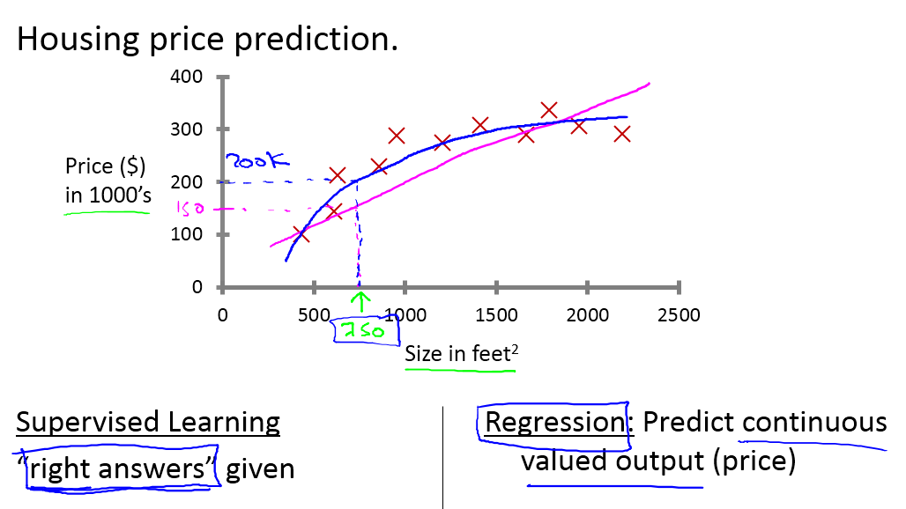

我们应用学习算法，可以在这组数据中画一条直线，或者换句话说，拟合一条直线，根据这条线我们可以推测出，这套房子可能卖$\$150,000$，当然这不是唯一的算法。可能还有更好的，比如我们不用直线拟合这些数据，用二次方程去拟合可能效果会更好。根据二次方程的曲线，我们可以从这个点推测出，这套房子能卖接近$\$200,000$。稍后我们将讨论如何选择学习算法，如何决定用直线还是二次方程来拟合。两个方案中有一个能让你朋友的房子出售得更合理。这些都是学习算法里面很好的例子。以上就是监督学习的例子。

可以看出，监督学习指的就是我们给学习算法一个数据集。这个数据集由“正确答案”组成。在房价的例子中，我们给了一系列房子的数据，我们给定数据集中每个样本的正确价格，即它们实际的售价然后运用学习算法，算出更多的正确答案。比如你朋友那个新房子的价格。用术语来讲，这叫做回归问题。我们试着推测出一个连续值的结果，即房子的价格。

一般房子的价格会记到美分，所以房价实际上是一系列离散的值，但是我们通常又把房价看成实数，看成是标量，所以又把它看成一个连续的数值。

回归这个词的意思是，我们在试着推测出这一系列连续值属性。

我再举另外一个监督学习的例子。我和一些朋友之前研究过这个。假设说你想通过查看病历来推测乳腺癌良性与否，假如有人检测出乳腺肿瘤，恶性肿瘤有害并且十分危险，而良性的肿瘤危害就没那么大，所以人们显然会很在意这个问题。

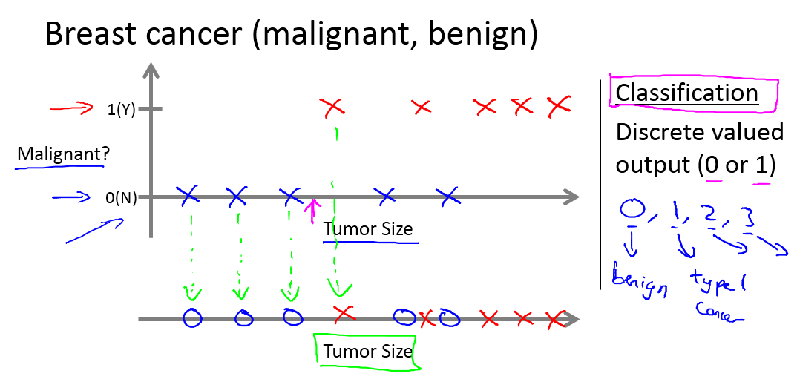

让我们来看一组数据：这个数据集中，横轴表示肿瘤的大小，纵轴上，我标出1和0表示是或者不是恶性肿瘤。我们之前见过的肿瘤，如果是恶性则记为1，不是恶性，或者说良性记为0。

我有5个良性肿瘤样本，在1的位置有5个恶性肿瘤样本。现在我们有一个朋友很不幸检查出乳腺肿瘤。假设说她的肿瘤大概这么大，那么机器学习的问题就在于，你能否估算出肿瘤是恶性的或是良性的概率。用术语来讲，这是一个分类问题。

分类指的是，我们试着推测出离散的输出值：0或1良性或恶性，而事实上在分类问题中，输出可能不止两个值。比如说可能有三种乳腺癌，所以你希望预测离散输出0、1、2、3。0 代表良性，1 表示第1类乳腺癌，2表示第2类癌症，3表示第3类，但这也是分类问题。

因为这几个离散的输出分别对应良性，第一类第二类或者第三类癌症，在分类问题中我们可以用另一种方式绘制这些数据点。

现在我用不同的符号来表示这些数据。既然我们把肿瘤的尺寸看做区分恶性或良性的特征，那么我可以这么画，我用不同的符号来表示良性和恶性肿瘤。或者说是负样本和正样本现在我们不全部画**X**，良性的肿瘤改成用 **O** 表示，恶性的继续用 **X** 表示。来预测肿瘤的恶性与否。

在其它一些机器学习问题中，可能会遇到不止一种特征。举个例子，我们不仅知道肿瘤的尺寸，还知道对应患者的年龄。在其他机器学习问题中，我们通常有更多的特征，我朋友研究这个问题时，通常采用这些特征，比如肿块密度，肿瘤细胞尺寸的一致性和形状的一致性等等，还有一些其他的特征。这就是我们即将学到最有趣的学习算法之一。

那种算法不仅能处理2种3种或5种特征，即使有无限多种特征都可以处理。

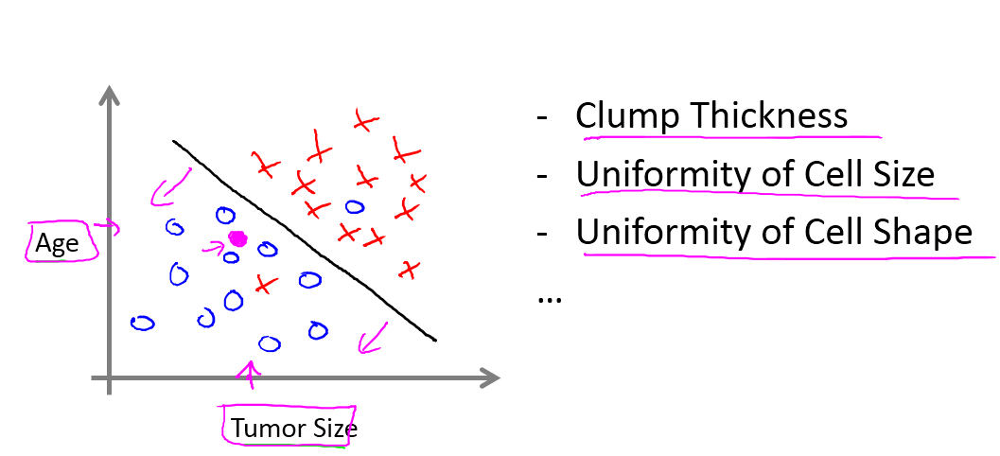

上图中，我列举了总共5种不同的特征，坐标轴上的两种和右边的3种，但是在一些学习问题中，你希望不只用3种或5种特征。相反，你想用无限多种特征，好让你的算法可以利用大量的特征，或者说线索来做推测。那你怎么处理无限多个特征，甚至怎么存储这些特征都存在问题，你电脑的内存肯定不够用。**我们以后会讲一个算法，叫支持向量机，里面有一个巧妙的数学技巧，能让计算机处理无限多个特征。**想象一下，我没有写下这两种和右边的三种特征，而是在一个无限长的列表里面，一直写一直写不停的写，写下无限多个特征，事实上，我们能用算法来处理它们。

现在来回顾一下，这节课我们介绍了监督学习。其基本思想是，我们数据集中的每个样本都有相应的“正确答案”。再根据这些样本作出预测，就像房子和肿瘤的例子中做的那样。我们还介绍了回归问题，即通过回归来推出一个连续的输出，之后我们介绍了分类问题，其目标是推出一组离散的结果。

现在来个小测验：假设你经营着一家公司，你想开发学习算法来处理这两个问题：

1.  你有一大批同样的货物，想象一下，你有上千件一模一样的货物等待出售，这时你想预测接下来的三个月能卖多少件？

2.  你有许多客户，这时你想写一个软件来检验每一个用户的账户。对于每一个账户，你要判断它们是否曾经被盗过？

那这两个问题，它们属于分类问题、还是回归问题?

问题一是一个回归问题，因为你知道，如果我有数千件货物，我会把它看成一个实数，一个连续的值。因此卖出的物品数，也是一个连续的值。

问题二是一个分类问题，因为我会把预测的值，用 0 来表示账户未被盗，用 1 表示账户曾经被盗过。所以我们根据账号是否被盗过，把它们定为0 或 1，然后用算法推测一个账号是 0 还是 1，因为只有少数的离散值，所以我把它归为分类问题。

以上就是监督学习的内容。

### 1.4 无监督学习

参考视频: 1 - 4 - Unsupervised Learning (14 min).mkv

本次视频中，我们将介绍第二种主要的机器学习问题。叫做无监督学习。

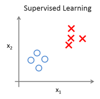

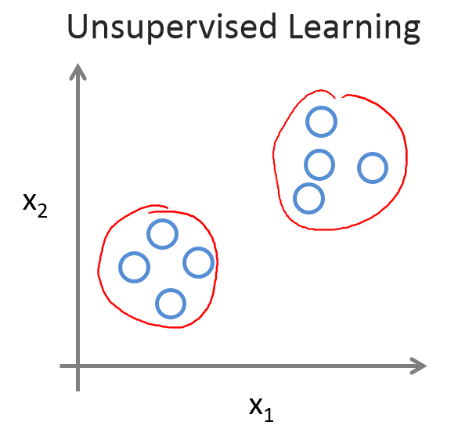

上个视频中，已经介绍了监督学习。回想当时的数据集，如图表所示，这个数据集中每条数据都已经标明是阴性或阳性，即是良性或恶性肿瘤。所以，对于监督学习里的每条数据，我们已经清楚地知道，训练集对应的正确答案，是良性或恶性了。

在无监督学习中，我们已知的数据。看上去有点不一样，不同于监督学习的数据的样子，即无监督学习中没有任何的标签或者是有相同的标签或者就是没标签。所以我们已知数据集，却不知如何处理，也未告知每个数据点是什么。别的都不知道，就是一个数据集。你能从数据中找到某种结构吗？针对数据集，无监督学习就能判断出数据有两个不同的聚集簇。这是一个，那是另一个，二者不同。是的，无监督学习算法可能会把这些数据分成两个不同的簇。所以叫做聚类算法。事实证明，它能被用在很多地方。

聚类应用的一个例子就是在谷歌新闻中。如果你以前从来没见过它，你可以到这个URL网址news.google.com去看看。谷歌新闻每天都在，收集非常多，非常多的网络的新闻内容。它再将这些新闻分组，组成有关联的新闻。所以谷歌新闻做的就是搜索非常多的新闻事件，自动地把它们聚类到一起。所以，这些新闻事件全是同一主题的，所以显示到一起。

事实证明，聚类算法和无监督学习算法同样还用在很多其它的问题上。

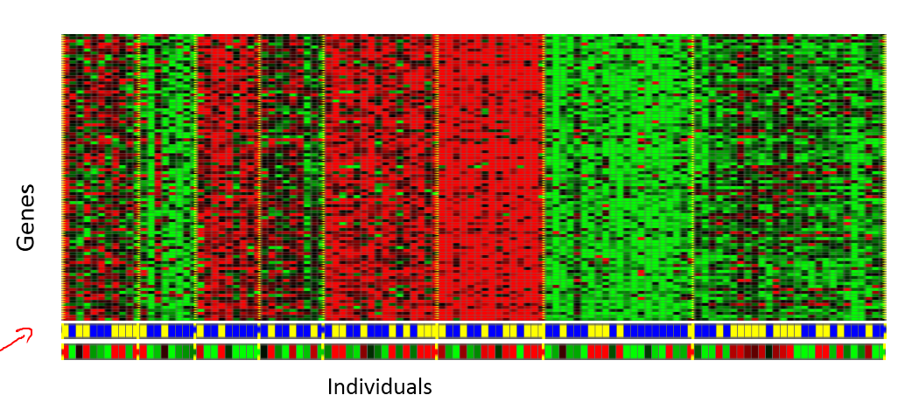

其中就有基因学的理解应用。一个**DNA**微观数据的例子。基本思想是输入一组不同个体，对其中的每个个体，你要分析出它们是否有一个特定的基因。技术上，你要分析多少特定基因已经表达。所以这些颜色，红，绿，灰等等颜色，这些颜色展示了相应的程度，即不同的个体是否有着一个特定的基因。你能做的就是运行一个聚类算法，把个体聚类到不同的类或不同类型的组（人）……

所以这个就是无监督学习，因为我们没有提前告知算法一些信息，比如，这是第一类的人，那些是第二类的人，还有第三类，等等。我们只是说，是的，这是有一堆数据。我不知道数据里面有什么。我不知道谁是什么类型。我甚至不知道人们有哪些不同的类型，这些类型又是什么。但你能自动地找到数据中的结构吗？就是说你要自动地聚类那些个体到各个类，我没法提前知道哪些是哪些。因为我们没有给算法正确答案来回应数据集中的数据，所以这就是无监督学习。

无监督学习或聚集有着大量的应用。它用于组织大型计算机集群。我有些朋友在大数据中心工作，那里有大型的计算机集群，他们想解决什么样的机器易于协同地工作，如果你能够让那些机器协同工作，你就能让你的数据中心工作得更高效。第二种应用就是社交网络的分析。所以已知你朋友的信息，比如你经常发**email**的，或是你**Facebook**的朋友、**谷歌+**圈子的朋友，我们能否自动地给出朋友的分组呢？即每组里的人们彼此都熟识，认识组里的所有人？还有市场分割。许多公司有大型的数据库，存储消费者信息。所以，你能检索这些顾客数据集，自动地发现市场分类，并自动地把顾客划分到不同的细分市场中，你才能自动并更有效地销售或不同的细分市场一起进行销售。这也是无监督学习，因为我们拥有所有的顾客数据，但我们没有提前知道是什么的细分市场，以及分别有哪些我们数据集中的顾客。我们不知道谁是在一号细分市场，谁在二号市场，等等。那我们就必须让算法从数据中发现这一切。最后，无监督学习也可用于天文数据分析，这些聚类算法给出了令人惊讶、有趣、有用的理论，解释了星系是如何诞生的。这些都是聚类的例子，聚类只是无监督学习中的一种。

我现在告诉你们另一种。我先来介绍鸡尾酒宴问题。嗯，你参加过鸡尾酒宴吧？你可以想像下，有个宴会房间里满是人，全部坐着，都在聊天，这么多人同时在聊天，声音彼此重叠，因为每个人都在说话，同一时间都在说话，你几乎听不到你面前那人的声音。所以，可能在一个这样的鸡尾酒宴中的两个人，他俩同时都在说话，假设现在是在个有些小的鸡尾酒宴中。我们放两个麦克风在房间中，因为这些麦克风在两个地方，离说话人的距离不同每个麦克风记录下不同的声音，虽然是同样的两个说话人。听起来像是两份录音被叠加到一起，或是被归结到一起，产生了我们现在的这些录音。另外，这个算法还会区分出两个音频资源，这两个可以合成或合并成之前的录音，实际上，鸡尾酒算法的第一个输出结果是：

1，2，3，4，5，6，7，8，9，10,

所以，已经把英语的声音从录音中分离出来了。

第二个输出是这样：

1，2，3，4，5，6，7，8，9，10。

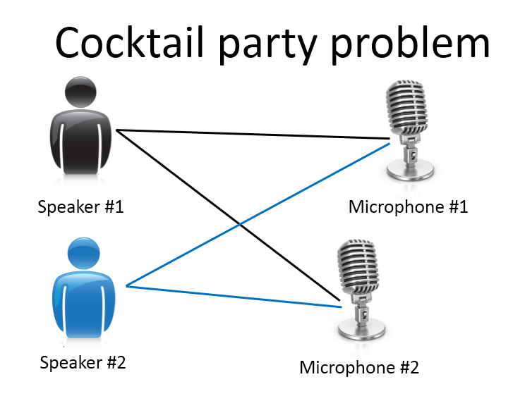

看看这个无监督学习算法，实现这个得要多么的复杂，是吧？它似乎是这样，为了构建这个应用，完成这个音频处理似乎需要你去写大量的代码或链接到一堆的合成器**JAVA**库，处理音频的库，看上去绝对是个复杂的程序，去完成这个从音频中分离出音频。事实上，这个算法对应你刚才知道的那个问题的算法可以就用一行代码来完成。

就是这里展示的代码：`[W,s,v] = svd((repmat(sum(x.*x,1),size(x,1),1).*x)*x');`

研究人员花费了大量时间才最终实现这行代码。我不是说这个是简单的问题，但它证明了，当你使用正确的编程环境，许多学习算法是相当短的程序。所以，这也是为什么在本课中，我们打算使用**Octave**编程环境。**Octave**,是免费的开源软件，使用一个像**Octave**或**Matlab**的工具，许多学习算法变得只有几行代码就可实现。

后面，我会教你们一点关于如何使用**Octave**的知识，你就可以用**Octave**来实现一些算法了。或者，如果你有**Matlab**（盗版？），你也可以用**Matlab**。事实上，在硅谷里，对大量机器学习算法，我们第一步就是建原型，在**Octave**建软件原型，因为软件在**Octave**中可以令人难以置信地、快速地实现这些学习算法。这里的这些函数比如**SVM**（**支持向量机**）函数，**奇异值分解**，**Octave**里已经建好了。如果你试图完成这个工作，但借助**C++**或**JAVA**的话，你会需要很多很多行的代码，并链接复杂的**C++**或**Java**库。所以，你可以实现这些算法，借助**C++**或**Java**或**Python**，它只是用这些语言来实现会更加复杂。(编者注：这个是当时的情况，现在**Python**变主流了)

我已经见到，在我教机器学习将近十年后的现在，发现，学习可以更加高速，如果使用**Octave**作为编程环境，如果使用**Octave**作为学习工具，以及作为原型工具，它会让你对学习算法的学习和建原型快上许多。

事实上，许多人在大硅谷的公司里做的其实就是，使用一种工具像**Octave**来做第一步的学习算法的原型搭建，只有在你已经让它工作后，你才移植它到**C++**或**Java**或别的语言。事实证明，这样做通常可以让你的算法运行得比直接用**C++**实现更快，所以，我知道，作为一名指导者，我必须说“相信我”，但对你们中从未使用过**Octave**这种编程环境的人，我还是要告诉你们这一点一定要相信我，我想，对你们而言，我认为你们的时间，你们的开发时间是最有价值的资源。我已经见过很多人这样做了，我把你看作是机器学习研究员，或机器学习开发人员，想更加高产的话，你要学会使用这个原型工具，开始使用**Octave**。

最后，总结下本视频内容，我有个简短的复习题给你们。

我们介绍了无监督学习，它是学习策略，交给算法大量的数据，并让算法为我们从数据中找出某种结构。

好的，希望你们还记得**垃圾邮件问题**。如果你有标记好的数据，区别好是垃圾还是非垃圾邮件，我们把这个当作**监督学习问题**。

**新闻事件分类**的例子，就是那个谷歌新闻的例子，我们在本视频中有见到了，我们看到，可以用一个聚类算法来聚类这些文章到一起，所以是**无监督学习**。

**细分市场**的例子，我在更早一点的时间讲过，你可以当作**无监督学习**问题，因为我只是拿到算法数据，再让算法去自动地发现细分市场。

最后一个例子，**糖尿病**，这个其实就像是我们的乳腺癌，上个视频里的。只是替换了好、坏肿瘤，良性、恶性肿瘤，我们改用糖尿病或没病。所以我们把这个当作**监督学习**，我们能够解决它，作为一个监督学习问题，就像我们在乳腺癌数据中做的一样。

好了，以上就是无监督学习的视频内容，在下一个视频中，我们将深入探究特定的学习算法，开始介绍这些算法是如何工作的，和我们还有你如何来实现它们。

二、单变量线性回归(Linear Regression with One Variable)
-------------------------------------------------------

### 2.1 模型表示

参考视频: 2 - 1 - Model Representation (8 min).mkv

我们的第一个学习算法是线性回归算法。在这段视频中，你会看到这个算法的概况，更重要的是你将会了解监督学习过程完整的流程。

让我们通过一个例子来开始：这个例子是预测住房价格的，我们要使用一个数据集，数据集包含俄勒冈州波特兰市的住房价格。在这里，我要根据不同房屋尺寸所售出的价格，画出我的数据集。比方说，如果你朋友的房子是1250平方尺大小，你要告诉他们这房子能卖多少钱。那么，你可以做的一件事就是构建一个模型，也许是条直线，从这个数据模型上来看，也许你可以告诉你的朋友，他能以大约220000(美元)左右的价格卖掉这个房子。这就是监督学习算法的一个例子。

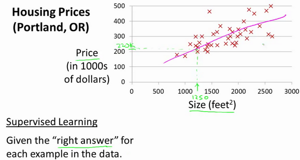

它被称作监督学习是因为对于每个数据来说，我们给出了“正确的答案”，即告诉我们：根据我们的数据来说，房子实际的价格是多少，而且，更具体来说，这是一个回归问题。回归一词指的是，我们根据之前的数据预测出一个准确的输出值，对于这个例子就是价格，同时，还有另一种最常见的监督学习方式，叫做分类问题，当我们想要预测离散的输出值，例如，我们正在寻找癌症肿瘤，并想要确定肿瘤是良性的还是恶性的，这就是0/1离散输出的问题。更进一步来说，在监督学习中我们有一个数据集，这个数据集被称训练集。

**我将在整个课程中用小写的$m$来表示训练样本的数目。**

以之前的房屋交易问题为例，假使我们回归问题的训练集（**Training Set**）如下表所示：

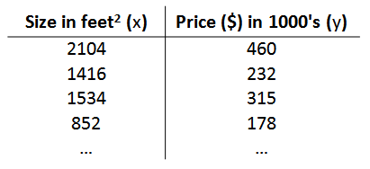

我们将要用来描述这个回归问题的标记如下:

$m$ 代表训练集中实例的数量

$x$  代表特征/输入变量

$y$ 代表目标变量/输出变量

$\left( x,y \right)$ 代表训练集中的实例

$({{x}^{(i)}},{{y}^{(i)}})$ 代表第$i$ 个观察实例

$h$  代表学习算法的解决方案或函数也称为假设（**hypothesis**）

这就是一个监督学习算法的工作方式，我们可以看到这里有我们的训练集里房屋价格
我们把它喂给我们的学习算法，学习算法的工作了，然后输出一个函数，通常表示为小写 $h$  表示。$h$  代表**hypothesis**(**假设**)，$h$表示一个函数，输入是房屋尺寸大小，就像你朋友想出售的房屋，因此 $h$ 根据输入的 $x$值来得出 $y$ 值，$y$ 值对应房子的价格 因此，$h$ 是一个从$x$ 到 $y$ 的函数映射。

我将选择最初的使用规则$h$代表**hypothesis**，因而，要解决房价预测问题，我们实际上是要将训练集“喂”给我们的学习算法，进而学习得到一个假设$h$，然后将我们要预测的房屋的尺寸作为输入变量输入给$h$，预测出该房屋的交易价格作为输出变量输出为结果。那么，对于我们的房价预测问题，我们该如何表达 $h$？

一种可能的表达方式为：$h_\theta \left( x \right)=\theta_{0} + \theta_{1}x$，因为只含有一个特征/输入变量，因此这样的问题叫作单变量线性回归问题。

### 2.2 代价函数

参考视频: 2 - 2 - Cost Function (8 min).mkv

在这段视频中我们将定义代价函数的概念，这有助于我们弄清楚如何把最有可能的直线与我们的数据相拟合。如图：

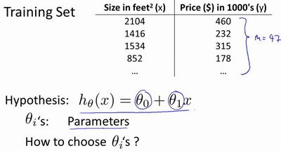

在线性回归中我们有一个像这样的训练集，$m$代表了训练样本的数量，比如 $m = 47$。而我们的假设函数，也就是用来进行预测的函数，是这样的线性函数形式：$h_\theta \left( x \right)=\theta_{0}+\theta_{1}x$。

接下来我们会引入一些术语我们现在要做的便是为我们的模型选择合适的**参数**（**parameters**）$\theta_{0}$ 和 $\theta_{1}$，在房价问题这个例子中便是直线的斜率和在$y$ 轴上的截距。

我们选择的参数决定了我们得到的直线相对于我们的训练集的准确程度，模型所预测的值与训练集中实际值之间的差距（下图中蓝线所指）就是**建模误差**（**modeling error**）。

我们的目标便是选择出可以使得建模误差的平方和能够最小的模型参数。 即使得代价函数 $J \left( \theta_0, \theta_1 \right) = \frac{1}{2m}\sum\limits_{i=1}^m \left( h_{\theta}(x^{(i)})-y^{(i)} \right)^{2}$最小。

我们绘制一个等高线图，三个坐标分别为$\theta_{0}$和$\theta_{1}$ 和$J(\theta_{0}, \theta_{1})$：

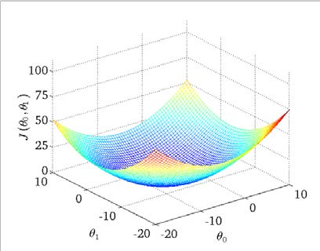

则可以看出在三维空间中存在一个使得$J(\theta_{0}, \theta_{1})$最小的点。

代价函数也被称作平方误差函数，有时也被称为平方误差代价函数。我们之所以要求出误差的平方和，是因为误差平方代价函数，对于大多数问题，特别是回归问题，都是一个合理的选择。还有其他的代价函数也能很好地发挥作用，但是平方误差代价函数可能是解决回归问题最常用的手段了。

在后续课程中，我们还会谈论其他的代价函数，但我们刚刚讲的选择是对于大多数线性回归问题非常合理的。

也许这个函数$J(\theta_{0}, \theta_{1})$有点抽象，可能你仍然不知道它的内涵，在接下来的几个视频里，我们要更进一步解释代价函数J的工作原理，并尝试更直观地解释它在计算什么，以及我们使用它的目的。

### 2.3 代价函数的直观理解I

参考视频: 2 - 3 - Cost Function - Intuition I (11 min).mkv

在上一个视频中，我们给了代价函数一个数学上的定义。在这个视频里，让我们通过一些例子来获取一些直观的感受，看看代价函数到底是在干什么。

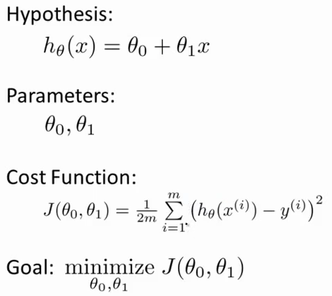

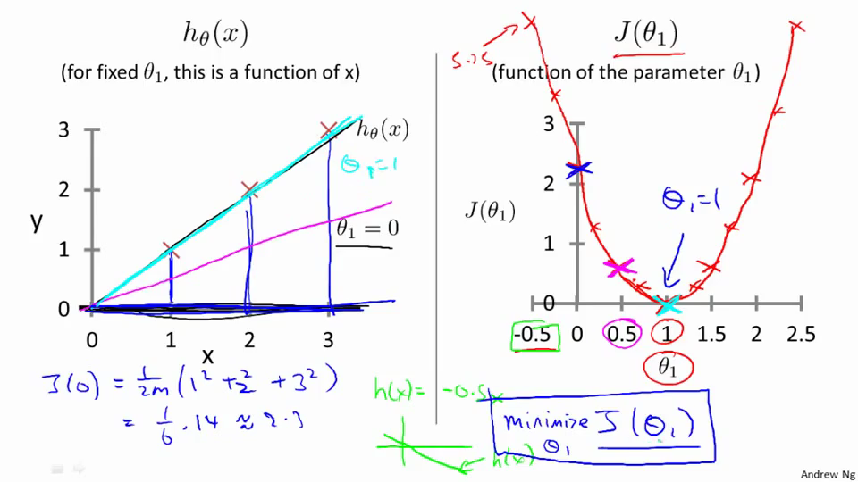

### 2.4 代价函数的直观理解II

参考视频: 2 - 4 - Cost Function - Intuition II (9 min).mkv

这节课中，我们将更深入地学习代价函数的作用，这段视频的内容假设你已经认识等高线图，如果你对等高线图不太熟悉的话，这段视频中的某些内容你可能会听不懂，但不要紧，如果你跳过这段视频的话，也没什么关系，不听这节课对后续课程理解影响不大。

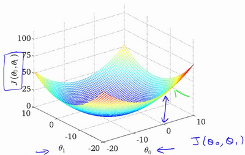

代价函数的样子，等高线图，则可以看出在三维空间中存在一个使得$J(\theta_{0}, \theta_{1})$最小的点。

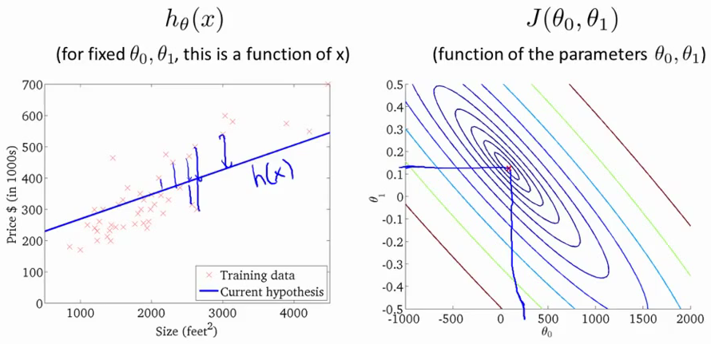

通过这些图形，我希望你能更好地理解这些代价函数$ J$所表达的值是什么样的，它们对应的假设是什么样的，以及什么样的假设对应的点，更接近于代价函数$J$的最小值。

当然，我们真正需要的是一种有效的算法，能够自动地找出这些使代价函数$J$取最小值的参数$\theta_{0}$和$\theta_{1}$来。

我们也不希望编个程序把这些点画出来，然后人工的方法来读出这些点的数值，这很明显不是一个好办法。我们会遇到更复杂、更高维度、更多参数的情况，而这些情况是很难画出图的，因此更无法将其可视化，因此我们真正需要的是编写程序来找出这些最小化代价函数的$\theta_{0}$和$\theta_{1}$的值，在下一节视频中，我们将介绍一种算法，能够自动地找出能使代价函数$J$最小化的参数$\theta_{0}$和$\theta_{1}$的值。

### 2.5 梯度下降

参考视频: 2 - 5 - Gradient Descent (11 min).mkv

梯度下降是一个用来求函数最小值的算法，我们将使用梯度下降算法来求出代价函数$J(\theta_{0}, \theta_{1})$ 的最小值。

梯度下降背后的思想是：开始时我们随机选择一个参数的组合$\left( {\theta_{0}},{\theta_{1}},......,{\theta_{n}} \right)$，计算代价函数，然后我们寻找下一个能让代价函数值下降最多的参数组合。我们持续这么做直到找到一个局部最小值（**local minimum**），因为我们并没有尝试完所有的参数组合，所以不能确定我们得到的局部最小值是否便是全局最小值（**global minimum**），选择不同的初始参数组合，可能会找到不同的局部最小值。

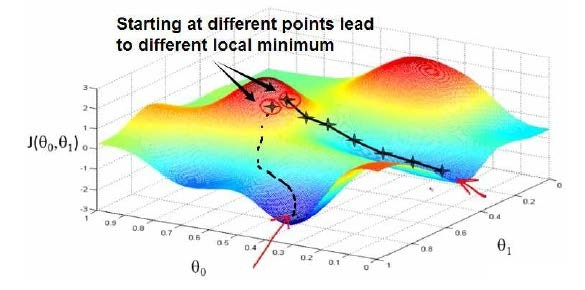

想象一下你正站立在山的这一点上，站立在你想象的公园这座红色山上，在梯度下降算法中，我们要做的就是旋转360度，看看我们的周围，并问自己要在某个方向上，用小碎步尽快下山。这些小碎步需要朝什么方向？如果我们站在山坡上的这一点，你看一下周围，你会发现最佳的下山方向，你再看看周围，然后再一次想想，我应该从什么方向迈着小碎步下山？然后你按照自己的判断又迈出一步，重复上面的步骤，从这个新的点，你环顾四周，并决定从什么方向将会最快下山，然后又迈进了一小步，并依此类推，直到你接近局部最低点的位置。

批量梯度下降（**batch gradient descent**）算法的公式为：

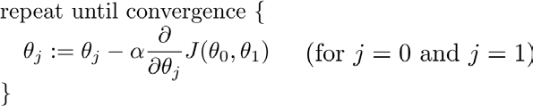

其中$a$是学习率（**learning rate**），它决定了我们沿着能让代价函数下降程度最大的方向向下迈出的步子有多大，在批量梯度下降中，我们每一次都同时让所有的参数减去学习速率乘以代价函数的导数。

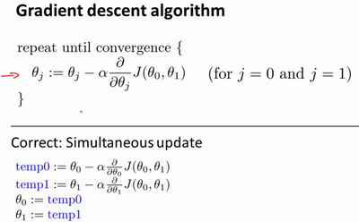

在梯度下降算法中，还有一个更微妙的问题，梯度下降中，我们要更新${\theta_{0}}$和${\theta_{1}}$ ，当 $j=0$ 和$j=1$时，会产生更新，所以你将更新$J\left( {\theta_{0}} \right)$和$J\left( {\theta_{1}} \right)$。实现梯度下降算法的微妙之处是，在这个表达式中，如果你要更新这个等式，你需要同时更新${\theta_{0}}$和${\theta_{1}}$，我的意思是在这个等式中，我们要这样更新：

${\theta_{0}}$:= ${\theta_{0}}$ ，并更新${\theta_{1}}$:= ${\theta_{1}}$。

实现方法是：你应该计算公式右边的部分，通过那一部分计算出${\theta_{0}}$和${\theta_{1}}$的值，然后同时更新${\theta_{0}}$和${\theta_{1}}$。

让我进一步阐述这个过程：

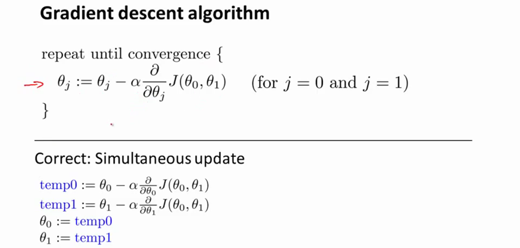

在梯度下降算法中，这是正确实现同时更新的方法。我不打算解释为什么你需要同时更新，同时更新是梯度下降中的一种常用方法。我们之后会讲到，同步更新是更自然的实现方法。当人们谈到梯度下降时，他们的意思就是同步更新。

在接下来的视频中，我们要进入这个微分项的细节之中。我已经写了出来但没有真正定义，如果你已经修过微积分课程，如果你熟悉偏导数和导数，这其实就是这个微分项：

$\alpha \frac{\partial }{\partial {{\theta }_{0}}}J({{\theta }_{0}},{{\theta }_{1}})$，$\alpha \frac{\partial }{\partial {{\theta }_{1}}}J({{\theta }_{0}},{{\theta }_{1}})$。

如果你不熟悉微积分，不用担心，即使你之前没有看过微积分，或者没有接触过偏导数，在接下来的视频中，你会得到一切你需要知道，如何计算这个微分项的知识。

下一个视频中，希望我们能够给出实现梯度下降算法的所有知识 。

### 2.6 梯度下降的直观理解

参考视频: 2 - 6 - Gradient Descent Intuition (12 min).mkv

在之前的视频中，我们给出了一个数学上关于梯度下降的定义，本次视频我们更深入研究一下，更直观地感受一下这个算法是做什么的，以及梯度下降算法的更新过程有什么意义。梯度下降算法如下：

${\theta_{j}}:={\theta_{j}}-\alpha \frac{\partial }{\partial {\theta_{j}}}J\left(\theta \right)$

描述：对$\theta $赋值，使得$J\left( \theta  \right)$按梯度下降最快方向进行，一直迭代下去，最终得到局部最小值。其中$a$是学习率（**learning rate**），它决定了我们沿着能让代价函数下降程度最大的方向向下迈出的步子有多大。

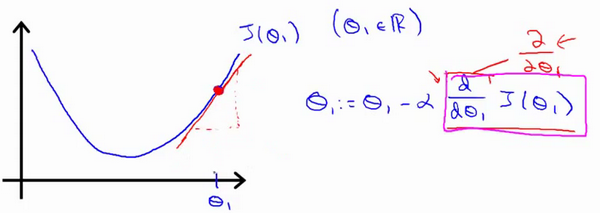

对于这个问题，求导的目的，基本上可以说取这个红点的切线，就是这样一条红色的直线，刚好与函数相切于这一点，让我们看看这条红色直线的斜率，就是这条刚好与函数曲线相切的这条直线，这条直线的斜率正好是这个三角形的高度除以这个水平长度，现在，这条线有一个正斜率，也就是说它有正导数，因此，我得到的新的${\theta_{1}}$，${\theta_{1}}$更新后等于${\theta_{1}}$减去一个正数乘以$a$。

这就是我梯度下降法的更新规则：${\theta_{j}}:={\theta_{j}}-\alpha \frac{\partial }{\partial {\theta_{j}}}J\left( \theta  \right)$

让我们来看看如果$a$太小或$a$太大会出现什么情况：

如果$a​$太小了，即我的学习速率太小，结果就是只能这样像小宝宝一样一点点地挪动，去努力接近最低点，这样就需要很多步才能到达最低点，所以如果$a$太小的话，可能会很慢，因为它会一点点挪动，它会需要很多步才能到达全局最低点。

如果$a$太大，那么梯度下降法可能会越过最低点，甚至可能无法收敛，下一次迭代又移动了一大步，越过一次，又越过一次，一次次越过最低点，直到你发现实际上离最低点越来越远，所以，如果$a$太大，它会导致无法收敛，甚至发散。

现在，我还有一个问题，当我第一次学习这个地方时，我花了很长一段时间才理解这个问题，如果我们预先把${\theta_{1}}$放在一个局部的最低点，你认为下一步梯度下降法会怎样工作？

假设你将${\theta_{1}}$初始化在局部最低点，在这儿，它已经在一个局部的最优处或局部最低点。结果是局部最优点的导数将等于零，因为它是那条切线的斜率。这意味着你已经在局部最优点，它使得${\theta_{1}}$不再改变，也就是新的${\theta_{1}}$等于原来的${\theta_{1}}$，因此，如果你的参数已经处于局部最低点，那么梯度下降法更新其实什么都没做，它不会改变参数的值。这也解释了为什么即使学习速率$a$保持不变时，梯度下降也可以收敛到局部最低点。

我们来看一个例子，这是代价函数$J\left( \theta  \right)$。

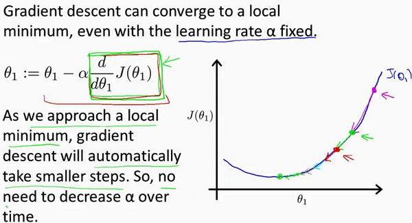

我想找到它的最小值，首先初始化我的梯度下降算法，在那个品红色的点初始化，如果我更新一步梯度下降，也许它会带我到这个点，因为这个点的导数是相当陡的。现在，在这个绿色的点，如果我再更新一步，你会发现我的导数，也即斜率，是没那么陡的。随着我接近最低点，我的导数越来越接近零，所以，梯度下降一步后，新的导数会变小一点点。然后我想再梯度下降一步，在这个绿点，我自然会用一个稍微跟刚才在那个品红点时比，再小一点的一步，到了新的红色点，更接近全局最低点了，因此这点的导数会比在绿点时更小。所以，我再进行一步梯度下降时，我的导数项是更小的，${\theta_{1}}$更新的幅度就会更小。所以随着梯度下降法的运行，你移动的幅度会自动变得越来越小，直到最终移动幅度非常小，你会发现，已经收敛到局部极小值。

回顾一下，在梯度下降法中，当我们接近局部最低点时，梯度下降法会自动采取更小的幅度，这是因为当我们接近局部最低点时，很显然在局部最低时导数等于零，所以当我们接近局部最低时，导数值会自动变得越来越小，所以梯度下降将自动采取较小的幅度，这就是梯度下降的做法。所以实际上没有必要再另外减小$a$。

这就是梯度下降算法，你可以用它来最小化任何代价函数$J$，不只是线性回归中的代价函数$J$。

在接下来的视频中，我们要用代价函数$J$，回到它的本质，线性回归中的代价函数。也就是我们前面得出的平方误差函数，结合梯度下降法，以及平方代价函数，我们会得出第一个机器学习算法，即线性回归算法。

### 2.7 梯度下降的线性回归

参考视频: 2 - 7 - GradientDescentForLinearRegression (6 min).mkv

在以前的视频中我们谈到关于梯度下降算法，梯度下降是很常用的算法，它不仅被用在线性回归上和线性回归模型、平方误差代价函数。在这段视频中，我们要将梯度下降和代价函数结合。我们将用到此算法，并将其应用于具体的拟合直线的线性回归算法里。

梯度下降算法和线性回归算法比较如图：

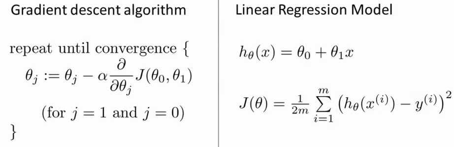

对我们之前的线性回归问题运用梯度下降法，关键在于求出代价函数的导数，即：

$\frac{\partial }{\partial {{\theta }_{j}}}J({{\theta }_{0}},{{\theta }_{1}})=\frac{\partial }{\partial {{\theta }_{j}}}\frac{1}{2m}{{\sum\limits_{i=1}^{m}{\left( {{h}_{\theta }}({{x}^{(i)}})-{{y}^{(i)}} \right)}}^{2}}$

$j=0$  时：$\frac{\partial }{\partial {{\theta }_{0}}}J({{\theta }_{0}},{{\theta }_{1}})=\frac{1}{m}{{\sum\limits_{i=1}^{m}{\left( {{h}_{\theta }}({{x}^{(i)}})-{{y}^{(i)}} \right)}}}$

$j=1$  时：$\frac{\partial }{\partial {{\theta }_{1}}}J({{\theta }_{0}},{{\theta }_{1}})=\frac{1}{m}\sum\limits_{i=1}^{m}{\left( \left( {{h}_{\theta }}({{x}^{(i)}})-{{y}^{(i)}} \right)\cdot {{x}^{(i)}} \right)}$

则算法改写成：

**Repeat {**

​                ${\theta_{0}}:={\theta_{0}}-a\frac{1}{m}\sum\limits_{i=1}^{m}{ \left({{h}_{\theta }}({{x}^{(i)}})-{{y}^{(i)}} \right)}$

​                ${\theta_{1}}:={\theta_{1}}-a\frac{1}{m}\sum\limits_{i=1}^{m}{\left( \left({{h}_{\theta }}({{x}^{(i)}})-{{y}^{(i)}} \right)\cdot {{x}^{(i)}} \right)}$

​               **}**

我们刚刚使用的算法，有时也称为批量梯度下降。实际上，在机器学习中，通常不太会给算法起名字，但这个名字”**批量梯度下降**”，指的是在梯度下降的每一步中，我们都用到了所有的训练样本，在梯度下降中，在计算微分求导项时，我们需要进行求和运算，所以，在每一个单独的梯度下降中，我们最终都要计算这样一个东西，这个项需要对所有$m$个训练样本求和。因此，批量梯度下降法这个名字说明了我们需要考虑所有这一"批"训练样本，而事实上，有时也有其他类型的梯度下降法，不是这种"批量"型的，不考虑整个的训练集，而是每次只关注训练集中的一些小的子集。在后面的课程中，我们也将介绍这些方法。

但就目前而言，应用刚刚学到的算法，你应该已经掌握了批量梯度算法，并且能把它应用到线性回归中了，这就是用于线性回归的梯度下降法。

如果你之前学过线性代数，有些同学之前可能已经学过高等线性代数，你应该知道有一种计算代价函数$J$最小值的数值解法，不需要梯度下降这种迭代算法。在后面的课程中，我们也会谈到这个方法，它可以在不需要多步梯度下降的情况下，也能解出代价函数$J$的最小值，这是另一种称为正规方程(**normal equations**)的方法。实际上在数据量较大的情况下，梯度下降法比正规方程要更适用一些。

现在我们已经掌握了梯度下降，我们可以在不同的环境中使用梯度下降法，我们还将在不同的机器学习问题中大量地使用它。所以，祝贺大家成功学会你的第一个机器学习算法。

在下一段视频中，告诉你泛化的梯度下降算法，这将使梯度下降更加强大。

### 2.8 接下来的内容

参考视频: 2 - 8 - What_'s Next (6 min).mkv

在接下来的一组视频中，我会对线性代数进行一个快速的复习回顾。如果你从来没有接触过向量和矩阵，那么这课件上所有的一切对你来说都是新知识，或者你之前对线性代数有所了解，但由于隔得久了，对其有所遗忘，那就请学习接下来的一组视频，我会快速地回顾你将用到的线性代数知识。

通过它们，你可以实现和使用更强大的线性回归模型。事实上，线性代数不仅仅在线性回归中应用广泛，它其中的矩阵和向量将有助于帮助我们实现之后更多的机器学习模型，并在计算上更有效率。正是因为这些矩阵和向量提供了一种有效的方式来组织大量的数据，特别是当我们处理巨大的训练集时，如果你不熟悉线性代数，如果你觉得线性代数看上去是一个复杂、可怕的概念，特别是对于之前从未接触过它的人，不必担心，事实上，为了实现机器学习算法，我们只需要一些非常非常基础的线性代数知识。通过接下来几个视频，你可以很快地学会所有你需要了解的线性代数知识。具体来说，为了帮助你判断是否有需要学习接下来的一组视频，我会讨论什么是矩阵和向量，谈谈如何加、减 、乘矩阵和向量，讨论逆矩阵和转置矩阵的概念。

如果你十分熟悉这些概念，那么你完全可以跳过这组关于线性代数的选修视频，但是如果你对这些概念仍有些许的不确定，不确定这些数字或这些矩阵的意思，那么请看一看下一组的视频，它会很快地教你一些你需要知道的线性代数的知识，便于之后编写机器学习算法和处理大量数据。

三、线性代数回顾(Linear Algebra Review)
---------------------------------------

### 3.1 矩阵和向量

参考视频: 3 - 1 - Matrices and Vectors (9 min).mkv

如图：这个是4×2矩阵，即4行2列，如$m$为行，$n$为列，那么$m×n$即4×2

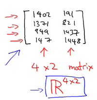

矩阵的维数即行数×列数

矩阵元素（矩阵项）：$A=\left[ \begin{matrix}   1402 & 191  \\   1371 & 821  \\   949 & 1437  \\   147 & 1448  \\\end{matrix} \right]$

$A_{ij}$指第$i$行，第$j$列的元素。

向量是一种特殊的矩阵，讲义中的向量一般都是列向量，如：
$y=\left[ \begin{matrix}   {460}  \\   {232}  \\   {315}  \\   {178}  \\\end{matrix} \right]$

为四维列向量（4×1）。

如下图为1索引向量和0索引向量，左图为1索引向量，右图为0索引向量，一般我们用1索引向量。

$y=\left[ \begin{matrix}   {{y}_{1}}  \\   {{y}_{2}}  \\   {{y}_{3}}  \\   {{y}_{4}}  \\\end{matrix} \right]$，$y=\left[ \begin{matrix}   {{y}_{0}}  \\   {{y}_{1}}  \\   {{y}_{2}}  \\   {{y}_{3}}  \\\end{matrix} \right]$

### 3.2 加法和标量乘法

参考视频: 3 - 2 - Addition and Scalar Multiplication (7 min).mkv

矩阵的加法：行列数相等的可以加。

例：

矩阵的乘法：每个元素都要乘

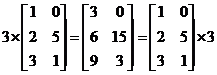

组合算法也类似。

### 3.3 矩阵向量乘法

参考视频: 3 - 3 - Matrix Vector Multiplication (14 min).mkv

矩阵和向量的乘法如图：$m×n$的矩阵乘以$n×1$的向量，得到的是$m×1$的向量

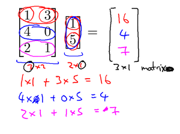

算法举例：

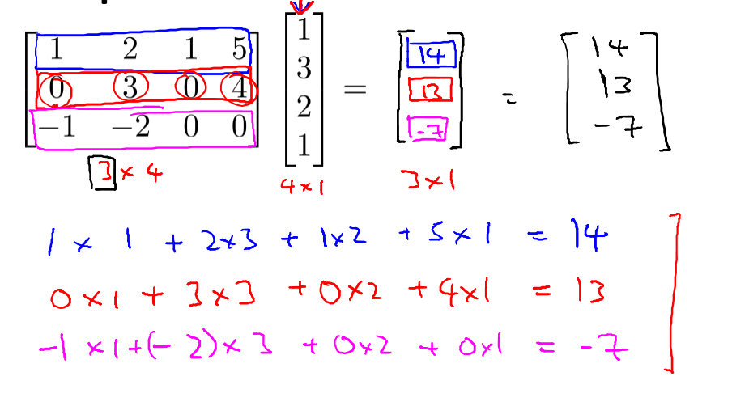

### 3.4 矩阵乘法

参考视频: 3 - 4 - Matrix Matrix Multiplication (11 min).mkv

矩阵乘法：

$m×n$矩阵乘以$n×o$矩阵，变成$m×o$矩阵。

如果这样说不好理解的话就举一个例子来说明一下，比如说现在有两个矩阵$A$和$B$，那么它们的乘积就可以表示为图中所示的形式。

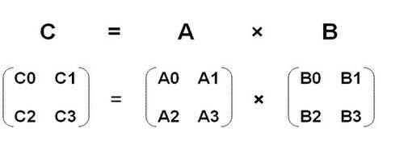
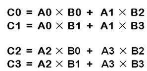

### 3.5 矩阵乘法的性质

参考视频: 3 - 5 - Matrix Multiplication Properties (9 min).mkv

矩阵乘法的性质：

矩阵的乘法不满足交换律：$A×B≠B×A$

矩阵的乘法满足结合律。即：$A×(B×C)=(A×B)×C$

单位矩阵：在矩阵的乘法中，有一种矩阵起着特殊的作用，如同数的乘法中的1,我们称这种矩阵为单位矩阵．它是个方阵，一般用 $I$ 或者 $E$ 表示，本讲义都用 $I$ 代表单位矩阵，从左上角到右下角的对角线（称为主对角线）上的元素均为1以外全都为0。如：

$A{{A}^{-1}}={{A}^{-1}}A=I$

对于单位矩阵，有$AI=IA=A$

### 3.6 逆、转置

参考视频: 3 - 6 - Inverse and Transpose (11 min).mkv

矩阵的逆：如矩阵$A$是一个$m×m$矩阵（方阵），如果有逆矩阵，则：$A{{A}^{-1}}={{A}^{-1}}A=I$

我们一般在**OCTAVE**或者**MATLAB**中进行计算矩阵的逆矩阵。

矩阵的转置：设$A$为$m×n$阶矩阵（即$m$行$n$列），第$i $行$j $列的元素是$a(i,j)$，即：$A=a(i,j)$

定义$A$的转置为这样一个$n×m$阶矩阵$B$，满足$B=a(j,i)$，即 $b (i,j)=a(j,i)$（$B$的第$i$行第$j$列元素是$A$的第$j$行第$i$列元素），记${{A}^{T}}=B$。(有些书记为A'=B）

直观来看，将$A$的所有元素绕着一条从第1行第1列元素出发的右下方45度的射线作镜面反转，即得到$A$的转置。

例：

${{\left| \begin{matrix}   a& b  \\   c& d  \\   e& f  \\\end{matrix} \right|}^{T}}=\left|\begin{matrix}   a& c & e  \\   b& d & f  \\\end{matrix} \right|$

矩阵的转置基本性质:

$ {{\left( A\pm B \right)}^{T}}={{A}^{T}}\pm {{B}^{T}} $
${{\left( A\times B \right)}^{T}}={{B}^{T}}\times {{A}^{T}}$
${{\left( {{A}^{T}} \right)}^{T}}=A $
${{\left( KA \right)}^{T}}=K{{A}^{T}} $

**matlab**中矩阵转置：直接打一撇，`x=y'`。

