第3周
=====
[TOC]

六、逻辑回归(Logistic Regression)
---------------------------------

### 6.1 分类问题

参考文档: 6 - 1 - Classification (8 min).mkv

在这个以及接下来的几个视频中，开始介绍分类问题。

在分类问题中，你要预测的变量 $y$ 是离散的值，我们将学习一种叫做逻辑回归 (**Logistic Regression**) 的算法，这是目前最流行使用最广泛的一种学习算法。

在分类问题中，我们尝试预测的是结果是否属于某一个类（例如正确或错误）。分类问题的例子有：判断一封电子邮件是否是垃圾邮件；判断一次金融交易是否是欺诈；之前我们也谈到了肿瘤分类问题的例子，区别一个肿瘤是恶性的还是良性的。

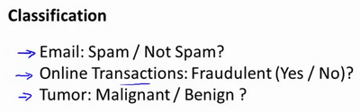

我们从二元的分类问题开始讨论。

我们将因变量(**dependent variable**)可能属于的两个类分别称为负向类（**negative class**）和正向类（**positive class**），则因变量$y\in { 0,1 \\}$ ，其中 0 表示负向类，1 表示正向类。

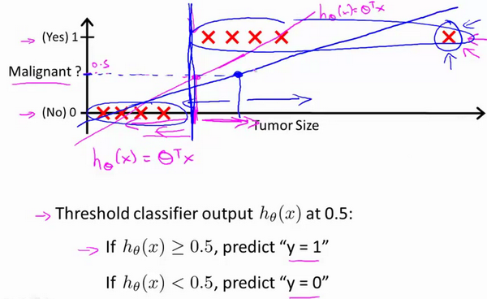

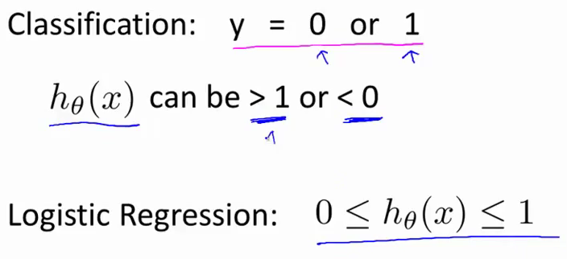

如果我们要用线性回归算法来解决一个分类问题，对于分类， $y$ 取值为 0 或者1，但如果你使用的是线性回归，那么假设函数的输出值可能远大于 1，或者远小于0，即使所有训练样本的标签  $y$ 都等于 0 或 1。尽管我们知道标签应该取值0 或者1，但是如果算法得到的值远大于1或者远小于0的话，就会感觉很奇怪。所以我们在接下来的要研究的算法就叫做逻辑回归算法，这个算法的性质是：它的输出值永远在0到 1 之间。

顺便说一下，逻辑回归算法是分类算法，我们将它作为分类算法使用。有时候可能因为这个算法的名字中出现了“回归”使你感到困惑，但逻辑回归算法实际上是一种分类算法，它适用于标签  $y$ 取值离散的情况，如：1 0 0 1。

在接下来的视频中，我们将开始学习逻辑回归算法的细节。

### 6.2 假说表示

参考视频: 6 - 2 - Hypothesis Representation (7 min).mkv

在这段视频中，我要给你展示假设函数的表达式，也就是说，在分类问题中，要用什么样的函数来表示我们的假设。此前我们说过，希望我们的分类器的输出值在0和1之间，因此，我们希望想出一个满足某个性质的假设函数，这个性质是它的预测值要在0和1之间。

回顾在一开始提到的乳腺癌分类问题，我们可以用线性回归的方法求出适合数据的一条直线：

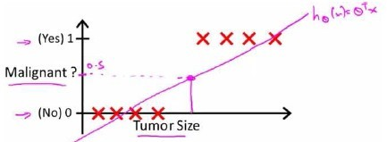

根据线性回归模型我们只能预测连续的值，然而对于分类问题，我们需要输出0或1，我们可以预测：

当${h_\theta}\left( x \right)>=0.5$时，预测 $y=1$。

当${h_\theta}\left( x \right)<0.5$时，预测 $y=0$ 。

对于上图所示的数据，这样的一个线性模型似乎能很好地完成分类任务。假使我们又观测到一个非常大尺寸的恶性肿瘤，将其作为实例加入到我们的训练集中来，这将使得我们获得一条新的直线。

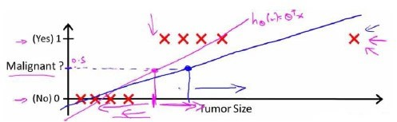

这时，再使用0.5作为阀值来预测肿瘤是良性还是恶性便不合适了。可以看出，线性回归模型，因为其预测的值可以超越[0,1]的范围，并不适合解决这样的问题。

我们引入一个新的模型，逻辑回归，该模型的输出变量范围始终在0和1之间。
逻辑回归模型的假设是： $h_\theta \left( x \right)=g\left(\theta^{T}X \right)$
其中：
$X$ 代表特征向量
$g$ 代表逻辑函数（**logistic function**)是一个常用的逻辑函数为**S**形函数（**Sigmoid function**），公式为： $g\left( z \right)=\frac{1}{1+{{e}^{-z}}}$。


**python**代码实现：

```python
import numpy as np
    
def sigmoid(z):
    
   return 1 / (1 + np.exp(-z))
```

该函数的图像为：

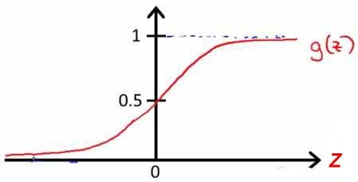

合起来，我们得到逻辑回归模型的假设：

对模型的理解： $g\left( z \right)=\frac{1}{1+{{e}^{-z}}}$。

$h_\theta \left( x \right)$的作用是，对于给定的输入变量，根据选择的参数计算输出变量=1的可能性（**estimated probablity**）即$h_\theta \left( x \right)=P\left( y=1|x;\theta \right)$
例如，如果对于给定的$x$，通过已经确定的参数计算得出$h_\theta \left( x \right)=0.7$，则表示有70%的几率$y$为正向类，相应地$y$为负向类的几率为1-0.7=0.3。

### 6.3 判定边界

参考视频: 6 - 3 - Decision Boundary (15 min).mkv

现在讲下决策边界(**decision boundary**)的概念。这个概念能更好地帮助我们理解逻辑回归的假设函数在计算什么。

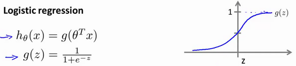

在逻辑回归中，我们预测：

当${h_\theta}\left( x \right)>=0.5$时，预测 $y=1$。

当${h_\theta}\left( x \right)<0.5$时，预测 $y=0$ 。

根据上面绘制出的 **S** 形函数图像，我们知道当

$z=0$ 时 $g(z)=0.5$

$z>0$ 时 $g(z)>0.5$

$z<0$ 时 $g(z)<0.5$

又 $z={\theta^{T}}x$ ，即：
${\theta^{T}}x>=0$  时，预测 $y=1$
${\theta^{T}}x<0$  时，预测 $y=0$

现在假设我们有一个模型：

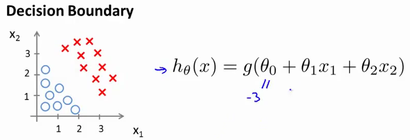

并且参数$\theta$ 是向量[-3 1 1]。 则当$-3+{x_1}+{x_2} \geq 0$，即${x_1}+{x_2} \geq 3$时，模型将预测 $y=1$。
我们可以绘制直线${x_1}+{x_2} = 3$，这条线便是我们模型的分界线，将预测为1的区域和预测为 0的区域分隔开。

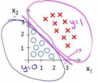

假使我们的数据呈现这样的分布情况，怎样的模型才能适合呢？


因为需要用曲线才能分隔 $y=0$ 的区域和 $y=1$ 的区域，我们需要二次方特征：${h_\theta}\left( x \right)=g\left( {\theta_0}+{\theta_1}{x_1}+{\theta_{2}}{x_{2}}+{\theta_{3}}x_{1}^{2}+{\theta_{4}}x_{2}^{2} \right)$是[-1 0 0 1 1]，则我们得到的判定边界恰好是圆点在原点且半径为1的圆形。

我们可以用非常复杂的模型来适应非常复杂形状的判定边界。

### 6.4 代价函数

参考视频: 6 - 4 - Cost Function (11 min).mkv

在这段视频中，我们要介绍如何拟合逻辑回归模型的参数$\theta$。具体来说，我要定义用来拟合参数的优化目标或者叫代价函数，这便是监督学习问题中的逻辑回归模型的拟合问题。

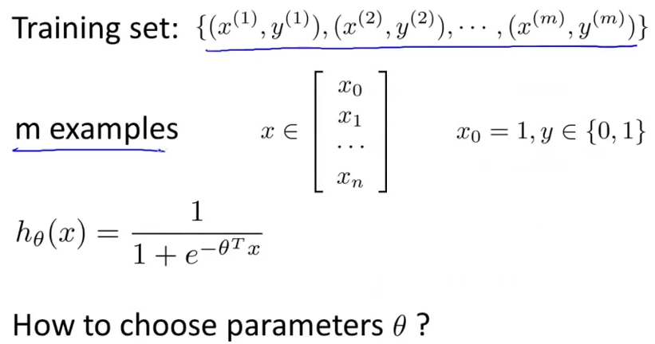

对于线性回归模型，我们定义的代价函数是所有模型误差的平方和。理论上来说，我们也可以对逻辑回归模型沿用这个定义，但是问题在于，当我们将${h_\theta}\left( x \right)=\frac{1}{1+{e^{-\theta^{T}x}}}$带入到这样定义了的代价函数中时，我们得到的代价函数将是一个非凸函数（**non-convexfunction**）。

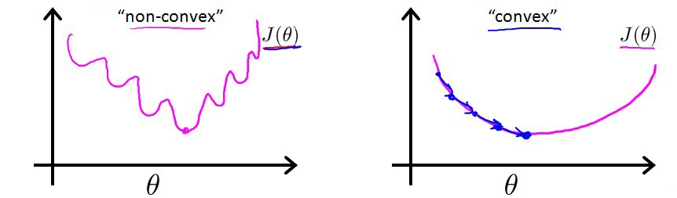

这意味着我们的代价函数有许多局部最小值，这将影响梯度下降算法寻找全局最小值。

线性回归的代价函数为：$J\left( \theta  \right)=\frac{1}{m}\sum\limits_{i=1}^{m}{\frac{1}{2}{{\left( {h_\theta}\left({x}^{\left( i \right)} \right)-{y}^{\left( i \right)} \right)}^{2}}}$ 。
我们重新定义逻辑回归的代价函数为：$J\left( \theta  \right)=\frac{1}{m}\sum\limits_{i=1}^{m}{{Cost}\left( {h_\theta}\left( {x}^{\left( i \right)} \right),{y}^{\left( i \right)} \right)}$，其中

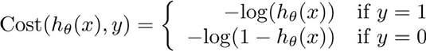

${h_\theta}\left( x \right)$与 $Cost\left( {h_\theta}\left( x \right),y \right)$之间的关系如下图所示：

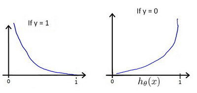

这样构建的$Cost\left( {h_\theta}\left( x \right),y \right)$函数的特点是：当实际的  $y=1$ 且${h_\theta}\left( x \right)$也为 1 时误差为 0，当 $y=1$ 但${h_\theta}\left( x \right)$不为1时误差随着${h_\theta}\left( x \right)$变小而变大；当实际的 $y=0$ 且${h_\theta}\left( x \right)$也为 0 时代价为 0，当$y=0$ 但${h_\theta}\left( x \right)$不为 0时误差随着 ${h_\theta}\left( x \right)$的变大而变大。
将构建的 $Cost\left( {h_\theta}\left( x \right),y \right)$简化如下： 
$Cost\left( {h_\theta}\left( x \right),y \right)=-y\times log\left( {h_\theta}\left( x \right) \right)-(1-y)\times log\left( 1-{h_\theta}\left( x \right) \right)$
带入代价函数得到：
$J\left( \theta  \right)=\frac{1}{m}\sum\limits_{i=1}^{m}{[-{{y}^{(i)}}\log \left( {h_\theta}\left( {{x}^{(i)}} \right) \right)-\left( 1-{{y}^{(i)}} \right)\log \left( 1-{h_\theta}\left( {{x}^{(i)}} \right) \right)]}$
即：$J\left( \theta  \right)=-\frac{1}{m}\sum\limits_{i=1}^{m}{[{{y}^{(i)}}\log \left( {h_\theta}\left( {{x}^{(i)}} \right) \right)+\left( 1-{{y}^{(i)}} \right)\log \left( 1-{h_\theta}\left( {{x}^{(i)}} \right) \right)]}$

**Python**代码实现：

```python
import numpy as np
    
def cost(theta, X, y):
    
  theta = np.matrix(theta)
  X = np.matrix(X)
  y = np.matrix(y)
  first = np.multiply(-y, np.log(sigmoid(X* theta.T)))
  second = np.multiply((1 - y), np.log(1 - sigmoid(X* theta.T)))
  return np.sum(first - second) / (len(X))
```

在得到这样一个代价函数以后，我们便可以用梯度下降算法来求得能使代价函数最小的参数了。算法为：

**Repeat** {
$\theta_j := \theta_j - \alpha \frac{\partial}{\partial\theta_j} J(\theta)$
(**simultaneously update all** )
}


求导后得到：

**Repeat** {
$\theta_j := \theta_j - \alpha \frac{1}{m}\sum\limits_{i=1}^{m}{{\left( {h_\theta}\left( \mathop{x}^{\left( i \right)} \right)-\mathop{y}^{\left( i \right)} \right)}}\mathop{x}_{j}^{(i)}$ 
**(simultaneously update all** )
}

在这个视频中，我们定义了单训练样本的代价函数，凸性分析的内容是超出这门课的范围的，但是可以证明我们所选的代价值函数会给我们一个凸优化问题。代价函数$J(\theta)$会是一个凸函数，并且没有局部最优值。

推导过程：

$J\left( \theta  \right)=-\frac{1}{m}\sum\limits_{i=1}^{m}{[{{y}^{(i)}}\log \left( {h_\theta}\left( {{x}^{(i)}} \right) \right)+\left( 1-{{y}^{(i)}} \right)\log \left( 1-{h_\theta}\left( {{x}^{(i)}} \right) \right)]}$
考虑：
${h_\theta}\left( {{x}^{(i)}} \right)=\frac{1}{1+{{e}^{-{\theta^T}{{x}^{(i)}}}}}$
则：
${{y}^{(i)}}\log \left( {h_\theta}\left( {{x}^{(i)}} \right) \right)+\left( 1-{{y}^{(i)}} \right)\log \left( 1-{h_\theta}\left( {{x}^{(i)}} \right) \right)$
$={{y}^{(i)}}\log \left( \frac{1}{1+{{e}^{-{\theta^T}{{x}^{(i)}}}}} \right)+\left( 1-{{y}^{(i)}} \right)\log \left( 1-\frac{1}{1+{{e}^{-{\theta^T}{{x}^{(i)}}}}} \right)$
$=-{{y}^{(i)}}\log \left( 1+{{e}^{-{\theta^T}{{x}^{(i)}}}} \right)-\left( 1-{{y}^{(i)}} \right)\log \left( 1+{{e}^{{\theta^T}{{x}^{(i)}}}} \right)$

所以：
$\frac{\partial }{\partial {\theta_{j}}}J\left( \theta  \right)=\frac{\partial }{\partial {\theta_{j}}}[-\frac{1}{m}\sum\limits_{i=1}^{m}{[-{{y}^{(i)}}\log \left( 1+{{e}^{-{\theta^{T}}{{x}^{(i)}}}} \right)-\left( 1-{{y}^{(i)}} \right)\log \left( 1+{{e}^{{\theta^{T}}{{x}^{(i)}}}} \right)]}]$
$=-\frac{1}{m}\sum\limits_{i=1}^{m}{[-{{y}^{(i)}}\frac{-x_{j}^{(i)}{{e}^{-{\theta^{T}}{{x}^{(i)}}}}}{1+{{e}^{-{\theta^{T}}{{x}^{(i)}}}}}-\left( 1-{{y}^{(i)}} \right)\frac{x_j^{(i)}{{e}^{{\theta^T}{{x}^{(i)}}}}}{1+{{e}^{{\theta^T}{{x}^{(i)}}}}}}]$
$=-\frac{1}{m}\sum\limits_{i=1}^{m}{{y}^{(i)}}\frac{x_j^{(i)}}{1+{{e}^{{\theta^T}{{x}^{(i)}}}}}-\left( 1-{{y}^{(i)}} \right)\frac{x_j^{(i)}{{e}^{{\theta^T}{{x}^{(i)}}}}}{1+{{e}^{{\theta^T}{{x}^{(i)}}}}}]$
$=-\frac{1}{m}\sum\limits_{i=1}^{m}{\frac{{{y}^{(i)}}x_j^{(i)}-x_j^{(i)}{{e}^{{\theta^T}{{x}^{(i)}}}}+{{y}^{(i)}}x_j^{(i)}{{e}^{{\theta^T}{{x}^{(i)}}}}}{1+{{e}^{{\theta^T}{{x}^{(i)}}}}}}$
$=-\frac{1}{m}\sum\limits_{i=1}^{m}{\frac{{{y}^{(i)}}\left( 1\text{+}{{e}^{{\theta^T}{{x}^{(i)}}}} \right)-{{e}^{{\theta^T}{{x}^{(i)}}}}}{1+{{e}^{{\theta^T}{{x}^{(i)}}}}}x_j^{(i)}}$
$=-\frac{1}{m}\sum\limits_{i=1}^{m}{({{y}^{(i)}}-\frac{{{e}^{{\theta^T}{{x}^{(i)}}}}}{1+{{e}^{{\theta^T}{{x}^{(i)}}}}})x_j^{(i)}}$
$=-\frac{1}{m}\sum\limits_{i=1}^{m}{({{y}^{(i)}}-\frac{1}{1+{{e}^{-{\theta^T}{{x}^{(i)}}}}})x_j^{(i)}}$
$=-\frac{1}{m}\sum\limits_{i=1}^{m}{[{{y}^{(i)}}-{h_\theta}\left( {{x}^{(i)}} \right)]x_j^{(i)}}$
$=\frac{1}{m}\sum\limits_{i=1}^{m}{[{h_\theta}\left( {{x}^{(i)}} \right)-{{y}^{(i)}}]x_j^{(i)}}$

注：虽然得到的梯度下降算法表面上看上去与线性回归的梯度下降算法一样，但是这里的${h_\theta}\left( x \right)=g\left( {\theta^T}X \right)$与线性回归中不同，所以实际上是不一样的。另外，在运行梯度下降算法之前，进行特征缩放依旧是非常必要的。

一些梯度下降算法之外的选择：
除了梯度下降算法以外，还有一些常被用来令代价函数最小的算法，这些算法更加复杂和优越，而且通常不需要人工选择学习率，通常比梯度下降算法要更加快速。这些算法有：**共轭梯度**（**Conjugate Gradient**），**局部优化法**(**Broyden fletcher goldfarb shann,BFGS**)和**有限内存局部优化法**(**LBFGS**) ，**fminunc**是 **matlab**和**octave** 中都带的一个最小值优化函数，使用时我们需要提供代价函数和每个参数的求导，下面是 **octave** 中使用 **fminunc** 函数的代码示例：

```octave
function [jVal, gradient] = costFunction(theta)

    jVal = [...code to compute J(theta)...];
    gradient = [...code to compute derivative of J(theta)...];
    
end
    
options = optimset('GradObj', 'on', 'MaxIter', '100');
    
initialTheta = zeros(2,1);
    
[optTheta, functionVal, exitFlag] = fminunc(@costFunction, initialTheta, options);
```

在下一个视频中，我们会把单训练样本的代价函数的这些理念进一步发展，然后给出整个训练集的代价函数的定义，我们还会找到一种比我们目前用的更简单的写法，基于这些推导出的结果，我们将应用梯度下降法得到我们的逻辑回归算法。

### 6.5 简化的成本函数和梯度下降

参考视频: 6 - 5 - Simplified Cost Function and Gradient Descent (10 min).mkv

在这段视频中，我们将会找出一种稍微简单一点的方法来写代价函数，来替换我们现在用的方法。同时我们还要弄清楚如何运用梯度下降法，来拟合出逻辑回归的参数。因此，听了这节课，你就应该知道如何实现一个完整的逻辑回归算法。

这就是逻辑回归的代价函数：

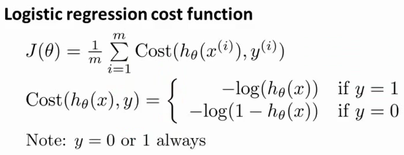

这个式子可以合并成：

$Cost\left( {h_\theta}\left( x \right),y \right)=-y\times log\left( {h_\theta}\left( x \right) \right)-(1-y)\times log\left( 1-{h_\theta}\left( x \right) \right)$
即，逻辑回归的代价函数：
$Cost\left( {h_\theta}\left( x \right),y \right)=-y\times log\left( {h_\theta}\left( x \right) \right)-(1-y)\times log\left( 1-{h_\theta}\left( x \right) \right)$
$=-\frac{1}{m}\sum\limits_{i=1}^{m}{[{{y}^{(i)}}\log \left( {h_\theta}\left( {{x}^{(i)}} \right) \right)+\left( 1-{{y}^{(i)}} \right)\log \left( 1-{h_\theta}\left( {{x}^{(i)}} \right) \right)]}$
根据这个代价函数，为了拟合出参数，该怎么做呢？我们要试图找尽量让$J\left( \theta  \right)$ 取得最小值的参数$\theta $。
$\underset{\theta}{\min }J\left( \theta  \right)$ 
所以我们想要尽量减小这一项，这将我们将得到某个参数$\theta $。
如果我们给出一个新的样本，假如某个特征 $x$，我们可以用拟合训练样本的参数$\theta $，来输出对假设的预测。
另外，我们假设的输出，实际上就是这个概率值：$p(y=1|x;\theta)$，就是关于 $x$以$\theta $为参数，$y=1$ 的概率，你可以认为我们的假设就是估计 $y=1$ 的概率，所以，接下来就是弄清楚如何最大限度地最小化代价函数$J\left( \theta  \right)$，作为一个关于$\theta $的函数，这样我们才能为训练集拟合出参数$\theta $。


最小化代价函数的方法，是使用**梯度下降法**(**gradient descent**)。这是我们的代价函数：
$J\left( \theta  \right)=-\frac{1}{m}\sum\limits_{i=1}^{m}{[{{y}^{(i)}}\log \left( {h_\theta}\left( {{x}^{(i)}} \right) \right)+\left( 1-{{y}^{(i)}} \right)\log \left( 1-{h_\theta}\left( {{x}^{(i)}} \right) \right)]}$


如果我们要最小化这个关于$\theta$的函数值，这就是我们通常用的梯度下降法的模板。


我们要反复更新每个参数，用这个式子来更新，就是用它自己减去学习率 $\alpha$
乘以后面的微分项。求导后得到：


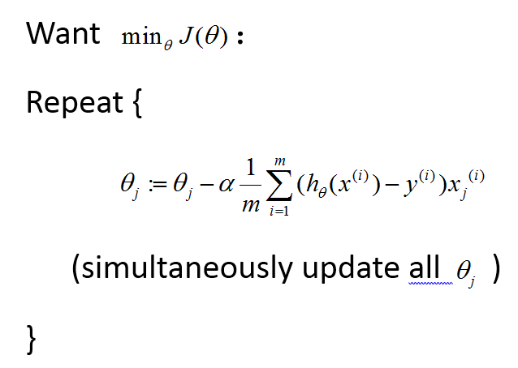


如果你计算一下的话，你会得到这个等式：
${\theta_j}:={\theta_j}-\alpha \frac{1}{m}\sum\limits_{i=1}^{m}{({h_\theta}({{x}^{(i)}})-{{y}^{(i)}}){x_{j}}^{(i)}}$
我把它写在这里，将后面这个式子，在 $i=1$  到 $m$ 上求和，其实就是预测误差乘以$x_j^{(i)}$ ，所以你把这个偏导数项$\frac{\partial }{\partial {\theta_j}}J\left( \theta  \right)$放回到原来式子这里，我们就可以将梯度下降算法写作如下形式：
${\theta_j}:={\theta_j}-\alpha \frac{1}{m}\sum\limits_{i=1}^{m}{({h_\theta}({{x}^{(i)}})-{{y}^{(i)}}){x_{j}}^{(i)}}$

所以，如果你有 $n$ 个特征，也就是说：，参数向量$\theta $包括${\theta_{0}}$ ${\theta_{1}}$ ${\theta_{2}}$ 一直到${\theta_{n}}$，那么你就需要用这个式子：


${\theta_j}:={\theta_j}-\alpha \frac{1}{m}\sum\limits_{i=1}^{m}{({h_\theta}({{x}^{(i)}})-{{y}^{(i)}}){{x}_{j}}^{(i)}}$来同时更新所有$\theta $的值。


现在，如果你把这个更新规则和我们之前用在线性回归上的进行比较的话，你会惊讶地发现，这个式子正是我们用来做线性回归梯度下降的。

那么，线性回归和逻辑回归是同一个算法吗？要回答这个问题，我们要观察逻辑回归看看发生了哪些变化。实际上，假设的定义发生了变化。

对于线性回归假设函数：

${h_\theta}\left( x \right)={\theta^T}X={\theta_{0}}{x_{0}}+{\theta_{1}}{x_{1}}+{\theta_{2}}{x_{2}}+...+{\theta_{n}}{x_{n}}$

而现在逻辑函数假设函数：

${h_\theta}\left( x \right)=\frac{1}{1+{{e}^{-{\theta^T}X}}}$

因此，即使更新参数的规则看起来基本相同，但由于假设的定义发生了变化，所以逻辑函数的梯度下降，跟线性回归的梯度下降实际上是两个完全不同的东西。

在先前的视频中，当我们在谈论线性回归的梯度下降法时，我们谈到了如何监控梯度下降法以确保其收敛，我通常也把同样的方法用在逻辑回归中，来监测梯度下降，以确保它正常收敛。

当使用梯度下降法来实现逻辑回归时，我们有这些不同的参数$\theta $，就是${\theta_{0}}$ ${\theta_{1}}$ ${\theta_{2}}$ 一直到${\theta_{n}}$，我们需要用这个表达式来更新这些参数。我们还可以使用 **for循环**来更新这些参数值，用 `for i=1 to n`，或者 `for i=1 to n+1`。当然，不用 **for循环**也是可以的，理想情况下，我们更提倡使用向量化的实现，可以把所有这些 $n$个参数同时更新。

最后还有一点，我们之前在谈线性回归时讲到的特征缩放，我们看到了特征缩放是如何提高梯度下降的收敛速度的，这个特征缩放的方法，也适用于逻辑回归。如果你的特征范围差距很大的话，那么应用特征缩放的方法，同样也可以让逻辑回归中，梯度下降收敛更快。

就是这样，现在你知道如何实现逻辑回归，这是一种非常强大，甚至可能世界上使用最广泛的一种分类算法。

### 6.6 高级优化

参考视频: 6 - 6 - Advanced Optimization (14 min).mkv

在上一个视频中，我们讨论了用梯度下降的方法最小化逻辑回归中代价函数$J\left( \theta  \right)$。在本次视频中，我会教你们一些高级优化算法和一些高级的优化概念，利用这些方法，我们就能够使通过梯度下降，进行逻辑回归的速度大大提高，而这也将使算法更加适合解决大型的机器学习问题，比如，我们有数目庞大的特征量。
现在我们换个角度来看什么是梯度下降，我们有个代价函数$J\left( \theta  \right)$，而我们想要使其最小化，那么我们需要做的是编写代码，当输入参数 $\theta$ 时，它们会计算出两样东西：$J\left( \theta  \right)$ 以及$J$ 等于 0、1直到 $n$ 时的偏导数项。


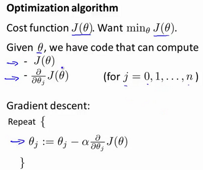

假设我们已经完成了可以实现这两件事的代码，那么梯度下降所做的就是反复执行这些更新。
另一种考虑梯度下降的思路是：我们需要写出代码来计算$J\left( \theta  \right)$ 和这些偏导数，然后把这些插入到梯度下降中，然后它就可以为我们最小化这个函数。
对于梯度下降来说，我认为从技术上讲，你实际并不需要编写代码来计算代价函数$J\left( \theta  \right)$。你只需要编写代码来计算导数项，但是，如果你希望代码还要能够监控这些$J\left( \theta  \right)$ 的收敛性，那么我们就需要自己编写代码来计算代价函数$J(\theta)$和偏导数项$\frac{\partial }{\partial {\theta_j}}J\left( \theta  \right)$。所以，在写完能够计算这两者的代码之后，我们就可以使用梯度下降。
然而梯度下降并不是我们可以使用的唯一算法，还有其他一些算法，更高级、更复杂。如果我们能用这些方法来计算代价函数$J\left( \theta  \right)$和偏导数项$\frac{\partial }{\partial {\theta_j}}J\left( \theta  \right)$两个项的话，那么这些算法就是为我们优化代价函数的不同方法，**共轭梯度法 BFGS** (**变尺度法**) 和**L-BFGS** (**限制变尺度法**) 就是其中一些更高级的优化算法，它们需要有一种方法来计算 $J\left( \theta  \right)$，以及需要一种方法计算导数项，然后使用比梯度下降更复杂的算法来最小化代价函数。这三种算法的具体细节超出了本门课程的范畴。实际上你最后通常会花费很多天，或几周时间研究这些算法，你可以专门学一门课来提高数值计算能力，不过让我来告诉你他们的一些特性：

这三种算法有许多优点：

一个是使用这其中任何一个算法，你通常不需要手动选择学习率 $\alpha$，所以对于这些算法的一种思路是，给出计算导数项和代价函数的方法，你可以认为算法有一个智能的内部循环，而且，事实上，他们确实有一个智能的内部循环，称为**线性搜索**(**line search**)算法，它可以自动尝试不同的学习速率 $\alpha$，并自动选择一个好的学习速率 $a$，因此它甚至可以为每次迭代选择不同的学习速率，那么你就不需要自己选择。这些算法实际上在做更复杂的事情，不仅仅是选择一个好的学习速率，所以它们往往最终比梯度下降收敛得快多了，不过关于它们到底做什么的详细讨论，已经超过了本门课程的范围。

实际上，我过去使用这些算法已经很长一段时间了，也许超过十年了，使用得相当频繁，而直到几年前我才真正搞清楚**共轭梯度法 BFGS** 和 **L-BFGS**的细节。

我们实际上完全有可能成功使用这些算法，并应用于许多不同的学习问题，而不需要真正理解这些算法的内环间在做什么，如果说这些算法有缺点的话，那么我想说主要缺点是它们比梯度下降法复杂多了，特别是你最好不要使用 **L-BGFS**、**BFGS**这些算法，除非你是数值计算方面的专家。实际上，我不会建议你们编写自己的代码来计算数据的平方根，或者计算逆矩阵，因为对于这些算法，我还是会建议你直接使用一个软件库，比如说，要求一个平方根，我们所能做的就是调用一些别人已经写好用来计算数字平方根的函数。幸运的是现在我们有**Octave** 和与它密切相关的 **MATLAB** 语言可以使用。

**Octave** 有一个非常理想的库用于实现这些先进的优化算法，所以，如果你直接调用它自带的库，你就能得到不错的结果。我必须指出这些算法实现得好或不好是有区别的，因此，如果你正在你的机器学习程序中使用一种不同的语言，比如如果你正在使用**C**、**C++**、**Java**等等，你可能会想尝试一些不同的库，以确保你找到一个能很好实现这些算法的库。因为在**L-BFGS**或者等高线梯度的实现上，表现得好与不太好是有差别的，因此现在让我们来说明：如何使用这些算法：

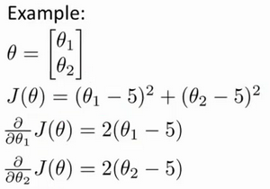

比方说，你有一个含两个参数的问题，这两个参数是${\theta_{0}}$和${\theta_{1}}$，因此，通过这个代价函数，你可以得到${\theta_{1}}$和 ${\theta_{2}}$的值，如果你将$J\left( \theta  \right)$ 最小化的话，那么它的最小值将是${\theta_{1}}=5$ ，${\theta_{2}}=5$。代价函数$J\left( \theta  \right)$的导数推出来就是这两个表达式：

$\frac{\partial }{\partial {{\theta }_{1}}}J(\theta)=2({{\theta }_{1}}-5)$

$\frac{\partial }{\partial {{\theta }_{2}}}J(\theta)=2({{\theta }_{2}}-5)$

如果我们不知道最小值，但你想要代价函数找到这个最小值，是用比如梯度下降这些算法，但最好是用比它更高级的算法，你要做的就是运行一个像这样的**Octave** 函数：

```octave
function [jVal, gradient]=costFunction(theta)
    
　　jVal=(theta(1)-5)^2+(theta(2)-5)^2;
    
　　gradient=zeros(2,1);
    
　　gradient(1)=2*(theta(1)-5);
    
　　gradient(2)=2*(theta(2)-5);
    
end
```

这样就计算出这个代价函数，函数返回的第二个值是梯度值，梯度值应该是一个2×1的向量，梯度向量的两个元素对应这里的两个偏导数项，运行这个**costFunction** 函数后，你就可以调用高级的优化函数，这个函数叫
**fminunc**，它表示**Octave** 里无约束最小化函数。调用它的方式如下：

```octave
options=optimset('GradObj','on','MaxIter',100);

initialTheta=zeros(2,1);
    
[optTheta, functionVal, exitFlag]=fminunc(@costFunction, initialTheta, options);
```

你要设置几个**options**，这个 **options** 变量作为一个数据结构可以存储你想要的**options**，所以 **GradObj** 和**On**，这里设置梯度目标参数为打开(**on**)，这意味着你现在确实要给这个算法提供一个梯度，然后设置最大迭代次数，比方说100，我们给出一个$\theta$ 的猜测初始值，它是一个2×1的向量，那么这个命令就调用**fminunc**，这个@符号表示指向我们刚刚定义的**costFunction** 函数的指针。如果你调用它，它就会使用众多高级优化算法中的一个，当然你也可以把它当成梯度下降，只不过它能自动选择学习速率$\alpha$，你不需要自己来做。然后它会尝试使用这些高级的优化算法，就像加强版的梯度下降法，为你找到最佳的${\theta}$值。

让我告诉你它在 **Octave** 里什么样：

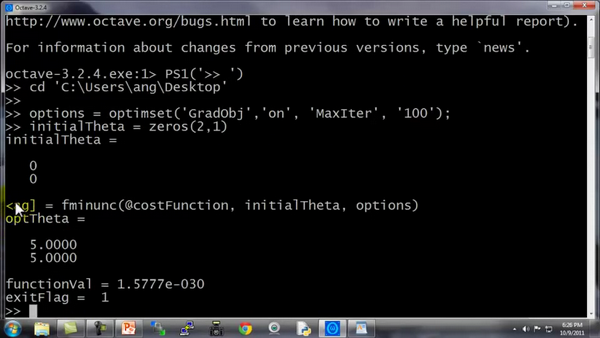

所以我写了这个关于**theta**的 **costFunction** 函数，它计算出代价函数 **jval**以及梯度**gradient**，**gradient** 有两个元素，是代价函数对于**theta(1)** 和 **theta(2)**这两个参数的偏导数。

我希望你们从这个幻灯片中学到的主要内容是：写一个函数，它能返回代价函数值、梯度值，因此要把这个应用到逻辑回归，或者甚至线性回归中，你也可以把这些优化算法用于线性回归，你需要做的就是输入合适的代码来计算这里的这些东西。

现在你已经知道如何使用这些高级的优化算法，有了这些算法，你就可以使用一个复杂的优化库，它让算法使用起来更模糊一点。因此也许稍微有点难调试，不过由于这些算法的运行速度通常远远超过梯度下降。

所以当我有一个很大的机器学习问题时，我会选择这些高级算法，而不是梯度下降。有了这些概念，你就应该能将逻辑回归和线性回归应用于更大的问题中，这就是高级优化的概念。

在下一个视频，我想要告诉你如何修改你已经知道的逻辑回归算法，然后使它在多类别分类问题中也能正常运行。

### 6.7 多类别分类：一对多

参考视频: 6 - 7 - Multiclass Classification\_ One-vs-all (6 min).mkv

在本节视频中，我们将谈到如何使用逻辑回归 (**logistic regression**)来解决多类别分类问题，具体来说，我想通过一个叫做"一对多" (**one-vs-all**) 的分类算法。

先看这样一些例子。

第一个例子：假如说你现在需要一个学习算法能自动地将邮件归类到不同的文件夹里，或者说可以自动地加上标签，那么，你也许需要一些不同的文件夹，或者不同的标签来完成这件事，来区分开来自工作的邮件、来自朋友的邮件、来自家人的邮件或者是有关兴趣爱好的邮件，那么，我们就有了这样一个分类问题：其类别有四个，分别用$y=1$、$y=2$、$y=3$、$y=4$ 来代表。

第二个例子是有关药物诊断的，如果一个病人因为鼻塞来到你的诊所，他可能并没有生病，用 $y=1$ 这个类别来代表；或者患了感冒，用 $y=2$ 来代表；或者得了流感用$y=3$来代表。

第三个例子：如果你正在做有关天气的机器学习分类问题，那么你可能想要区分哪些天是晴天、多云、雨天、或者下雪天，对上述所有的例子，$y$ 可以取一个很小的数值，一个相对"谨慎"的数值，比如1 到3、1到4或者其它数值，以上说的都是多类分类问题，顺便一提的是，对于下标是0 1 2 3，还是 1 2 3 4 都不重要，我更喜欢将分类从 1 开始标而不是0，其实怎样标注都不会影响最后的结果。

然而对于之前的一个，二元分类问题，我们的数据看起来可能是像这样：

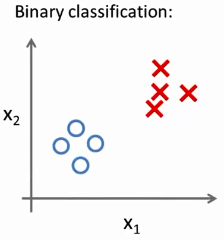

对于一个多类分类问题，我们的数据集或许看起来像这样：

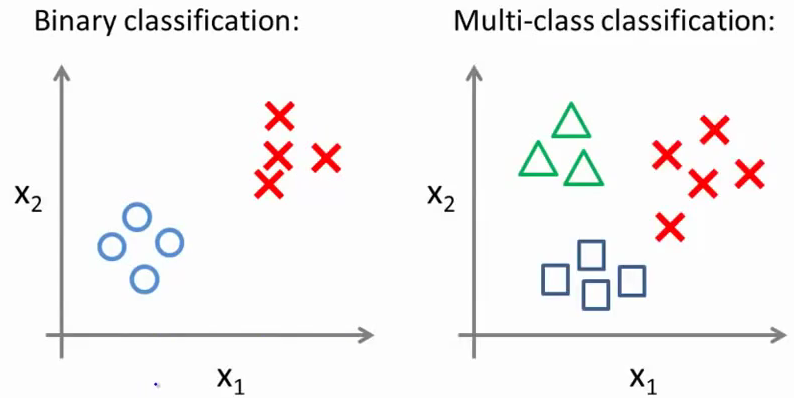

我用3种不同的符号来代表3个类别，问题就是给出3个类型的数据集，我们如何得到一个学习算法来进行分类呢？

我们现在已经知道如何进行二元分类，可以使用逻辑回归，对于直线或许你也知道，可以将数据集一分为二为正类和负类。用一对多的分类思想，我们可以将其用在多类分类问题上。

下面将介绍如何进行一对多的分类工作，有时这个方法也被称为"一对余"方法。

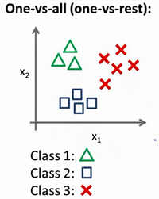

现在我们有一个训练集，好比上图表示的有3个类别，我们用三角形表示 $y=1$，方框表示$y=2$，叉叉表示 $y=3$。我们下面要做的就是使用一个训练集，将其分成3个二元分类问题。

我们先从用三角形代表的类别1开始，实际上我们可以创建一个，新的"伪"训练集，类型2和类型3定为负类，类型1设定为正类，我们创建一个新的训练集，如下图所示的那样，我们要拟合出一个合适的分类器。

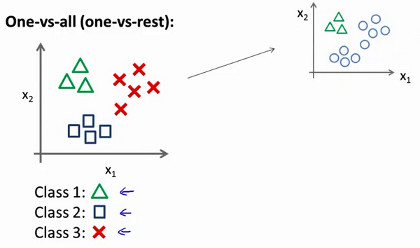

这里的三角形是正样本，而圆形代表负样本。可以这样想，设置三角形的值为1，圆形的值为0，下面我们来训练一个标准的逻辑回归分类器，这样我们就得到一个正边界。

为了能实现这样的转变，我们将多个类中的一个类标记为正向类（$y=1$），然后将其他所有类都标记为负向类，这个模型记作$h_\theta^{\left( 1 \right)}\left( x \right)$。接着，类似地第我们选择另一个类标记为正向类（$y=2$），再将其它类都标记为负向类，将这个模型记作 $h_\theta^{\left( 2 \right)}\left( x \right)$,依此类推。
最后我们得到一系列的模型简记为： $h_\theta^{\left( i \right)}\left( x \right)=p\left( y=i|x;\theta  \right)$其中：$i=\left( 1,2,3....k \right)$ 


最后，在我们需要做预测时，我们将所有的分类机都运行一遍，然后对每一个输入变量，都选择最高可能性的输出变量。

总之，我们已经把要做的做完了，现在要做的就是训练这个逻辑回归分类器：$h_\theta^{\left( i \right)}\left( x \right)$， 其中 $i$ 对应每一个可能的 $y=i$，最后，为了做出预测，我们给出输入一个新的 $x$ 值，用这个做预测。我们要做的就是在我们三个分类器里面输入 $x$，然后我们选择一个让 $h_\theta^{\left( i \right)}\left( x \right)$ 最大的$ i$，即$\mathop{\max}\limits_i\,h_\theta^{\left( i \right)}\left( x \right)$。

你现在知道了基本的挑选分类器的方法，选择出哪一个分类器是可信度最高效果最好的，那么就可认为得到一个正确的分类，无论$i$值是多少，我们都有最高的概率值，我们预测$y$就是那个值。这就是多类别分类问题，以及一对多的方法，通过这个小方法，你现在也可以将逻辑回归分类器用在多类分类的问题上。

七、正则化(Regularization)
--------------------------

### 7.1 过拟合的问题

参考视频: 7 - 1 - The Problem of Overfitting (10 min).mkv

到现在为止，我们已经学习了几种不同的学习算法，包括线性回归和逻辑回归，它们能够有效地解决许多问题，但是当将它们应用到某些特定的机器学习应用时，会遇到过拟合(**over-fitting**)的问题，可能会导致它们效果很差。

在这段视频中，我将为你解释什么是过度拟合问题，并且在此之后接下来的几个视频中，我们将谈论一种称为正则化(**regularization**)的技术，它可以改善或者减少过度拟合问题。

如果我们有非常多的特征，我们通过学习得到的假设可能能够非常好地适应训练集（代价函数可能几乎为0），但是可能会不能推广到新的数据。

下图是一个回归问题的例子：


第一个模型是一个线性模型，欠拟合，不能很好地适应我们的训练集；第三个模型是一个四次方的模型，过于强调拟合原始数据，而丢失了算法的本质：预测新数据。我们可以看出，若给出一个新的值使之预测，它将表现的很差，是过拟合，虽然能非常好地适应我们的训练集但在新输入变量进行预测时可能会效果不好；而中间的模型似乎最合适。

分类问题中也存在这样的问题：


就以多项式理解，$x$ 的次数越高，拟合的越好，但相应的预测的能力就可能变差。

问题是，如果我们发现了过拟合问题，应该如何处理？

1. 丢弃一些不能帮助我们正确预测的特征。可以是手工选择保留哪些特征，或者使用一些模型选择的算法来帮忙（例如**PCA**）

2. 正则化。 保留所有的特征，但是减少参数的大小（**magnitude**）。

### 7.2 代价函数

参考视频: 7 - 2 - Cost Function (10 min).mkv

上面的回归问题中如果我们的模型是：
${h_\theta}\left( x \right)={\theta_{0}}+{\theta_{1}}{x_{1}}+{\theta_{2}}{x_{2}^2}+{\theta_{3}}{x_{3}^3}+{\theta_{4}}{x_{4}^4}$
我们可以从之前的事例中看出，正是那些高次项导致了过拟合的产生，所以如果我们能让这些高次项的系数接近于0的话，我们就能很好的拟合了。
所以我们要做的就是在一定程度上减小这些参数$\theta $ 的值，这就是正则化的基本方法。我们决定要减少${\theta_{3}}$和${\theta_{4}}$的大小，我们要做的便是修改代价函数，在其中${\theta_{3}}$和${\theta_{4}}$ 设置一点惩罚。这样做的话，我们在尝试最小化代价时也需要将这个惩罚纳入考虑中，并最终导致选择较小一些的${\theta_{3}}$和${\theta_{4}}$。
修改后的代价函数如下：$\underset{\theta }{\mathop{\min }}\,\frac{1}{2m}[\sum\limits_{i=1}^{m}{{{\left( {{h}_{\theta }}\left( {{x}^{(i)}} \right)-{{y}^{(i)}} \right)}^{2}}+1000\theta _{3}^{2}+10000\theta _{4}^{2}]}$

通过这样的代价函数选择出的${\theta_{3}}$和${\theta_{4}}$ 对预测结果的影响就比之前要小许多。假如我们有非常多的特征，我们并不知道其中哪些特征我们要惩罚，我们将对所有的特征进行惩罚，并且让代价函数最优化的软件来选择这些惩罚的程度。这样的结果是得到了一个较为简单的能防止过拟合问题的假设：$J\left( \theta  \right)=\frac{1}{2m}[\sum\limits_{i=1}^{m}{{{({h_\theta}({{x}^{(i)}})-{{y}^{(i)}})}^{2}}+\lambda \sum\limits_{j=1}^{n}{\theta_{j}^{2}}]}$

其中$\lambda $又称为正则化参数（**Regularization Parameter**）。 注：根据惯例，我们不对${\theta_{0}}$ 进行惩罚。经过正则化处理的模型与原模型的可能对比如下图所示：

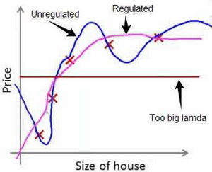

如果选择的正则化参数$\lambda$ 过大，则会把所有的参数都最小化了，导致模型变成 ${h_\theta}\left( x \right)={\theta_{0}}$，也就是上图中红色直线所示的情况，造成欠拟合。
那为什么增加的一项$\lambda =\sum\limits_{j=1}^{n}{\theta_j^{2}}$ 可以使$\theta $的值减小呢？
因为如果我们令 $\lambda$ 的值很大的话，为了使**Cost Function** 尽可能的小，所有的 $\theta $ 的值（不包括${\theta_{0}}$）都会在一定程度上减小。
但若$\lambda$ 的值太大了，那么$\theta $（不包括${\theta_{0}}$）都会趋近于0，这样我们所得到的只能是一条平行于$x$轴的直线。
所以对于正则化，我们要取一个合理的 $\lambda$ 的值，这样才能更好的应用正则化。
回顾一下代价函数，为了使用正则化，让我们把这些概念应用到到线性回归和逻辑回归中去，那么我们就可以让他们避免过度拟合了。


### 7.3 正则化线性回归

参考视频: 7 - 3 - Regularized Linear Regression (11 min).mkv

对于线性回归的求解，我们之前推导了两种学习算法：一种基于梯度下降，一种基于正规方程。

正则化线性回归的代价函数为：

$J\left( \theta  \right)=\frac{1}{2m}\sum\limits_{i=1}^{m}{[({{({h_\theta}({{x}^{(i)}})-{{y}^{(i)}})}^{2}}+\lambda \sum\limits_{j=1}^{n}{\theta _{j}^{2}})]}$

如果我们要使用梯度下降法令这个代价函数最小化，因为我们未对$\theta_0​$进行正则化，所以梯度下降算法将分两种情形：

$Repeat$  $until$  $convergence${

​                                                   ${\theta_0}:={\theta_0}-a\frac{1}{m}\sum\limits_{i=1}^{m}{(({h_\theta}({{x}^{(i)}})-{{y}^{(i)}})x_{0}^{(i)}})$ 

​                                                   ${\theta_j}:={\theta_j}-a[\frac{1}{m}\sum\limits_{i=1}^{m}{(({h_\theta}({{x}^{(i)}})-{{y}^{(i)}})x_{j}^{\left( i \right)}}+\frac{\lambda }{m}{\theta_j}]$ 

​                                                             $for$ $j=1,2,...n$

​                                                   }


对上面的算法中$ j=1,2,...,n$ 时的更新式子进行调整可得：

${\theta_j}:={\theta_j}(1-a\frac{\lambda }{m})-a\frac{1}{m}\sum\limits_{i=1}^{m}{({h_\theta}({{x}^{(i)}})-{{y}^{(i)}})x_{j}^{\left( i \right)}}​$ 
可以看出，正则化线性回归的梯度下降算法的变化在于，每次都在原有算法更新规则的基础上令$\theta $值减少了一个额外的值。

我们同样也可以利用正规方程来求解正则化线性回归模型，方法如下所示：

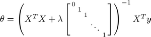

图中的矩阵尺寸为 $(n+1)*(n+1)$。

### 7.4 正则化的逻辑回归模型

参考视频: 7 - 4 - Regularized Logistic Regression (9 min).mkv

针对逻辑回归问题，我们在之前的课程已经学习过两种优化算法：我们首先学习了使用梯度下降法来优化代价函数$J\left( \theta  \right)$，接下来学习了更高级的优化算法，这些高级优化算法需要你自己设计代价函数$J\left( \theta  \right)$。

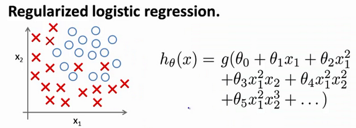

自己计算导数同样对于逻辑回归，我们也给代价函数增加一个正则化的表达式，得到代价函数：

$J\left( \theta  \right)=\frac{1}{m}\sum\limits_{i=1}^{m}{[-{{y}^{(i)}}\log \left( {h_\theta}\left( {{x}^{(i)}} \right) \right)-\left( 1-{{y}^{(i)}} \right)\log \left( 1-{h_\theta}\left( {{x}^{(i)}} \right) \right)]}+\frac{\lambda }{2m}\sum\limits_{j=1}^{n}{\theta _{j}^{2}}$

**Python**代码：

```python
import numpy as np

def costReg(theta, X, y, learningRate):
    theta = np.matrix(theta)
    X = np.matrix(X)
    y = np.matrix(y)
    first = np.multiply(-y, np.log(sigmoid(X*theta.T)))
    second = np.multiply((1 - y), np.log(1 - sigmoid(X*theta.T)))
    reg = (learningRate / (2 * len(X))* np.sum(np.power(theta[:,1:theta.shape[1]],2))
    return np.sum(first - second) / (len(X)) + reg
```

要最小化该代价函数，通过求导，得出梯度下降算法为：

$Repeat$  $until$  $convergence${

​                                                   ${\theta_0}:={\theta_0}-a\frac{1}{m}\sum\limits_{i=1}^{m}{(({h_\theta}({{x}^{(i)}})-{{y}^{(i)}})x_{0}^{(i)}})$

​                                                  ${\theta_j}:={\theta_j}-a[\frac{1}{m}\sum\limits_{i=1}^{m}{({h_\theta}({{x}^{(i)}})-{{y}^{(i)}})x_{j}^{\left( i \right)}}+\frac{\lambda }{m}{\theta_j}]$

​                                                 $for$ $j=1,2,...n$

​                                                 }

注：看上去同线性回归一样，但是知道 ${h_\theta}\left( x \right)=g\left( {\theta^T}X \right)​$，所以与线性回归不同。
**Octave** 中，我们依旧可以用 `fminuc` 函数来求解代价函数最小化的参数，值得注意的是参数${\theta_{0}}​$的更新规则与其他情况不同。
注意：

1. 虽然正则化的逻辑回归中的梯度下降和正则化的线性回归中的表达式看起来一样，但由于两者的${h_\theta}\left( x \right)​$不同所以还是有很大差别。

2. ${\theta_{0}}$不参与其中的任何一个正则化。

目前大家对机器学习算法可能还只是略懂，但是一旦你精通了线性回归、高级优化算法和正则化技术，坦率地说，你对机器学习的理解可能已经比许多工程师深入了。现在，你已经有了丰富的机器学习知识，目测比那些硅谷工程师还厉害，或者用机器学习算法来做产品。

接下来的课程中，我们将学习一个非常强大的非线性分类器，无论是线性回归问题，还是逻辑回归问题，都可以构造多项式来解决。你将逐渐发现还有更强大的非线性分类器，可以用来解决多项式回归问题。我们接下来将将学会，比现在解决问题的方法强大N倍的学习算法。
