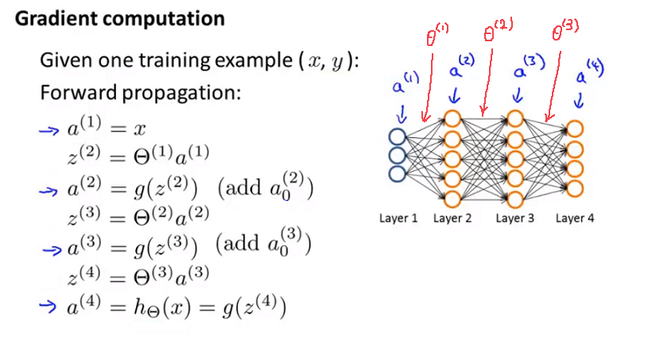

第5周
=====
[TOC]

九、神经网络的学习(Neural Networks: Learning)
---------------------------------------------

### 9.1 代价函数

参考视频: 9 - 1 - Cost Function (7 min).mkv

首先引入一些便于稍后讨论的新标记方法：

假设神经网络的训练样本有$m$个，每个包含一组输入$x$和一组输出信号$y$，$L$表示神经网络层数，$S_I$表示每层的**neuron**个数($S_l$表示输出层神经元个数)，$S_L$代表最后一层中处理单元的个数。

将神经网络的分类定义为两种情况：二类分类和多类分类，

二类分类：$S_L=0, y=0\, or\, 1$表示哪一类；

$K$类分类：$S_L=k, y_i = 1$表示分到第$i$类；$(k>2)$


我们回顾逻辑回归问题中我们的代价函数为：

$  J\left(\theta \right)=-\frac{1}{m}\left[\sum_\limits{i=1}^{m}{y}^{(i)}\log{h_\theta({x}^{(i)})}+\left(1-{y}^{(i)}\right)log\left(1-h_\theta\left({x}^{(i)}\right)\right)\right]+\frac{\lambda}{2m}\sum_\limits{j=1}^{n}{\theta_j}^{2}  $

在逻辑回归中，我们只有一个输出变量，又称标量（**scalar**），也只有一个因变量$y$，但是在神经网络中，我们可以有很多输出变量，我们的$h_\theta(x)$是一个维度为$K$的向量，并且我们训练集中的因变量也是同样维度的一个向量，因此我们的代价函数会比逻辑回归更加复杂一些，为：$\newcommand{\subk}[1]{ #1_k }$
$$h_\theta\left(x\right)\in \mathbb{R}^{K}$$ $${\left({h_\theta}\left(x\right)\right)}_{i}={i}^{th} \text{output}$$

$J(\Theta) = -\frac{1}{m} \left[ \sum\limits_{i=1}^{m} \sum\limits_{k=1}^{k} {y_k}^{(i)} \log \subk{(h_\Theta(x^{(i)}))} + \left( 1 - y_k^{(i)} \right) \log \left( 1- \subk{\left( h_\Theta \left( x^{(i)} \right) \right)} \right) \right] + \frac{\lambda}{2m} \sum\limits_{l=1}^{L-1} \sum\limits_{i=1}^{s_l} \sum\limits_{j=1}^{s_{l+1}} \left( \Theta_{ji}^{(l)} \right)^2$

这个看起来复杂很多的代价函数背后的思想还是一样的，我们希望通过代价函数来观察算法预测的结果与真实情况的误差有多大，唯一不同的是，对于每一行特征，我们都会给出$K​$个预测，基本上我们可以利用循环，对每一行特征都预测$K​$个不同结果，然后在利用循环在$K​$个预测中选择可能性最高的一个，将其与$y​$中的实际数据进行比较。

正则化的那一项只是排除了每一层$\theta_0$后，每一层的$\theta$ 矩阵的和。最里层的循环$j$循环所有的行（由$s_{l+1}$  层的激活单元数决定），循环$i$则循环所有的列，由该层（$s_l$层）的激活单元数所决定。即：$h_\theta(x)$与真实值之间的距离为每个样本-每个类输出的加和，对参数进行**regularization**的**bias**项处理所有参数的平方和。

### 9.2 反向传播算法

参考视频: 9 - 2 - Backpropagation Algorithm (12 min).mkv

之前我们在计算神经网络预测结果的时候我们采用了一种正向传播方法，我们从第一层开始正向一层一层进行计算，直到最后一层的$h_{\theta}\left(x\right)$。

现在，为了计算代价函数的偏导数$\frac{\partial}{\partial\Theta^{(l)}_{ij}}J\left(\Theta\right)$，我们需要采用一种反向传播算法，也就是首先计算最后一层的误差，然后再一层一层反向求出各层的误差，直到倒数第二层。
以一个例子来说明反向传播算法。

假设我们的训练集只有一个样本$\left({x}^{(1)},{y}^{(1)}\right)$，我们的神经网络是一个四层的神经网络，其中$K=4，S_{L}=4，L=4$：

前向传播算法：



下面的公式推导过程见：<https://blog.csdn.net/qq_29762941/article/details/80343185>

我们从最后一层的误差开始计算，误差是激活单元的预测（${a^{(4)}}$）与实际值（$y^k$）之间的误差，（$k=1:k$）。
我们用$\delta$来表示误差，则：$\delta^{(4)}=a^{(4)}-y$
我们利用这个误差值来计算前一层的误差：$\delta^{(3)}=\left({\Theta^{(3)}}\right)^{T}\delta^{(4)}\ast g'\left(z^{(3)}\right)$
其中 $g'(z^{(3)})$是 $S$ 形函数的导数，$g'(z^{(3)})=a^{(3)}\ast(1-a^{(3)})$。而$(θ^{(3)})^{T}\delta^{(4)}$则是权重导致的误差的和。下一步是继续计算第二层的误差：
$ \delta^{(2)}=(\Theta^{(2)})^{T}\delta^{(3)}\ast g'(z^{(2)})$
因为第一层是输入变量，不存在误差。我们有了所有的误差的表达式后，便可以计算代价函数的偏导数了，假设$λ=0$，即我们不做任何正则化处理时有：
$\frac{\partial}{\partial\Theta_{ij}^{(l)}}J(\Theta)=a_{j}^{(l)} \delta_{i}^{l+1}$

重要的是清楚地知道上面式子中上下标的含义：

$l$ 代表目前所计算的是第几层。

$j$ 代表目前计算层中的激活单元的下标，也将是下一层的第$j$个输入变量的下标。

$i$ 代表下一层中误差单元的下标，是受到权重矩阵中第$i$行影响的下一层中的误差单元的下标。

如果我们考虑正则化处理，并且我们的训练集是一个特征矩阵而非向量。在上面的特殊情况中，我们需要计算每一层的误差单元来计算代价函数的偏导数。在更为一般的情况中，我们同样需要计算每一层的误差单元，但是我们需要为整个训练集计算误差单元，此时的误差单元也是一个矩阵，我们用$\Delta^{(l)}_{ij}$来表示这个误差矩阵。第 $l$  层的第 $i$ 个激活单元受到第 $j$ 个参数影响而导致的误差。

我们的算法表示为：


即首先用正向传播方法计算出每一层的激活单元，利用训练集的结果与神经网络预测的结果求出最后一层的误差，然后利用该误差运用反向传播法计算出直至第二层的所有误差。

在求出了$\Delta_{ij}^{(l)}$之后，我们便可以计算代价函数的偏导数了，计算方法如下：
$ D_{ij}^{(l)} :=\frac{1}{m}\Delta_{ij}^{(l)}+\lambda\Theta_{ij}^{(l)}$              ${if}\; j \neq  0$

$ D_{ij}^{(l)} :=\frac{1}{m}\Delta_{ij}^{(l)}$                             ${if}\; j = 0$

在**Octave** 中，如果我们要使用 `fminuc`这样的优化算法来求解求出权重矩阵，我们需要将矩阵首先展开成为向量，在利用算法求出最优解后再重新转换回矩阵。

假设我们有三个权重矩阵，Theta1，Theta2 和 Theta3，尺寸分别为 10\*11，10\*11 和1*11，
下面的代码可以实现这样的转换：

```
thetaVec = [Theta1(:) ; Theta2(:) ; Theta3(:)]

...optimization using functions like fminuc...

Theta1 = reshape(thetaVec(1:110, 10, 11);

Theta2 = reshape(thetaVec(111:220, 10, 11);

Theta1 = reshape(thetaVec(221:231, 1, 11);
```


### 9.3 反向传播算法的直观理解

参考视频: 9 - 3 - Backpropagation Intuition (13 min).mkv

在上一段视频中，我们介绍了反向传播算法，对很多人来说，当第一次看到这种算法时，第一印象通常是，这个算法需要那么多繁杂的步骤，简直是太复杂了，实在不知道这些步骤，到底应该如何合在一起使用。就好像一个黑箱，里面充满了复杂的步骤。如果你对反向传播算法也有这种感受的话，这其实是正常的，相比于线性回归算法和逻辑回归算法而言，从数学的角度上讲，反向传播算法似乎并不简洁，对于反向传播这种算法，其实我已经使用了很多年了，但即便如此，即使是现在，我也经常感觉自己对反向传播算法的理解并不是十分深入，对于反向传播算法究竟是如何执行的，并没有一个很直观的理解。做过编程练习的同学应该可以感受到这些练习或多或少能帮助你，将这些复杂的步骤梳理了一遍，巩固了反向传播算法具体是如何实现的，这样你才能自己掌握这种算法。

在这段视频中，我想更加深入地讨论一下反向传播算法的这些复杂的步骤，并且希望给你一个更加全面直观的感受，理解这些步骤究竟是在做什么，也希望通过这段视频，你能理解，它至少还是一个合理的算法。但可能你即使看了这段视频，你还是觉得反向传播依然很复杂，依然像一个黑箱，太多复杂的步骤，依然感到有点神奇，这也是没关系的。即使是我接触反向传播这么多年了，有时候仍然觉得这是一个难以理解的算法，但还是希望这段视频能有些许帮助，为了更好地理解反向传播算法，我们再来仔细研究一下前向传播的原理：

前向传播算法：


反向传播算法做的是：


**感悟**：上图中的 $\delta^{(l)}_{j}="error" \ of cost \  for \ a^{(l)}_{j} \ (unit \ j \ in \ layer \ l)$ 理解如下：

$\delta^{(l)}_{j}$ 相当于是第 $l$ 层的第 $j$ 单元中得到的激活项的“误差”，即”正确“的 $a^{(l)}_{j}$ 与计算得到的 $a^{(l)}_{j}$ 的差。

而 $a^{(l)}_{j}=g(z^{(l)})$ ，（g为sigmoid函数）。我们可以想象 $\delta^{(l)}_{j}$ 为函数求导时迈出的那一丁点微分，所以更准确的说 $\delta^{(l)}_{j}=\frac{\partial}{\partial z^{(l)}_{j}}cost(i)$

### 9.4 实现注意：展开参数

参考视频: 9 - 4 - Implementation Note\_ Unrolling Parameters (8 min).mkv

在上一段视频中，我们谈到了怎样使用反向传播算法计算代价函数的导数。在这段视频中，我想快速地向你介绍一个细节的实现过程，怎样把你的参数从矩阵展开成向量，以便我们在高级最优化步骤中的使用需要。


### 9.5 梯度检验

参考视频: 9 - 5 - Gradient Checking (12 min).mkv

当我们对一个较为复杂的模型（例如神经网络）使用梯度下降算法时，可能会存在一些不容易察觉的错误，意味着，虽然代价看上去在不断减小，但最终的结果可能并不是最优解。

为了避免这样的问题，我们采取一种叫做梯度的数值检验（**Numerical Gradient Checking**）方法。这种方法的思想是通过估计梯度值来检验我们计算的导数值是否真的是我们要求的。

对梯度的估计采用的方法是在代价函数上沿着切线的方向选择离两个非常近的点然后计算两个点的平均值用以估计梯度。即对于某个特定的 $\theta$，我们计算出在 $\theta$-$\varepsilon $ 处和 $\theta$+$\varepsilon $ 的代价值（$\varepsilon $是一个非常小的值，通常选取 0.001），然后求两个代价的平均，用以估计在 $\theta$ 处的代价值。


**Octave** 中代码如下：

`gradApprox = (J(theta + eps) – J(theta - eps)) / (2*eps)`

当$\theta$是一个向量时，我们则需要对偏导数进行检验。因为代价函数的偏导数检验只针对一个参数的改变进行检验，下面是一个只针对$\theta_1$进行检验的示例：
$$ \frac{\partial}{\partial\theta_1}=\frac{J\left(\theta_1+\varepsilon_1,\theta_2,\theta_3...\theta_n \right)-J \left( \theta_1-\varepsilon_1,\theta_2,\theta_3...\theta_n \right)}{2\varepsilon} $$

最后我们还需要对通过反向传播方法计算出的偏导数进行检验。

根据上面的算法，计算出的偏导数存储在矩阵 $D_{ij}^{(l)}$ 中。检验时，我们要将该矩阵展开成为向量，同时我们也将 $\theta$ 矩阵展开为向量，我们针对每一个 $\theta$ 都计算一个近似的梯度值，将这些值存储于一个近似梯度矩阵中，最终将得出的这个矩阵同 $D_{ij}^{(l)}$ 进行比较。


### 9.6 随机初始化

参考视频: 9 - 6 - Random Initialization (7 min).mkv

任何优化算法都需要一些初始的参数。到目前为止我们都是初始所有参数为0，这样的初始方法对于逻辑回归来说是可行的，但是对于神经网络来说是不可行的。如果我们令所有的初始参数都为0，这将意味着我们第二层的所有激活单元都会有相同的值。同理，如果我们初始所有的参数都为一个非0的数，结果也是一样的。

我们通常初始参数为正负ε之间的随机值，假设我们要随机初始一个尺寸为10×11的参数矩阵，代码如下：

`Theta1 = rand(10, 11) * (2*eps) – eps`

### 9.7 综合起来

参考视频: 9 - 7 - Putting It Together (14 min).mkv

小结一下使用神经网络时的步骤：

网络结构：第一件要做的事是选择网络结构，即决定选择多少层以及决定每层分别有多少个单元。

第一层的单元数即我们训练集的特征数量。

最后一层的单元数是我们训练集的结果的类的数量。

如果隐藏层数大于1，确保每个隐藏层的单元个数相同，通常情况下隐藏层单元的个数越多越好。

我们真正要决定的是隐藏层的层数和每个中间层的单元数。

训练神经网络：

1. 参数的随机初始化

2. 利用正向传播方法计算所有的$h_{\theta}(x)$

3. 编写计算代价函数 $J$ 的代码

4. 利用反向传播方法计算所有偏导数

5. 利用数值检验方法检验这些偏导数

6. 使用优化算法来最小化代价函数

### 9.8 自主驾驶

参考视频: 9 - 8 - Autonomous Driving (7 min).mkv

在这段视频中，我想向你介绍一个具有历史意义的神经网络学习的重要例子。那就是使用神经网络来实现自动驾驶，也就是说使汽车通过学习来自己驾驶。接下来我将演示的这段视频是我从 Dean Pomerleau那里拿到的，他是我的同事，任职于美国东海岸的卡耐基梅隆大学。在这部分视频中，你就会明白可视化技术到底是什么？在看这段视频之前，我会告诉你可视化技术是什么。

在下面也就是左下方，就是汽车所看到的前方的路况图像。


在图中你依稀能看出一条道路，朝左延伸了一点，又向右了一点，然后上面的这幅图，你可以看到一条水平的菜单栏显示的是驾驶操作人选择的方向。就是这里的这条白亮的区段显示的就是人类驾驶者选择的方向。比如：最左边的区段，对应的操作就是向左急转，而最右端则对应向右急转的操作。因此，稍微靠左的区段，也就是中心稍微向左一点的位置，则表示在这一点上人类驾驶者的操作是慢慢的向左拐。

这幅图的第二部分对应的就是学习算法选出的行驶方向。并且，类似的，这一条白亮的区段显示的就是神经网络在这里选择的行驶方向，是稍微的左转，并且实际上在神经网络开始学习之前，你会看到网络的输出是一条灰色的区段，就像这样的一条灰色区段覆盖着整个区域这些均称的灰色区域，显示出神经网络已经随机初始化了，并且初始化时，我们并不知道汽车如何行驶，或者说我们并不知道所选行驶方向。只有在学习算法运行了足够长的时间之后，才会有这条白色的区段出现在整条灰色区域之中。显示出一个具体的行驶方向这就表示神经网络算法，在这时候已经选出了一个明确的行驶方向，不像刚开始的时候，输出一段模糊的浅灰色区域，而是输出一条白亮的区段，表示已经选出了明确的行驶方向。


**ALVINN** (**Autonomous Land Vehicle In a Neural Network**)是一个基于神经网络的智能系统，通过观察人类的驾驶来学习驾驶，**ALVINN**能够控制**NavLab**，装在一辆改装版军用悍马，这辆悍马装载了传感器、计算机和驱动器用来进行自动驾驶的导航试验。实现**ALVINN**功能的第一步，是对它进行训练，也就是训练一个人驾驶汽车。


然后让**ALVINN**观看，**ALVINN**每两秒将前方的路况图生成一张数字化图片，并且记录驾驶者的驾驶方向，得到的训练集图片被压缩为30x32像素，并且作为输入提供给**ALVINN**的三层神经网络，通过使用反向传播学习算法，**ALVINN**会训练得到一个与人类驾驶员操纵方向基本相近的结果。一开始，我们的网络选择出的方向是随机的，大约经过两分钟的训练后，我们的神经网络便能够准确地模拟人类驾驶者的驾驶方向，对其他道路类型，也重复进行这个训练过程，当网络被训练完成后，操作者就可按下运行按钮，车辆便开始行驶了。


每秒钟**ALVINN**生成12次数字化图片，并且将图像传送给神经网络进行训练，多个神经网络同时工作，每一个网络都生成一个行驶方向，以及一个预测自信度的参数，预测自信度最高的那个神经网络得到的行驶方向。比如这里，在这条单行道上训练出的网络将被最终用于控制车辆方向，车辆前方突然出现了一个交叉十字路口，当车辆到达这个十字路口时，我们单行道网络对应的自信度骤减，当它穿过这个十字路口时，前方的双车道将进入其视线，双车道网络的自信度便开始上升，当它的自信度上升时，双车道的网络，将被选择来控制行驶方向，车辆将被安全地引导进入双车道路。

这就是基于神经网络的自动驾驶技术。当然，我们还有很多更加先进的试验来实现自动驾驶技术。在美国，欧洲等一些国家和地区，他们提供了一些比这个方法更加稳定的驾驶控制技术。但我认为，使用这样一个简单的基于反向传播的神经网络，训练出如此强大的自动驾驶汽车，的确是一次令人惊讶的成就。