第8周
=====
[TOC]
十三、聚类(Clustering)
----------------------

### 13.1 无监督学习：简介

参考视频: 13 - 1 - Unsupervised Learning\_ Introduction (3 min).mkv

在这个视频中，我将开始介绍聚类算法。这将是一个激动人心的时刻，因为这是我们学习的第一个非监督学习算法。我们将要让计算机学习无标签数据，而不是此前的标签数据。

那么，什么是非监督学习呢？在课程的一开始，我曾简单的介绍过非监督学习，然而，我们还是有必要将其与监督学习做一下比较。

在一个典型的监督学习中，我们有一个有标签的训练集，我们的目标是找到能够区分正样本和负样本的决策边界，在这里的监督学习中，我们有一系列标签，我们需要据此拟合一个假设函数。与此不同的是，在非监督学习中，我们的数据没有附带任何标签，我们拿到的数据就是这样的：

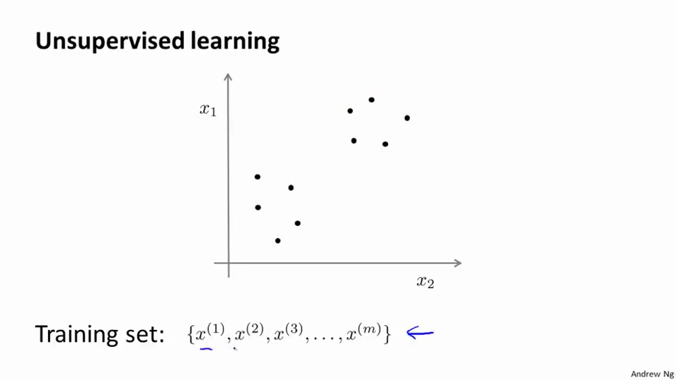

在这里我们有一系列点，却没有标签。因此，我们的训练集可以写成只有$x^{(1)}$,$x^{(2)}$…..一直到$x^{(m)}$。我们没有任何标签$y$。因此，图上画的这些点没有标签信息。也就是说，在非监督学习中，我们需要将一系列无标签的训练数据，输入到一个算法中，然后我们告诉这个算法，快去为我们找找这个数据的内在结构给定数据。我们可能需要某种算法帮助我们寻找一种结构。图上的数据看起来可以分成两个分开的点集（称为簇），一个能够找到我圈出的这些点集的算法，就被称为聚类算法。


这将是我们介绍的第一个非监督学习算法。当然，此后我们还将提到其他类型的非监督学习算法，它们可以为我们找到其他类型的结构或者其他的一些模式，而不只是簇。

我们将先介绍聚类算法。此后，我们将陆续介绍其他算法。那么聚类算法一般用来做什么呢？

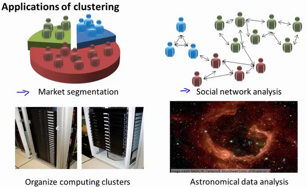

在这门课程的早些时候，我曾经列举过一些应用：比如市场分割。也许你在数据库中存储了许多客户的信息，而你希望将他们分成不同的客户群，这样你可以对不同类型的客户分别销售产品或者分别提供更适合的服务。社交网络分析：事实上有许多研究人员正在研究这样一些内容，他们关注一群人，关注社交网络，例如**Facebook**，**Google+**，或者是其他的一些信息，比如说：你经常跟哪些人联系，而这些人又经常给哪些人发邮件，由此找到关系密切的人群。因此，这可能需要另一个聚类算法，你希望用它发现社交网络中关系密切的朋友。我有一个朋友正在研究这个问题，他希望使用聚类算法来更好的组织计算机集群，或者更好的管理数据中心。因为如果你知道数据中心中，那些计算机经常协作工作。那么，你可以重新分配资源，重新布局网络。由此优化数据中心，优化数据通信。

最后，我实际上还在研究如何利用聚类算法了解星系的形成。然后用这个知识，了解一些天文学上的细节问题。好的，这就是聚类算法。这将是我们介绍的第一个非监督学习算法。在下一个视频中，我们将开始介绍一个具体的聚类算法。

### 13.2 K-均值算法

参考视频: 13 - 2 - K-Means Algorithm (13 min).mkv

**K-均值**是最普及的聚类算法，算法接受一个未标记的数据集，然后将数据聚类成不同的组。

**K-均值**是一个迭代算法，假设我们想要将数据聚类成n个组，其方法为:

首先选择$K$个随机的点，称为**聚类中心**（**cluster centroids**）；

对于数据集中的每一个数据，按照距离$K$个中心点的距离，将其与距离最近的中心点关联起来，与同一个中心点关联的所有点聚成一类。

计算每一个组的平均值，将该组所关联的中心点移动到平均值的位置。

重复步骤2-4直至中心点不再变化。

下面是一个聚类示例：

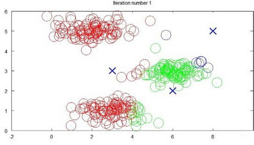

迭代 1 次

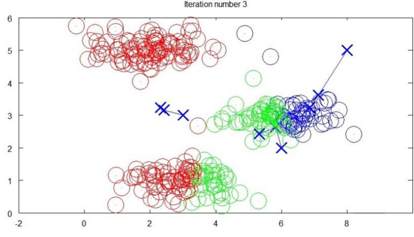

迭代 3 次

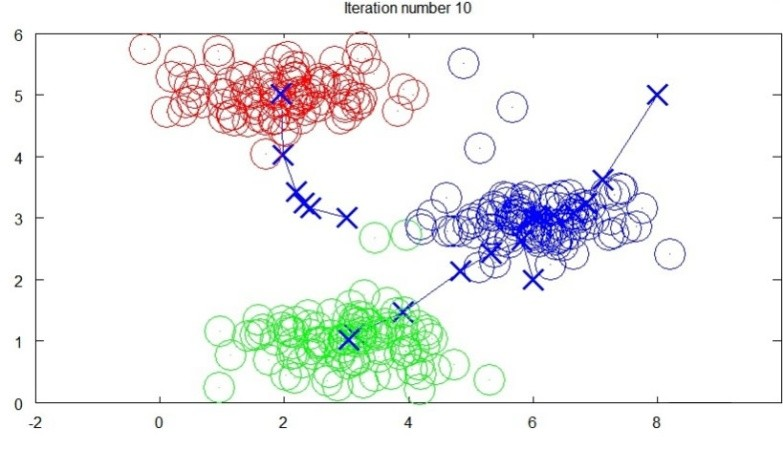

迭代 10 次

用$μ^1$,$μ^2$,...,$μ^k$ 来表示聚类中心，用$c^{(1)}$,$c^{(2)}$,...,$c^{(m)}$来存储与第$i$个实例数据最近的聚类中心的索引，**K-均值**算法的伪代码如下：

```
Repeat {

for i = 1 to m

c(i) := index (form 1 to K) of cluster centroid closest to x(i)

for k = 1 to K

μk := average (mean) of points assigned to cluster k

}
```

算法分为两个步骤，第一个**for**循环是赋值步骤，即：对于每一个样例$i$，计算其应该属于的类。第二个**for**循环是聚类中心的移动，即：对于每一个类$K$，重新计算该类的质心。

**K-均值**算法也可以很便利地用于将数据分为许多不同组，即使在没有非常明显区分的组群的情况下也可以。下图所示的数据集包含身高和体重两项特征构成的，利用**K-均值**算法将数据分为三类，用于帮助确定将要生产的T-恤衫的三种尺寸。

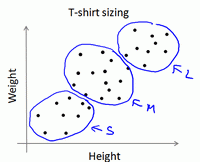

### 13.3 优化目标

参考视频: 13 - 3 - Optimization Objective (7 min).mkv

K-均值最小化问题，是要最小化所有的数据点与其所关联的聚类中心点之间的距离之和，因此
K-均值的代价函数（又称**畸变函数** **Distortion function**）为：

$$J(c^{(1)},...,c^{(m)},μ_1,...,μ_K)=\dfrac {1}{m}\sum^{m}_{i=1}\left\| X^{\left( i\right) }-\mu_{c^{(i)}}\right\| ^{2}$$

其中${{\mu }_{{{c}^{(i)}}}}$代表与${{x}^{(i)}}$最近的聚类中心点。
我们的的优化目标便是找出使得代价函数最小的 $c^{(1)}$,$c^{(2)}$,...,$c^{(m)}$和$μ^1$,$μ^2$,...,$μ^k$：
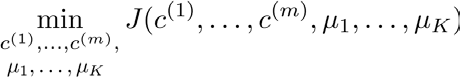

回顾刚才给出的:
**K-均值**迭代算法，我们知道，第一个循环是用于减小$c^{(i)}$引起的代价，而第二个循环则是用于减小${{\mu }_{i}}$引起的代价。迭代的过程一定会是每一次迭代都在减小代价函数，不然便是出现了错误。

### 13.4 随机初始化

参考视频: 13 - 4 - Random Initialization (8 min).mkv

在运行K-均值算法的之前，我们首先要随机初始化所有的聚类中心点，下面介绍怎样做：

1. 我们应该选择$K<m$，即聚类中心点的个数要小于所有训练集实例的数量

2. 随机选择$K$个训练实例，然后令$K$个聚类中心分别与这$K$个训练实例相等

**K-均值**的一个问题在于，它有可能会停留在一个局部最小值处，而这取决于初始化的情况。

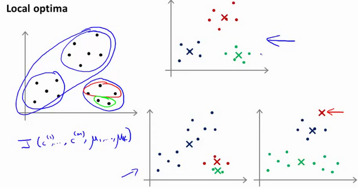

为了解决这个问题，我们通常需要多次运行**K-均值**算法，每一次都重新进行随机初始化，最后再比较多次运行**K-均值**的结果，选择代价函数最小的结果。这种方法在$K$较小的时候（2--10）还是可行的，但是如果$K$较大，这么做也可能不会有明显地改善。

### 13.5 选择聚类数

参考视频: 13 - 5 - Choosing the Number of Clusters (8 min).mkv

没有所谓最好的选择聚类数的方法，通常是需要根据不同的问题，人工进行选择的。选择的时候思考我们运用**K-均值**算法聚类的动机是什么，然后选择能最好服务于该目的标聚类数。

当人们在讨论，选择聚类数目的方法时，有一个可能会谈及的方法叫作“肘部法则”。关于“肘部法则”，我们所需要做的是改变$K$值，也就是聚类类别数目的总数。我们用一个聚类来运行**K均值**聚类方法。这就意味着，所有的数据都会分到一个聚类里，然后计算成本函数或者计算畸变函数$J$。$K$代表聚类数字。

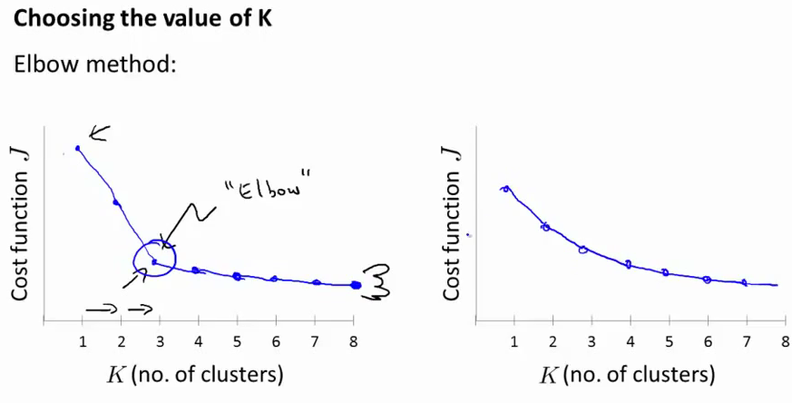

我们可能会得到一条类似于这样的曲线。像一个人的肘部。这就是“肘部法则”所做的，让我们来看这样一个图，看起来就好像有一个很清楚的肘在那儿。好像人的手臂，如果你伸出你的胳膊，那么这就是你的肩关节、肘关节、手。这就是“肘部法则”。你会发现这种模式，它的畸变值会迅速下降，从1到2，从2到3之后，你会在3的时候达到一个肘点。在此之后，畸变值就下降的非常慢，看起来就像使用3个聚类来进行聚类是正确的，这是因为那个点是曲线的肘点，畸变值下降得很快，$K=3$之后就下降得很慢，那么我们就选$K=3$。当你应用“肘部法则”的时候，如果你得到了一个像上面这样的图，那么这将是一种用来选择聚类个数的合理方法。

例如，我们的 T-恤制造例子中，我们要将用户按照身材聚类，我们可以分成3个尺寸:$S,M,L$，也可以分成5个尺寸$XS,S,M,L,XL$，这样的选择是建立在回答“聚类后我们制造的T-恤是否能较好地适合我们的客户”这个问题的基础上作出的。

**聚类参考资料：**

1.相似度/距离计算方法总结

(1). 闵可夫斯基距离**Minkowski**/（其中欧式距离：$p=2$) 

$dist(X,Y)={{\left( {{\sum\limits_{i=1}^{n}{\left| {{x}_{i}}-{{y}_{i}} \right|}}^{p}} \right)}^{\frac{1}{p}}}$

(2). 杰卡德相似系数(**Jaccard**)：

$J(A,B)=\frac{\left| A\cap B \right|}{\left|A\cup B \right|}$

(3). 余弦相似度(**cosine similarity**)：

$n$维向量$x$和$y$的夹角记做$\theta$，根据余弦定理，其余弦值为：

$cos (\theta )=\frac{{{x}^{T}}y}{\left|x \right|\cdot \left| y \right|}=\frac{\sum\limits_{i=1}^{n}{{{x}_{i}}{{y}_{i}}}}{\sqrt{\sum\limits_{i=1}^{n}{{{x}_{i}}^{2}}}\sqrt{\sum\limits_{i=1}^{n}{{{y}_{i}}^{2}}}}$
(4). Pearson皮尔逊相关系数：
${{\rho }_{XY}}=\frac{\operatorname{cov}(X,Y)}{{{\sigma }_{X}}{{\sigma }_{Y}}}=\frac{E[(X-{{\mu }_{X}})(Y-{{\mu }_{Y}})]}{{{\sigma }_{X}}{{\sigma }_{Y}}}=\frac{\sum\limits_{i=1}^{n}{(x-{{\mu }_{X}})(y-{{\mu }_{Y}})}}{\sqrt{\sum\limits_{i=1}^{n}{{{(x-{{\mu }_{X}})}^{2}}}}\sqrt{\sum\limits_{i=1}^{n}{{{(y-{{\mu }_{Y}})}^{2}}}}}$

Pearson相关系数即将$x$、$y$坐标向量各自平移到原点后的夹角余弦。

2.聚类的衡量指标

(1). 均一性：$p$

类似于精确率，一个簇中只包含一个类别的样本，则满足均一性。其实也可以认为就是正确率(每个 聚簇中正确分类的样本数占该聚簇总样本数的比例和)

(2). 完整性：$r$

类似于召回率，同类别样本被归类到相同簇中，则满足完整性;每个聚簇中正确分类的样本数占该 
类型的总样本数比例的和

(3). **V-measure**:

均一性和完整性的加权平均 

$V = \frac{(1+\beta^2)*pr}{\beta^2*p+r}$

(4). 轮廓系数

样本$i$的轮廓系数：$s(i)$

簇内不相似度:计算样本$i$到同簇其它样本的平均距离为$a(i)$，应尽可能小。

簇间不相似度:计算样本$i$到其它簇$C_j$的所有样本的平均距离$b_{ij}$，应尽可能大。

轮廓系数：$s(i)$值越接近1表示样本$i$聚类越合理，越接近-1，表示样本$i$应该分类到 另外的簇中，近似为0，表示样本$i$应该在边界上;所有样本的$s(i)$的均值被成为聚类结果的轮廓系数。 

$s(i) = \frac{b(i)-a(i)}{max\{a(i),b(i)\}}$

(5). **ARI**

数据集$S$共有$N$个元素，  两个聚类结果分别是：

$X=\{{{X}_{1}},{{X}_{2}},...,{{X}_{r}}\},Y=\{{{Y}_{1}},{{Y}_{2}},...,{{Y}_{s}}\}$

$X$和$Y$的元素个数为：

$a=\{{{a}_{1}},{{a}_{2}},...,{{a}_{r}}\},b=\{{{b}_{1}},{{b}_{2}},...,{{b}_{s}}\}$


记：${{n}_{ij}}=\left| {{X}_{i}}\cap {{Y}_{i}} \right|$

$ARI=\frac{\sum\limits_{i,j}{C_{{{n}_{ij}}}^{2}}-\left[ \left( \sum\limits_{i}{C_{{{a}_{i}}}^{2}} \right)\cdot \left( \sum\limits_{i}{C_{{{b}_{i}}}^{2}} \right) \right]/C_{n}^{2}}{\frac{1}{2}\left[ \left( \sum\limits_{i}{C_{{{a}_{i}}}^{2}} \right)+\left( \sum\limits_{i}{C_{{{b}_{i}}}^{2}} \right) \right]-\left[ \left( \sum\limits_{i}{C_{{{a}_{i}}}^{2}} \right)\cdot \left( \sum\limits_{i}{C_{{{b}_{i}}}^{2}} \right) \right]/C_{n}^{2}}$


十四、降维(Dimensionality Reduction)
------------------------------------

### 14.1 动机一：数据压缩

参考视频: 14 - 1 - Motivation I\_ Data Compression (10 min).mkv

这个视频，我想开始谈论第二种类型的无监督学习问题，称为降维。有几个不同的的原因使你可能想要做降维。一是数据压缩，后面我们会看了一些视频后，数据压缩不仅允许我们压缩数据，因而使用较少的计算机内存或磁盘空间，但它也让我们加快我们的学习算法。

但首先，让我们谈论降维是什么。作为一种生动的例子，我们收集的数据集，有许多，许多特征，我绘制两个在这里。

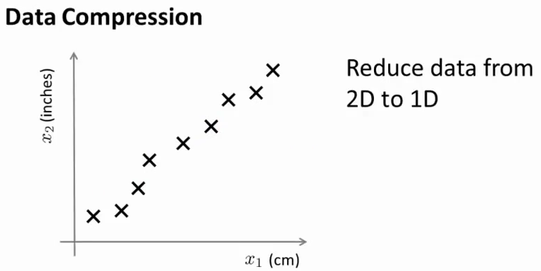

假设我们未知两个的特征：$x_1$:长度：用厘米表示；$x_2$：是用英寸表示同一物体的长度。

所以，这给了我们高度冗余表示，也许不是两个分开的特征$x_1$和$x_2$，这两个基本的长度度量，也许我们想要做的是减少数据到一维，只有一个数测量这个长度。这个例子似乎有点做作，这里厘米英寸的例子实际上不是那么不切实际的，两者并没有什么不同。

将数据从二维降至一维：
假使我们要采用两种不同的仪器来测量一些东西的尺寸，其中一个仪器测量结果的单位是英寸，另一个仪器测量的结果是厘米，我们希望将测量的结果作为我们机器学习的特征。现在的问题的是，两种仪器对同一个东西测量的结果不完全相等（由于误差、精度等），而将两者都作为特征有些重复，因而，我们希望将这个二维的数据降至一维。

从这件事情我看到的东西发生在工业上的事。如果你有几百个或成千上万的特征，它是它这往往容易失去你需要的特征。有时可能有几个不同的工程团队，也许一个工程队给你二百个特征，第二工程队给你另外三百个的特征，第三工程队给你五百个特征，一千多个特征都在一起，它实际上会变得非常困难，去跟踪你知道的那些特征，你从那些工程队得到的。其实不想有高度冗余的特征一样。

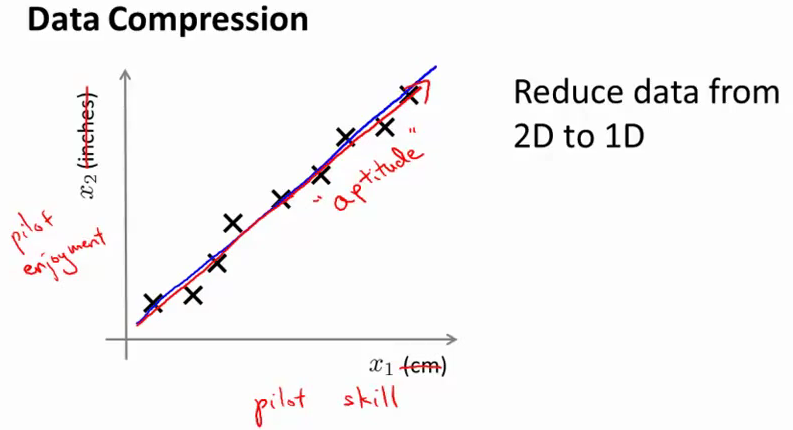

多年我一直在研究直升飞机自动驾驶。诸如此类。如果你想测量——如果你想做，你知道，做一个调查或做这些不同飞行员的测试——你可能有一个特征：$x_1$，这也许是他们的技能（直升机飞行员），也许$x_2$可能是飞行员的爱好。这是表示他们是否喜欢飞行，也许这两个特征将高度相关。你真正关心的可能是这条红线的方向，不同的特征，决定飞行员的能力。


将数据从三维降至二维：
这个例子中我们要将一个三维的特征向量降至一个二维的特征向量。过程是与上面类似的，我们将三维向量投射到一个二维的平面上，强迫使得所有的数据都在同一个平面上，降至二维的特征向量。


这样的处理过程可以被用于把任何维度的数据降到任何想要的维度，例如将1000维的特征降至100维。

正如我们所看到的，最后，这将使我们能够使我们的一些学习算法运行也较晚，但我们会在以后的视频提到它。

### 14.2 动机二：数据可视化

参考视频: 14 - 2 - Motivation II\_ Visualization (6 min).mkv

在许多及其学习问题中，如果我们能将数据可视化，我们便能寻找到一个更好的解决方案，降维可以帮助我们。

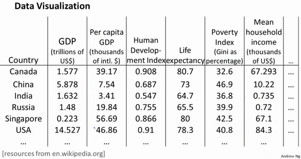

假使我们有有关于许多不同国家的数据，每一个特征向量都有50个特征（如**GDP**，人均**GDP**，平均寿命等）。如果要将这个50维的数据可视化是不可能的。使用降维的方法将其降至2维，我们便可以将其可视化了。

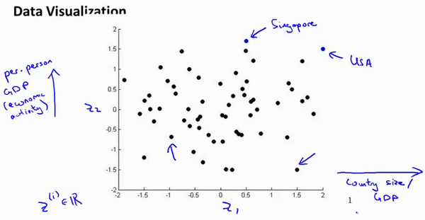

这样做的问题在于，降维的算法只负责减少维数，新产生的特征的意义就必须由我们自己去发现了。

### 14.3 主成分分析问题

参考视频: 14 - 3 - Principal Component Analysis Problem Formulation (9 min). mkv

主成分分析(**PCA**)是最常见的降维算法。

在**PCA**中，我们要做的是找到一个方向向量（**Vector direction**），当我们把所有的数据都投射到该向量上时，我们希望投射平均均方误差能尽可能地小。方向向量是一个经过原点的向量，而投射误差是从特征向量向该方向向量作垂线的长度。

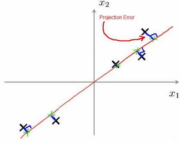

下面给出主成分分析问题的描述：

问题是要将$n$维数据降至$k$维，目标是找到向量$u^{(1)}$,$u^{(2)}$,...,$u^{(k)}$使得总的投射误差最小。主成分分析与线性回顾的比较：

主成分分析与线性回归是两种不同的算法。主成分分析最小化的是投射误差（**Projected Error**），而线性回归尝试的是最小化预测误差。线性回归的目的是预测结果，而主成分分析不作任何预测。

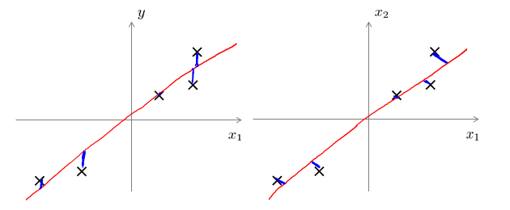

上图中，左边的是线性回归的误差（垂直于横轴投影），右边则是主要成分分析的误差（垂直于红线投影）。

**PCA**将$n$个特征降维到$k$个，可以用来进行数据压缩，如果100维的向量最后可以用10维来表示，那么压缩率为90%。同样图像处理领域的**KL变换**使用**PCA**做图像压缩。但**PCA** 要保证降维后，还要保证数据的特性损失最小。

**PCA**技术的一大好处是对数据进行降维的处理。我们可以对新求出的“主元”向量的重要性进行排序，根据需要取前面最重要的部分，将后面的维数省去，可以达到降维从而简化模型或是对数据进行压缩的效果。同时最大程度的保持了原有数据的信息。

**PCA**技术的一个很大的优点是，它是完全无参数限制的。在**PCA**的计算过程中完全不需要人为的设定参数或是根据任何经验模型对计算进行干预，最后的结果只与数据相关，与用户是独立的。

但是，这一点同时也可以看作是缺点。如果用户对观测对象有一定的先验知识，掌握了数据的一些特征，却无法通过参数化等方法对处理过程进行干预，可能会得不到预期的效果，效率也不高。

### 14.4 主成分分析算法

参考视频: 14 - 4 - Principal Component Analysis Algorithm (15 min).mkv

**PCA** 减少$n$维到$k$维：

第一步是均值归一化。我们需要计算出所有特征的均值，然后令 $x_j= x_j-μ_j$。如果特征是在不同的数量级上，我们还需要将其除以标准差 $σ^2$。

第二步是计算**协方差矩阵**（**covariance matrix**）$Σ$：
$\sum=\dfrac {1}{m}\sum^{n}_{i=1}\left( x^{(i)}\right) \left( x^{(i)}\right) ^{T}$


第三步是计算协方差矩阵$Σ$的**特征向量**（**eigenvectors**）:

在 **Octave** 里我们可以利用**奇异值分解**（**singular value decomposition**）来求解，`[U, S, V]= svd(sigma)`。

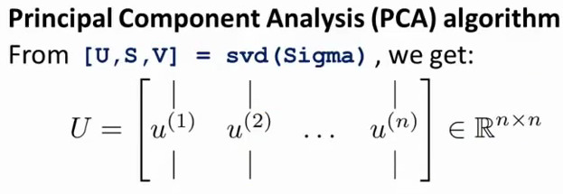
$$Sigma=\dfrac {1}{m}\sum^{n}_{i=1}\left( x^{(i)}\right) \left( x^{(i)}\right) ^{T}$$

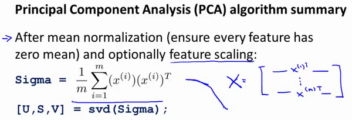

对于一个 $n×n$维度的矩阵，上式中的$U$是一个具有与数据之间最小投射误差的方向向量构成的矩阵。如果我们希望将数据从$n$维降至$k$维，我们只需要从$U$中选取前$k$个向量，获得一个$n×k$维度的矩阵，我们用$U_{reduce}$表示，然后通过如下计算获得要求的新特征向量$z^{(i)}$:
$$z^{(i)}=U^{T}_{reduce}*x^{(i)}$$


其中$x$是$n×1$维的，因此结果为$k×1$维度。注，我们不对方差特征进行处理。

### 14.5 选择主成分的数量

参考视频: 14 - 5 - Choosing The Number Of Principal Components (13 min).mkv

主要成分分析是减少投射的平均均方误差：

训练集的方差为：$\dfrac {1}{m}\sum^{m}_{i=1}\left\| x^{\left( i\right) }\right\| ^{2}$

我们希望在平均均方误差与训练集方差的比例尽可能小的情况下选择尽可能小的$k$值。

如果我们希望这个比例小于1%，就意味着原本数据的偏差有99%都保留下来了，如果我们选择保留95%的偏差，便能非常显著地降低模型中特征的维度了。

我们可以先令$k=1$，然后进行主要成分分析，获得$U_{reduce}$和$z$，然后计算比例是否小于1%。如果不是的话再令$k=2$，如此类推，直到找到可以使得比例小于1%的最小$k$ 值（原因是各个特征之间通常情况存在某种相关性）。

还有一些更好的方式来选择$k$，当我们在**Octave**中调用“**svd**”函数的时候，我们获得三个参数：`[U, S, V] = svd(sigma)`。

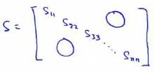

其中的$S$是一个$n×n$的矩阵，只有对角线上有值，而其它单元都是0，我们可以使用这个矩阵来计算平均均方误差与训练集方差的比例：
$$\dfrac {\dfrac {1}{m}\sum^{m}_{i=1}\left\| x^{\left( i\right) }-x^{\left( i\right) }_{approx}\right\| ^{2}}{\dfrac {1}{m}\sum^{m}_{i=1}\left\| x^{(i)}\right\| ^{2}}=1-\dfrac {\Sigma^{k}_{i=1}S_{ii}}{\Sigma^{m}_{i=1}S_{ii}}\leq 1\%$$

也就是：$$\frac {\Sigma^{k}_{i=1}s_{ii}}{\Sigma^{n}_{i=1}s_{ii}}\geq0.99$$

在压缩过数据后，我们可以采用如下方法来近似地获得原有的特征：$$x^{\left( i\right) }_{approx}=U_{reduce}z^{(i)}$$


### 14.6 重建的压缩表示

参考视频: 14 - 6 - Reconstruction from Compressed Representation (4 min).mkv

在以前的视频中，我谈论**PCA**作为压缩算法。在那里你可能需要把1000维的数据压缩100维特征，或具有三维数据压缩到一二维表示。所以，如果这是一个压缩算法，应该能回到这个压缩表示，回到你原有的高维数据的一种近似。

所以，给定的$z^{(i)}$，这可能100维，怎么回到你原来的表示$x^{(i)}$，这可能是1000维的数组？

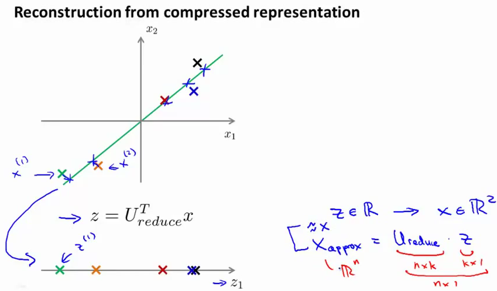

**PCA**算法，我们可能有一个这样的样本。如图中样本$x^{(1)}$,$x^{(2)}$。我们做的是，我们把这些样本投射到图中这个一维平面。然后现在我们需要只使用一个实数，比如$z^{(1)}$，指定这些点的位置后他们被投射到这一个三维曲面。给定一个点$z^{(1)}$，我们怎么能回去这个原始的二维空间呢？$x$为2维，$z$为1维，$z=U^{T}_{reduce}x$，相反的方程为：$x_{appox}=U_{reduce}\cdot z$,$x_{appox}\approx x$。如图：

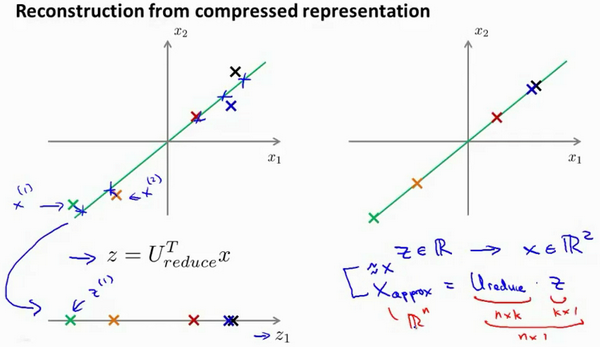

如你所知，这是一个漂亮的与原始数据相当相似。所以，这就是你从低维表示$z$回到未压缩的表示。我们得到的数据的一个之间你的原始数据 $x$，我们也把这个过程称为重建原始数据。

当我们认为试图重建从压缩表示 $x$ 的初始值。所以，给定未标记的数据集，您现在知道如何应用**PCA**，你的带高维特征$x$和映射到这的低维表示$z$。这个视频，希望你现在也知道如何采取这些低维表示$z$，映射到备份到一个近似你原有的高维数据。

现在你知道如何实施应用**PCA**，我们将要做的事是谈论一些技术在实际使用**PCA**很好，特别是，在接下来的视频中，我想谈一谈关于如何选择$k$。

### 14.7 主成分分析法的应用建议

参考视频: 14 - 7 - Advice for Applying PCA (13 min).mkv

假使我们正在针对一张 100×100像素的图片进行某个计算机视觉的机器学习，即总共有10000 个特征。

   1. 第一步是运用主要成分分析将数据压缩至1000个特征

   2. 然后对训练集运行学习算法

      3. 在预测时，采用之前学习而来的$U_{reduce}$将输入的特征$x$转换成特征向量$z$，然后再进行预测

注：如果我们有交叉验证集合测试集，也采用对训练集学习而来的$U_{reduce}$。

错误的主要成分分析情况：一个常见错误使用主要成分分析的情况是，将其用于减少过拟合（减少了特征的数量）。这样做非常不好，不如尝试正则化处理。原因在于主要成分分析只是近似地丢弃掉一些特征，它并不考虑任何与结果变量有关的信息，因此可能会丢失非常重要的特征。然而当我们进行正则化处理时，会考虑到结果变量，不会丢掉重要的数据。

另一个常见的错误是，默认地将主要成分分析作为学习过程中的一部分，这虽然很多时候有效果，最好还是从所有原始特征开始，只在有必要的时候（算法运行太慢或者占用太多内存）才考虑采用主要成分分析。


