第4周
=====

第八、神经网络：表述(Neural Networks: Representation)
-----------------------------------------------------

### 8.1 非线性假设

参考视频: 8 - 1 - Non-linear Hypotheses (10 min).mkv

我们之前学的，无论是线性回归还是逻辑回归都有这样一个缺点，即：当特征太多时，计算的负荷会非常大。

下面是一个例子：

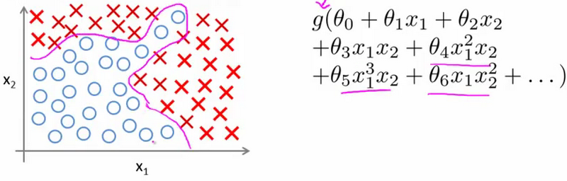

当我们使用x1、x2的多次项式进行预测时，我们可以应用的很好。

之前我们已经看到过，使用非线性的多项式项，能够帮助我们建立更好的分类模型。假设我们有非常多的特征，例如大于100个变量，我们希望用这100个特征来构建一个非线性的多项式模型，结果将是数量非常惊人的特征组合，即便我们只采用两两特征的组合（x1x2+x1x3+x1x4+...+x2x3+x2x4+...+x99x100）,我们也会有接近5000个组合而成的特征。这对于一般的逻辑回归来说需要计算的特征太多了。

假设我们希望训练一个模型来识别视觉对象（例如识别一张图片上是否是一辆汽车），我们怎样才能这么做呢？一种方法是我们利用很多汽车的图片和很多非汽车的图片，然后利用这些图片上一个个像素的值（饱和度或亮度）来作为特征。

假如我们只选用灰度图片，每个像素则只有一个值（而非 RGB
值），我们可以选取图片上的两个不同位置上的两个像素，然后训练一个逻辑回归算法利用这两个像素的值来判断图片上是否是汽车：

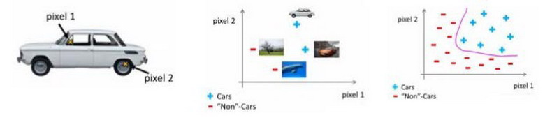

假使我们采用的都是50x50像素的小图片，并且我们将所有的像素视为特征，则会有
2500个特征，如果我们要进一步将两两特征组合构成一个多项式模型，则会有约25002/2
个（接近3百万个）特征。普通的逻辑回归模型，不能有效地处理这么多的特征，这时候我们需要神经网络。

### 8.2 神经元和大脑

参考视频: 8 - 2 - Neurons and the Brain (8 min).mkv

神经网络是一种很古老的算法，它最初产生的目的是制造能模拟大脑的机器。

在这门课中，我将向你们介绍神经网络。因为它能很好地解决不同的机器学习问题。而不只因为它们在逻辑上行得通，在这段视频中，我想告诉你们一些神经网络的背景知识，由此我们能知道可以用它们来做什么。不管是将其应用到现代的机器学习问题上，还是应用到那些你可能会感兴趣的问题中。也许，这一伟大的人工智能梦想在未来能制造出真正的智能机器。另外，我们还将讲解神经网络是怎么涉及这些问题的神经网络产生的原因是人们想尝试设计出模仿大脑的算法，从某种意义上说如果我们想要建立学习系统，那为什么不去模仿我们所认识的最神奇的学习机器——人类的大脑呢？

神经网络逐渐兴起于二十世纪八九十年代，应用得非常广泛。但由于各种原因，在90年代的后期应用减少了。但是最近，神经网络又东山再起了。其中一个原因是：神经网络是计算量有些偏大的算法。然而大概由于近些年计算机的运行速度变快，才足以真正运行起大规模的神经网络。正是由于这个原因和其他一些我们后面会讨论到的技术因素，如今的神经网络对于许多应用来说是最先进的技术。当你想模拟大脑时，是指想制造出与人类大脑作用效果相同的机器。大脑可以学会去以看而不是听的方式处理图像，学会处理我们的触觉

我们能学习数学，学着做微积分，而且大脑能处理各种不同的令人惊奇的事情。似乎如果你想要模仿它，你得写很多不同的软件来模拟所有这些五花八门的奇妙的事情。不过能不能假设大脑做所有这些，不同事情的方法，不需要用上千个不同的程序去实现。相反的，大脑处理的方法，只需要一个单一的学习算法就可以了？尽管这只是一个假设，不过让我和你分享，一些这方面的证据。

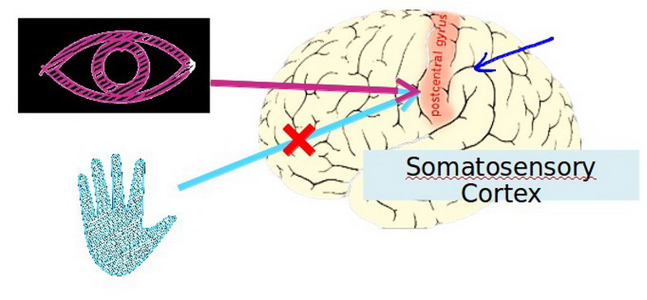

大脑的这一部分这一小片红色区域是你的听觉皮层，你现在正在理解我的话，这靠的是耳朵。耳朵接收到声音信号，并把声音信号传递给你的听觉皮层，正因如此，你才能明白我的话。

神经系统科学家做了下面这个有趣的实验，把耳朵到听觉皮层的神经切断。在这种情况下，将其重新接到一个动物的大脑上，这样从眼睛到视神经的信号最终将传到听觉皮层。如果这样做了。那么结果表明听觉皮层将会学会“看”。这里的“看”代表了我们所知道的每层含义。所以，如果你对动物这样做，那么动物就可以完成视觉辨别任务，它们可以看图像，并根据图像做出适当的决定。它们正是通过脑组织中的这个部分完成的。下面再举另一个例子，这块红色的脑组织是你的躯体感觉皮层，这是你用来处理触觉的，如果你做一个和刚才类似的重接实验，那么躯体感觉皮层也能学会“看”。这个实验和其它一些类似的实验，被称为神经重接实验，从这个意义上说，如果人体有同一块脑组织可以处理光、声或触觉信号，那么也许存在一种学习算法，可以同时处理视觉、听觉和触觉，而不是需要运行上千个不同的程序，或者上千个不同的算法来做这些大脑所完成的成千上万的美好事情。也许我们需要做的就是找出一些近似的或实际的大脑学习算法，然后实现它大脑通过自学掌握如何处理这些不同类型的数据。在很大的程度上，可以猜想如果我们把几乎任何一种传感器接入到大脑的几乎任何一个部位的话，大脑就会学会处理它。

下面再举几个例子：

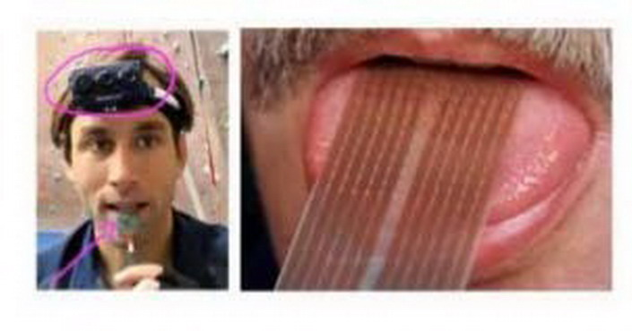

这张图是用舌头学会“看”的一个例子。它的原理是：这实际上是一个名为BrainPort的系统，它现在正在FDA
(美国食品和药物管理局)
的临床试验阶段，它能帮助失明人士看见事物。它的原理是，你在前额上带一个灰度摄像头，面朝前，它就能获取你面前事物的低分辨率的灰度图像。你连一根线到舌头上安装的电极阵列上，那么每个像素都被映射到你舌头的某个位置上，可能电压值高的点对应一个暗像素电压值低的点。对应于亮像素，即使依靠它现在的功能，使用这种系统就能让你我在几十分钟里就学会用我们的舌头“看”东西。

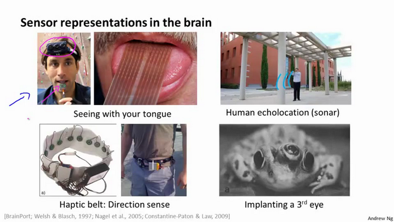

这是第二个例子，关于人体回声定位或者说人体声纳。你有两种方法可以实现：你可以弹响指，或者咂舌头。不过现在有失明人士，确实在学校里接受这样的培训，并学会解读从环境反弹回来的声波模式—这就是声纳。如果你搜索YouTube之后，就会发现有些视频讲述了一个令人称奇的孩子，他因为癌症眼球惨遭移除，虽然失去了眼球，但是通过打响指，他可以四处走动而不撞到任何东西，他能滑滑板，他可以将篮球投入篮框中。注意这是一个没有眼球的孩子。

第三个例子是触觉皮带，如果你把它戴在腰上，蜂鸣器会响，而且总是朝向北时发出嗡嗡声。它可以使人拥有方向感，用类似于鸟类感知方向的方式。

还有一些离奇的例子：

如果你在青蛙身上插入第三只眼，青蛙也能学会使用那只眼睛。因此，这将会非常令人惊奇。如果你能把几乎任何传感器接入到大脑中，大脑的学习算法就能找出学习数据的方法，并处理这些数据。从某种意义上来说，如果我们能找出大脑的学习算法，然后在计算机上执行大脑学习算法或与之相似的算法，也许这将是我们向人工智能迈进做出的最好的尝试。人工智能的梦想就是：有一天能制造出真正的智能机器。

神经网络可能为我们打开一扇进入遥远的人工智能梦的窗户，但我在这节课中讲授神经网络的原因，主要是对于现代机器学习应用。它是最有效的技术方法。因此在接下来的一些课程中，我们将开始深入到神经网络的技术细节。

### 8.3 模型表示1

参考视频: 8 - 3 - Model Representation I (12 min).mkv

为了构建神经网络模型，我们需要首先思考大脑中的神经网络是怎样的？每一个神经元都可以被认为是一个处理单元/神经核（processing
unit/
Nucleus），它含有许多输入/树突（input/Dendrite），并且有一个输出/轴突（output/Axon）。神经网络是大量神经元相互链接并通过电脉冲来交流的一个网络。

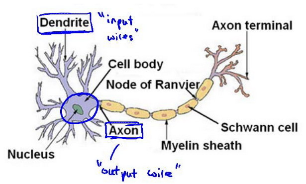

下面是一组神经元的示意图，神经元利用微弱的电流进行沟通。这些弱电流也称作动作电位，其实就是一些微弱的电流。所以如果神经元想要传递一个消息，它就会就通过它的轴突，发送一段微弱电流给其他神经元，这就是轴突。

这里是一条连接到输入神经，或者连接另一个神经元树突的神经，接下来这个神经元接收这条消息，做一些计算，它有可能会反过来将在轴突上的自己的消息传给其他神经元。这就是所有人类思考的模型：我们的神经元把自己的收到的消息进行计算，并向其他神经元传递消息。这也是我们的感觉和肌肉运转的原理。如果你想活动一块肌肉，就会触发一个神经元给你的肌肉发送脉冲，并引起你的肌肉收缩。如果一些感官：比如说眼睛想要给大脑传递一个消息，那么它就像这样发送电脉冲给大脑的。

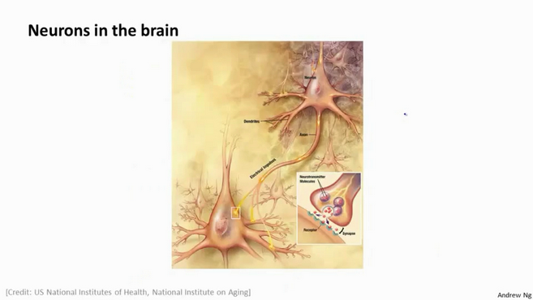

神经网络模型建立在很多神经元之上，每一个神经元又是一个个学习模型。这些神经元（也叫激活单元，activation
unit）采纳一些特征作为输出，并且根据本身的模型提供一个输出。下图是一个以逻辑回归模型作为自身学习模型的神经元示例，在神经网络中，参数又可被成为权重（weight）。

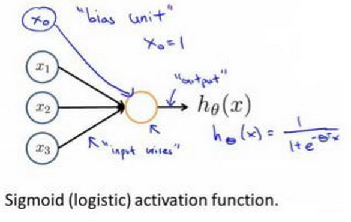

我们设计出了类似于神经元的神经网络，效果如下：

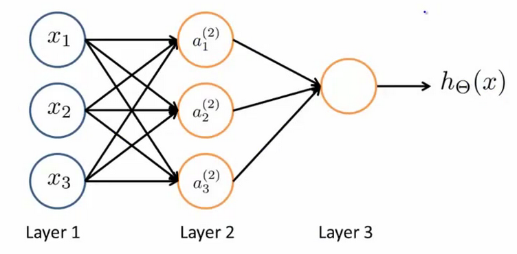

其中x1,x2,x3是输入单元（input units），我们将原始数据输入给它们。

a1,a2,a3是中间单元，它们负责将数据进行处理，然后呈递到下一层。

最后是输出单元，它负责计算hθ(x)。

神经网络模型是许多逻辑单元按照不同层级组织起来的网络，每一层的输出变量都是下一层的输入变量。下图为一个3层的神经网络，第一层成为输入层（Input
Layer），最后一层称为输出层（Output Layer），中间一层成为隐藏层（Hidden
Layers）。我们为每一层都增加一个偏差单位（bias unit）：

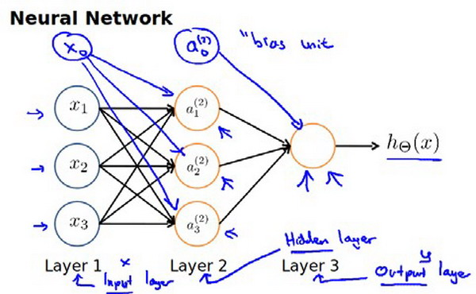

下面引入一些标记法来帮助描述模型：

代表第 j 层的第 i 个激活单元。

代表从第 j 层映射到第 j+1 层时的权重的矩阵，例如

代表从第一层映射到第二层的权重的矩阵。其尺寸为：以第
j+1层的激活单元数量为行数，以第 j
层的激活单元数加一为列数的矩阵。例如：上图所示的神经网络中

的尺寸为 3\*4。

对于上图所示的模型，激活单元和输出分别表达为：

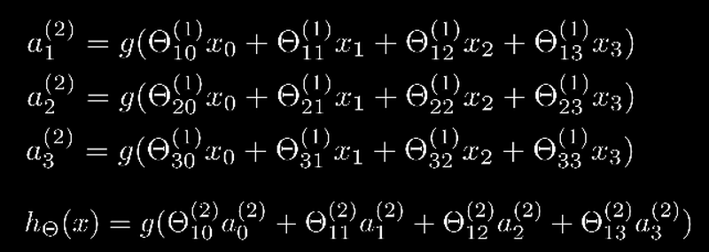

上面进行的讨论中只是将特征矩阵中的一行（一个训练实例）喂给了神经网络，我们需要将整个训练集都喂给我们的神经网络算法来学习模型。

我们可以知道：每一个a都是由上一层所有的x和每一个x所对应的决定的。

（我们把这样从左到右的算法称为前向传播算法( FORWARD PROPAGATION )）

把x, ，a分别用矩阵表示：

，

，

我们可以得到 。

### 8.4 模型表示2

参考视频: 8 - 4 - Model Representation II (12 min).mkv

( FORWARD PROPAGATION )
相对与使用循环来编码，利用向量化的方法会使得计算更为简便。以上面的神经网络为例，试着计算第二层的值：

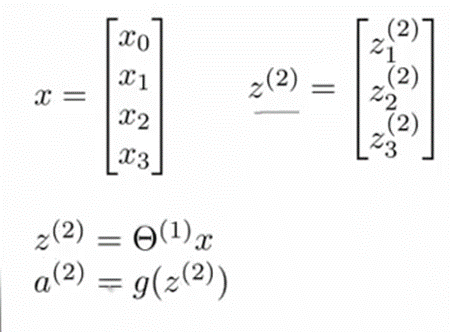

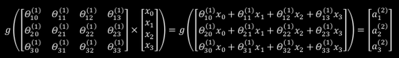

我们令

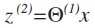

，则

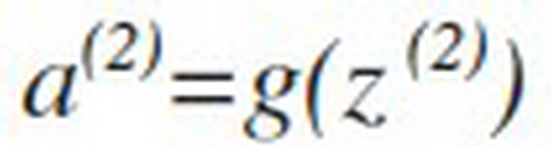

，计算后添加

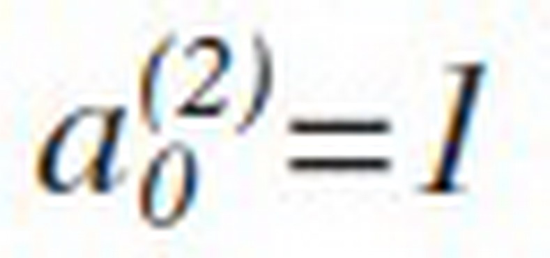

。 计算输出的值为：

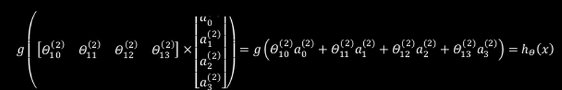

我们令

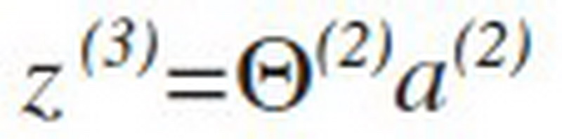

，则

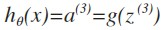

。

这只是针对训练集中一个训练实例所进行的计算。如果我们要对整个训练集进行计算，我们需要将训练集特征矩阵进行转置，使得同一个实例的特征都在同一列里。即：

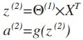

为了更好了了解Neuron Networks的工作原理，我们先把左半部分遮住：

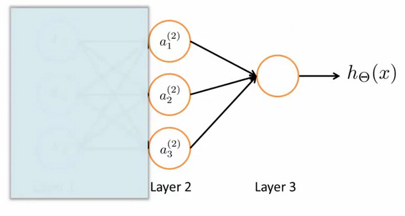

右半部分其实就是以a0,a1,a2,a3按照Logistic Regression的方式输出h(x)：

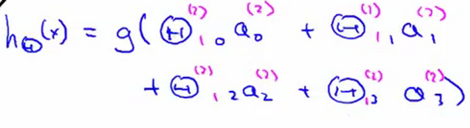

其实神经网络就像是logistic regression，只不过我们把logistic
regression中的输入向量[x1\~x3]变成了中间层的[a(2)1\~a(2)3], 即

h(x)=g(θ(2)0 a(2)0+θ(2)1 a(2)1+θ(2)2 a(2)2+θ(2)3 a(2)3)

我们可以把a0,a1,a2,a3看成更为高级的特征值，也就是x0,x1,x2,x3的进化体，并且它们是由x与决定的，因为是梯度下降的，所以a是变化的，并且变得越来越厉害，所以这些更高级的特征值远比仅仅将x次方厉害，也能更好的预测新数据。

这就是神经网络相比于逻辑回归和线性回归的优势。

### 8.5 特征和直观理解1

参考视频: 8 - 5 - Examples and Intuitions I (7 min).mkv

从本质上讲，神经网络能够通过学习得出其自身的一系列特征。在普通的逻辑回归中，我们被限制为使用数据中的原始特征x1,x2,...,xn，我们虽然可以使用一些二项式项来组合这些特征，但是我们仍然受到这些原始特征的限制。在神经网络中，原始特征只是输入层，在我们上面三层的神经网络例子中，第三层也就是输出层做出的预测利用的是第二层的特征，而非输入层中的原始特征，我们可以认为第二层中的特征是神经网络通过学习后自己得出的一系列用于预测输出变量的新特征。

神经网络中，单层神经元（无中间层）的计算可用来表示逻辑运算，比如逻辑AND、逻辑或OR
。

举例说明：逻辑与AND；下图中左半部分是神经网络的设计与output层表达式，右边上部分是sigmod函数，下半部分是真值表。

我们可以用这样的一个神经网络表示AND 函数：

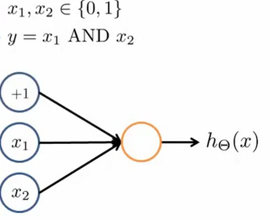

其中θ0 =-30，θ1 =20，θ2 =20

我们的输出函数h(x)即为：

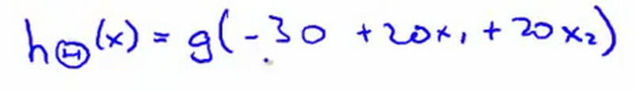

我们知道g(x)的图像是：

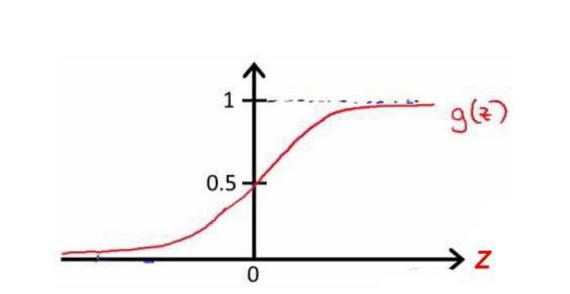

所以我们有：

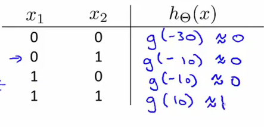

所以我们的：

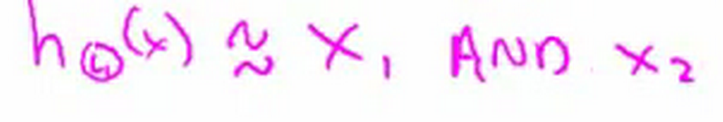

这就是AND函数。

接下来再介绍一个OR函数：

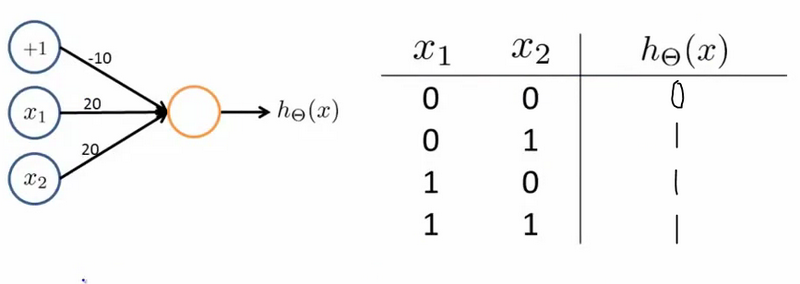

OR与AND整体一样，区别只在于的取值不同。

### 8.6 样本和直观理解II

参考视频: 8 - 6 - Examples and Intuitions II (10 min).mkv

二元逻辑运算符（BINARY LOGICAL
OPERATORS）当输入特征为布尔值（0或1）时，我们可以用一个单一的激活层可以作为二元逻辑运算符，为了表示不同的运算符，我们之需要选择不同的权重即可。

下图的神经元（三个权重分别为-30，20，20）可以被视为作用同于逻辑与（AND）：

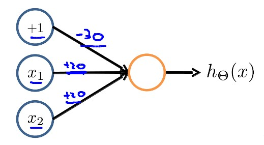

下图的神经元（三个权重分别为-10，20，20）可以被视为作用等同于逻辑或（OR）：

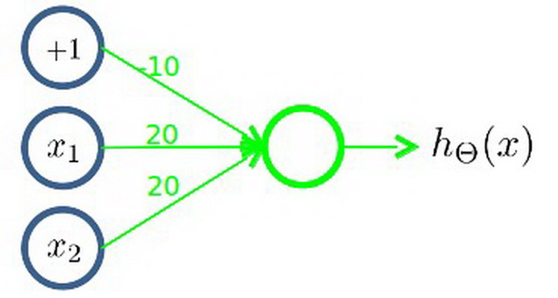

下图的神经元（两个权重分别为 10，-20）可以被视为作用等同于逻辑非（NOT）：

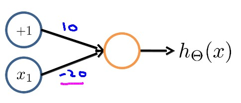

我们可以利用神经元来组合成更为复杂的神经网络以实现更复杂的运算。例如我们要实现XNOR
功能（输入的两个值必须一样，均为1或均为0），即
XNOR=（x1ANDx2）OR((NOTx1)AND(NOTx2))

首先构造一个能表达(NOTx1)AND(NOTx2)部分的神经元：

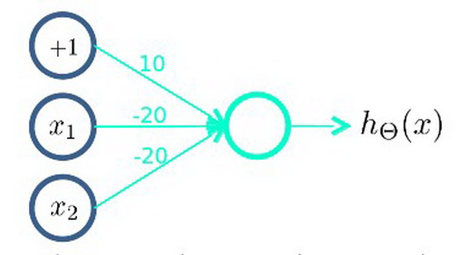

然后将表示 AND 的神经元和表示(NOTx1)AND(NOTx2)的神经元以及表示 OR
的神经元进行组合：

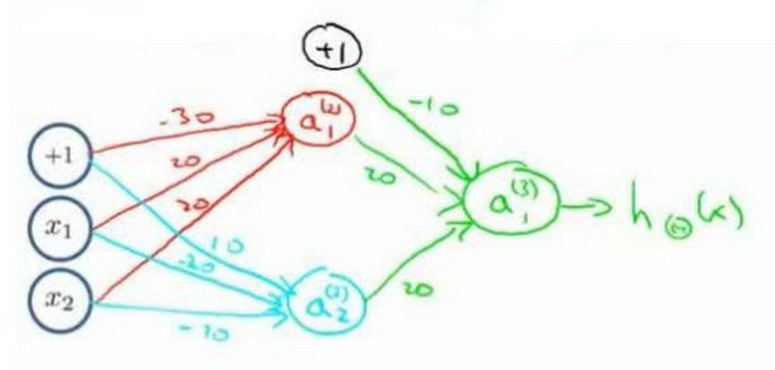

我们就得到了一个能实现 XNOR 运算符功能的神经网络。

按这种方法我们可以逐渐构造出越来越复杂的函数，也能得到更加厉害的特征值。

这就是神经网络的厉害之处。

### 8.7 多类分类

参考视频: 8 - 7 - Multiclass Class**i**fication (4 min).mkv

当我们有不止两种分类时（也就是y=1,2,3….），比如以下这种情况，该怎么办？如果我们要训练一个神经网络算法来识别路人、汽车、摩托车和卡车，在输出层我们应该有4个值。例如，第一个值为1或0用于预测是否是行人，第二个值用于判断是否为汽车。

输入向量x有三个维度，两个中间层，输出层4个神经元分别用来表示4类，也就是每一个数据在输出层都会出现[a
b c d]T，且a,b,c,d中仅有一个为1，表示当前类。下面是该神经网络的可能结构示例：

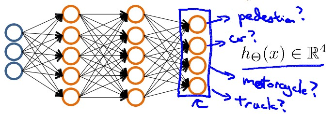

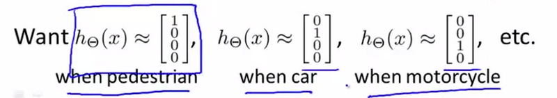

神经网络算法的输出结果为四种可能情形之一：

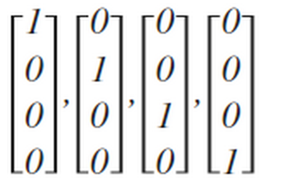
