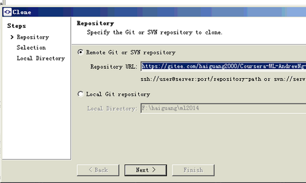
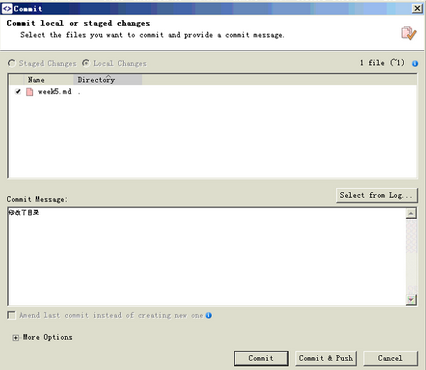
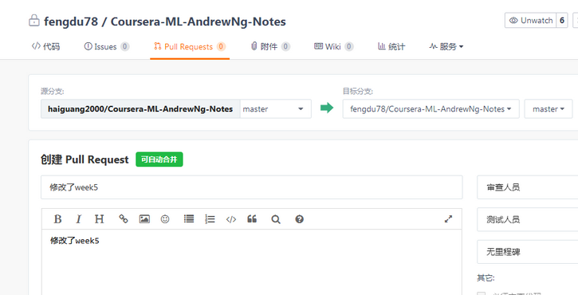

文档协作指南
============

首先，我们要注册一个码云账号（gitee.com），我们的文档暂时放在这里（因为github访问速度慢，我们将在以后公布到github）。

我会公布一个开放组的邀请链接，点击链接即可加入开发组。

加入开发组以后，要fork一下项目，把项目克隆下来，在本地修改了，提交push
quest，我审核完就会合并文档。

Git操作可以用命令行，也可以用smartgit客户端（下载地址：链接：http://pan.baidu.com/s/1pKJHifL
密码：vzia）

具体操作：

1.克隆项目：

2.修改了文件，建议先pull下，点

，以免版本冲突，再stage下文件，点

，再commit：

点击：

，

点击：commit&push.

最后，要打开码云网页，提交pull request。

我收到pull request后，需要到码云点击同意合并，即可合并代码。

注意：github的操作也基本类似，之所以协作的时候不用github，是因为github的项目都要公开，而且访问速度慢，今后还是会放到github的。
