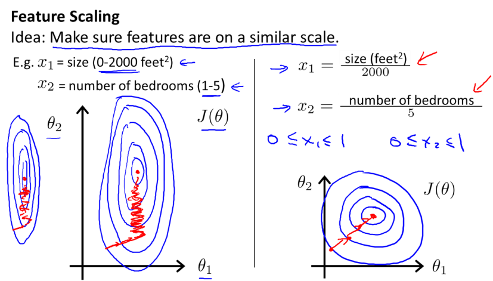
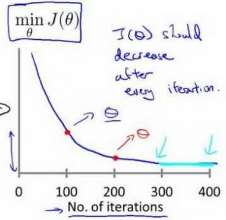
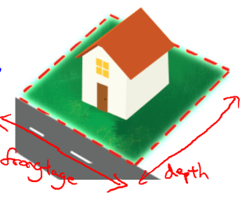
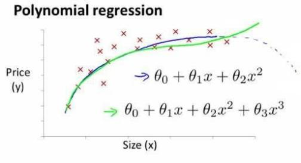
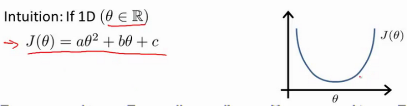
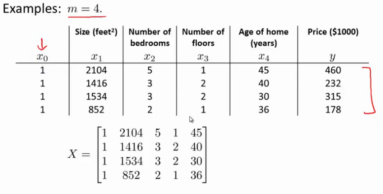

第2周
=====

四、多变量线性回归(Linear Regression with Multiple Variables)
-------------------------------------------------------------

### 4.1 多维特征

参考视频: 4 - 1 - Multiple Features (8 min).mkv

目前为止，我们探讨了单变量/特征的回归模型，现在我们对房价模型增加更多的特征，例如房间数楼层等，构成一个含有多个变量的模型，模型中的特征为\$\\left(
{{x}_{1}},{{x}_{1}},...,{{x}_{n}} \\right)\$。

增添更多特征后，我们引入一系列新的注释：

n 代表特征的数量

\${{x}\^{\\left( i \\right)}}\$代表第 i
个训练实例，是特征矩阵中的第i行，是一个向量（vector）。

比方说，上图的

，

\$\\mathop{x}_{j}\^{\\left( i \\right)}\$代表特征矩阵中第 i 行的第 j
个特征，也就是第 i 个训练实例的第 j 个特征。

如上图的

，

支持多变量的假设 h 表示为：\\[{{h}_{\\theta }}\\left( x \\right)={{\\theta
}_{0}}+{{\\theta }_{1}}{{x}_{1}}+{{\\theta }_{2}}{{x}_{2}}+...+{{\\theta
}_{n}}{{x}_{n}}\\]

这个公式中有n+1个参数和n个变量，为了使得公式能够简化一些，引入\${{x}_{0}}=1\$，则公式转化为：\\[{{h}_{\\theta
}}\\left( x \\right)={{\\theta }_{0}}{{x}_{0}}+{{\\theta
}_{1}}{{x}_{1}}+{{\\theta }_{2}}{{x}_{2}}+...+{{\\theta }_{n}}{{x}_{n}}\\]

此时模型中的参数是一个n+1维的向量，任何一个训练实例也都是n+1维的向量，特征矩阵X的维度是
m\*(n+1)。 因此公式可以简化为：\${{h}_{\\theta }}\\left( x \\right)={{\\theta
}\^{T}}X\$，其中上标T代表矩阵转置。

### 4.2 多变量梯度下降

参考视频: 4 - 2 - Gradient Descent for Multiple Variables (5 min).mkv

与单变量线性回归类似，在多变量线性回归中，我们也构建一个代价函数，则这个代价函数是所有建模误差的平方和，即：

\$J\\left( {{\\theta }_{0}},{{\\theta }_{1}}...{{\\theta }_{n}}
\\right)=\\frac{1}{2m}\\sum\\limits_{i=1}\^{m}{{{\\left( {{h}_{\\theta }}\\left(
\\mathop{x}\^{\\left( i \\right)} \\right)-\\mathop{y}\^{\\left( i \\right)}
\\right)}\^{2}}}\$

其中：\\[{{h}_{\\theta }}\\left( x \\right)={{\\theta }\^{T}}X={{\\theta
}_{0}}{{x}_{0}}+{{\\theta }_{1}}{{x}_{1}}+{{\\theta
}_{2}}{{x}_{2}}+...+{{\\theta }_{n}}{{x}_{n}}\\]

我们的目标和单变量线性回归问题中一样，是要找出使得代价函数最小的一系列参数。
多变量线性回归的批量梯度下降算法为：

即：

求导数后得到：

当n\>=1时，

我们开始随机选择一系列的参数值，计算所有的预测结果后，再给所有的参数一个新的值，如此循环直到收敛。

Python 代码示例：

计算代价函数

\$J\\left( \\theta \\right)=\\frac{1}{2m}\\sum\\limits_{i=1}\^{m}{{{\\left(
{{h}_{\\theta }}\\left( {{x}\^{(i)}} \\right)-{{y}\^{(i)}} \\right)}\^{2}}}\$

其中：\${{h}_{\\theta }}\\left( x \\right)={{\\theta }\^{T}}X={{\\theta
}_{0}}{{x}_{0}}+{{\\theta }_{1}}{{x}_{1}}+{{\\theta
}_{2}}{{x}_{2}}+...+{{\\theta }_{n}}{{x}_{n}}\$

代码：

def computeCost(X, y, theta):

inner = np.power(((X \* theta.T) - y), 2)

return np.sum(inner) / (2 \* len(X))

### 4.3 梯度下降法实践1-特征缩放

参考视频: 4 - 3 - Gradient Descent in Practice I - Feature Scaling (9 min).mkv

在我们面对多维特征问题的时候，我们要保证这些特征都具有相近的尺度，这将帮助梯度下降算法更快地收敛。

以房价问题为例，假设我们使用两个特征，房屋的尺寸和房间的数量，尺寸的值为 0-2000
平方英尺，而房间数量的值则是0-5，以两个参数分别为横纵坐标，绘制代价函数的等高线图能，看出图像会显得很扁，梯度下降算法需要非常多次的迭代才能收敛。

>   解决的方法是尝试将所有特征的尺度都尽量缩放到-1到1之间。如图：

>   最简单的方法是令：

>   其中 \${{\\mu }_{n}}\$是平均值，\${{s}_{n}}\$是标准差。

### 4.4 梯度下降法实践2-学习率

参考视频: 4 - 4 - Gradient Descent in Practice II - Learning Rate (9 min).mkv

梯度下降算法收敛所需要的迭代次数根据模型的不同而不同，我们不能提前预知，我们可以绘制迭代次数和代价函数的图表来观测算法在何时趋于收敛。

也有一些自动测试是否收敛的方法，例如将代价函数的变化值与某个阀值（例如
0.001）进行比较，但通常看上面这样的图表更好。

梯度下降算法的每次迭代受到学习率的影响，如果学习率α过小，则达到收敛所需的迭代次数会非常高；如果学习率α过大，每次迭代可能不会减小代价函数，可能会越过局部最小值导致无法收敛。

通常可以考虑尝试些学习率：

>   α=0.01，0.03，0.1，0.3，1，3，10

### 4.5 特征和多项式回归

参考视频: 4 - 5 - Features and Polynomial Regression (8 min).mkv

如房价预测问题，

\${{x}_{1}}\$=frontage（临街宽度），\${{x}_{2}}\$=depth（纵向深度），\$x\$=frontage\*depth=area（面积），则：\${{h}_{\\theta
}}\\left( x \\right)={{\\theta }_{0}}+{{\\theta }_{1}}x\$。

线性回归并不适用于所有数据，有时我们需要曲线来适应我们的数据，比如一个二次方模型：\${{h}_{\\theta
}}\\left( x \\right)={{\\theta }_{0}}+{{\\theta }_{1}}{{x}_{1}}+{{\\theta
}_{2}}x_{2}\^{2}\$

或者三次方模型： \${{h}_{\\theta }}\\left( x \\right)={{\\theta }_{0}}+{{\\theta
}_{1}}{{x}_{1}}+{{\\theta }_{2}}x_{2}\^{2}+\\theta {}_{3}x_{3}\^{3}\$

通常我们需要先观察数据然后再决定准备尝试怎样的模型。 另外，我们可以令：

从而将模型转化为线性回归模型。

根据函数图形特性，我们还可以使：

或者：

注：如果我们采用多项式回归模型，在运行梯度下降算法前，特征缩放非常有必要。

### 4.6 正规方程

参考视频: 4 - 6 - Normal Equation (16 min).mkv

到目前为止，我们都在使用梯度下降算法，但是对于某些线性回归问题，正规方程方法是更好的解决方案。如：

正规方程是通过求解下面的方程来找出使得代价函数最小的参数的：\$\\frac{\\partial
}{\\partial {{\\theta }_{j}}}J\\left( {{\\theta }_{j}} \\right)=0\$ 。

假设我们的训练集特征矩阵为 X（包含了 x0=1）并且我们的训练集结果为向量
y，则利用正规方程解出向量 \$\\theta ={{\\left( {{X}\^{T}}X
\\right)}\^{-1}}{{X}\^{T}}y\$ 。

上标T代表矩阵转置，上标-1
代表矩阵的逆。设矩阵\$A={{X}\^{T}}X\$，则：\${{X}\^{T}}X={{A}\^{-1}}\$

以下表示数据为例：

即：

运用正规方程方法求解参数：

在 Octave 中，正规方程写作：

pinv(X'\*X)\*X'\*y

注：对于那些不可逆的矩阵（通常是因为特征之间不独立，如同时包含英尺为单位的尺寸和米为单位的尺寸两个特征，也有可能是特征数量大于训练集的数量），正规方程方法是不能用的。

梯度下降与正规方程的比较：

| 梯度下降                    | 正规方程                                                                                                                                                                              |
|-----------------------------|---------------------------------------------------------------------------------------------------------------------------------------------------------------------------------------|
| 需要选择学习率α             | 不需要                                                                                                                                                                                |
| 需要多次迭代                | 一次运算得出                                                                                                                                                                          |
| 当特征数量n大时也能较好适用 | 需要计算\${{\\left( {{X}\^{T}}X \\right)}\^{-1}}\$ 如果特征数量n较大则运算代价大，因为矩阵逆的计算时间复杂度为\$O\\left( {{n}\^{3}} \\right)\$，通常来说当n小于10000 时还是可以接受的 |
| 适用于各种类型的模型        | 只适用于线性模型，不适合逻辑回归模型等其他模型                                                                                                                                        |

总结一下，只要特征变量的数目并不大，标准方程是一个很好的计算参数\$\\theta \$
的替代方法。具体地说，只要特征变量数量小于一万，我通常使用标准方程法，而不使用梯度下降法。

随着我们要讲的学习算法越来越复杂，例如，当我们讲到分类算法，像逻辑回归算法，我们会看到，
实际上对于那些算法，并不能使用标准方程法。对于那些更复杂的学习算法，我们将不得不仍然使用梯度下降法。因此，梯度下降法是一个非常有用的算法，可以用在有大量特征变量的线性回归问题。或者我们以后在课程中，会讲到的一些其他的算法，因为标准方程法不适合或者不能用在它们上。但对于这个特定的线性回归模型，标准方程法是一个比梯度下降法更快的替代算法。所以，根据具体的问题，以及你的特征变量的数量，这两种算法都是值得学习的。

正规方程的python实现：

import numpy as np

def normalEqn(X, y):

theta = np.linalg.inv(X.T\@X)\@X.T\@y \#X.T\@X等价于X.T.dot(X)

return theta

### 4.7 正规方程及不可逆性（可选）

参考视频: 4 - 7 - Normal Equation Noninvertibility (Optional) (6 min).mkv

在这段视频中谈谈正规方程 ( normal equation )，以及它们的不可逆性。

由于这是一种较为深入的概念，并且总有人问我有关这方面的问题，因此，我想在这里来讨论它，由于概念较为深入，所以对这段可选材料大家放轻松吧，也许你可能会深入地探索下去，并且会觉得理解以后会非常有用。但即使你没有理解正规方程和线性回归的关系，也没有关系。

我们要讲的问题如下：\$\\theta ={{\\left( {{X}\^{T}}X
\\right)}\^{-1}}{{X}\^{T}}y\$

有些同学曾经问过我，当计算θ=inv(X'X ) X'y
，那对于矩阵X'X的结果是不可逆的情况咋办呢?

如果你懂一点线性代数的知识，你或许会知道，有些矩阵可逆，而有些矩阵不可逆。我们称那些不可逆矩阵为奇异或退化矩阵。

问题的重点在于X'X的不可逆的问题很少发生，在Octave里，如果你用它来实现θ的计算，你将会得到一个正常的解。在Octave里，有两个函数可以求解矩阵的逆，一个被称为pinv()，另一个是inv()，这两者之间的差异是些许计算过程上的，一个是所谓的伪逆，另一个被称为逆。使用pinv()
函数可以展现数学上的过程，这将计算出θ的值，即便矩阵X'X是不可逆的。

在pinv() 和 inv() 之间，又有哪些具体区别呢 ?

其中inv()
引入了先进的数值计算的概念。例如，在预测住房价格时，如果\${{x}_{1}}\$是以英尺为尺寸规格计算的房子，\${{x}_{2}}\$是以平方米为尺寸规格计算的房子，同时，你也知道1米等于3.28英尺
( 四舍五入到两位小数
)，这样，你的这两个特征值将始终满足约束：\${{x}_{1}}={{x}_{2}}\*{{\\left( 3.28
\\right)}\^{2}}\$。

实际上，你可以用这样的一个线性方程，来展示那两个相关联的特征值，矩阵X'X将是不可逆的。

第二个原因是，在你想用大量的特征值，尝试实践你的学习算法的时候，可能会导致矩阵X'X的结果是不可逆的。

具体地说，在m小于或等于n的时候，例如，有m等于10个的训练样本也有n等于100的特征数量。要找到适合的
( n +1 ) 维参数矢量\$\\theta
\$，这将会变成一个101维的矢量，尝试从10个训练样本中找到满足101个参数的值，这工作可能会让你花上一阵子时间，但这并不总是一个好主意。因为，正如我们所看到你只有10个样本，以适应这100或101个参数，数据还是有些少。

稍后我们将看到，如何使用小数据样本以得到这100或101个参数，通常，我们会使用一种叫做正则化的线性代数方法，通过删除某些特征或者是使用某些技术，来解决当m比n小的时候的问题。即使你有一个相对较小的训练集，也可使用很多的特征来找到很多合适的参数。

总之当你发现的矩阵X'X的结果是奇异矩阵，或者找到的其它矩阵是不可逆的，我会建议你这么做。

首先，看特征值里是否有一些多余的特征，像这些\${{x}_{1}}\$和\${{x}_{2}}\$是线性相关的，互为线性函数。同时，当有一些多余的特征时，可以删除这两个重复特征里的其中一个，无须两个特征同时保留，将解决不可逆性的问题。因此，首先应该通过观察所有特征检查是否有多余的特征，如果有多余的就删除掉，直到他们不再是多余的为止，如果特征数量实在太多，我会删除些
用较少的特征来反映尽可能多内容，否则我会考虑使用正规化方法。

如果矩阵X'X是不可逆的，（通常来说，不会出现这种情况），如果在Octave里，可以用伪逆函数pinv
( )
来实现。这种使用不同的线性代数库的方法被称为伪逆。即使X'X的结果是不可逆的，但算法执行的流程是正确的。总之，出现不可逆矩阵的情况极少发生，所以在大多数实现线性回归中，出现不可逆的问题不应该过多的关注\${{X}\^{T}}X\$是不可逆的。
